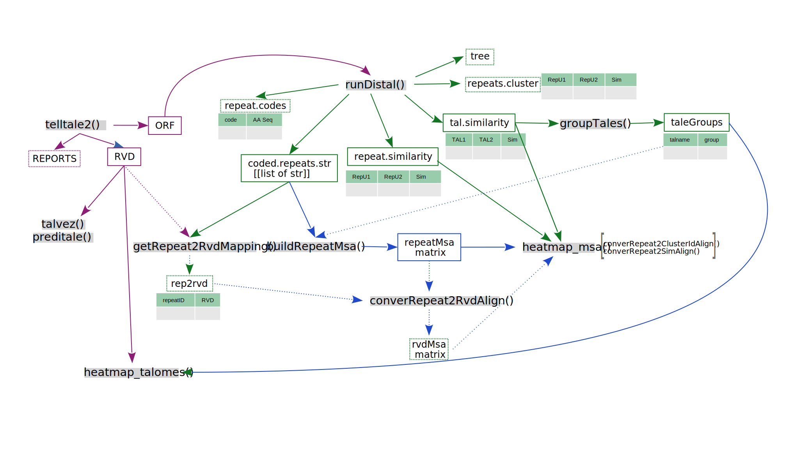

# tantale package
## An integrated collection of functions for TALE minning and analysis

<p align="center">
  
</p>


- A TALE-oriented OOP framework:
    - A TALE class and associated methods (to be done)


- TALE mining in bacterial sequences:
    - Wrapper around annotale
    - tellTale
    - Analysis tools for RVD inventory, repeat lenght


- TALEs classification, phylogeny:
    - Wrappers around distal, functal, annotale
    - TALE groups inference
    - Multiple alignments plotting  


- TALE targets mining:
    - Wrappers around target predictors
    - General parser for results aggregation
    - Connector with daTALbase

**NOTE** :

- Install via the `remotes` package

```
remotes::install_github("vibaotram/tantale",
                          type = "source",
                          dependencies = TRUE,
                          upgrade = "never"
                          )
```

- This is still a **work in progress** and is not necessarily fully and **properly** implemented!!!
- Documentation is also minimal and not necessarily up-to-date.
- If you feel like contributing, that is great, please send me an email: sebastien.cunnac@ird.fr
- tantale has been written with only Linux systems in mind and will very likely not work on other OS (eg Windows)
- Some of tantale wrappers use code written in other languages. For them to work, you must ideally have Java and Perl on the PATH in your system.
- Conda and Mamba muste be installed as well.
- Perl scripts (Talvez & DisTAL) used in tantale require a number of perl libraries. Upon experimenting a bit we realized it was more convenient to include those libraries in tantale. The consequence is that those files cause tantale to occupy a quite some disk space...
    
    

