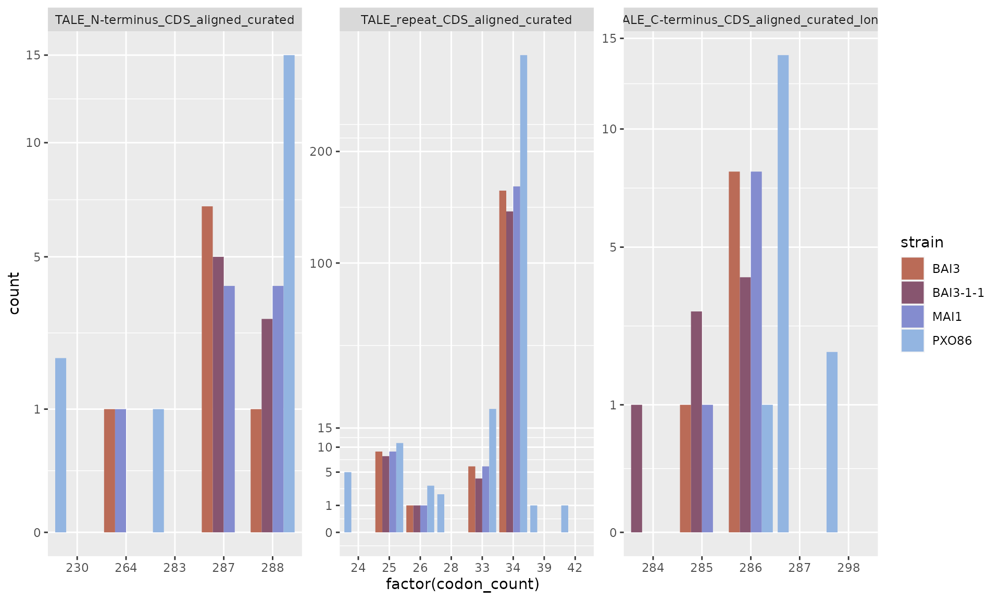
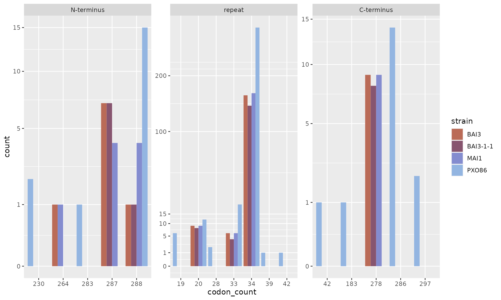

# 1. Mining TALE sequences in genomes with tantale

``` r
library(tantale)
library(ggplot2)
library(tidyverse)
library(Biostrings)
library(parallel)
library(magrittr)
library(DT)
```

In the first four articles, we illustrate the various major approaches
employed in a typical study of TALE diversity and function from a set of
bacterial genome sequences.

This first article covers all the steps in a TALE mining pipeline from
“accurate” or “error-prone” Xoo genome sequences using functions in
package `tantale`.  
Genomes used for this vignette are MAI1, BAI3, BAI3-1-1 (an error-prone
genome with *talC* deleted) and PXO86, an outgroup Asian strain.  

Get the fasta files:

``` r
mai1_fa <- system.file("extdata", "MAI1.fa", package = "tantale", mustWork = T)
bai3_fa <- system.file("extdata", "BAI3.fa", package = "tantale", mustWork = T)
bai311_fa <- system.file("extdata", "BAI3-1-1.fa", package = "tantale", mustWork = T)
pxo86 <- system.file("extdata", "PXO86.fa", package = "tantale", mustWork = T)
```

Output dir to save all the results of this vignette:

``` r
outdir <- fs::dir_create("~/TEMP/test_tantale") # tempdir(check = TRUE)
telltale_outdir <- file.path(outdir, "telltale")
dir.create(telltale_outdir, showWarnings = T)
```

## Finding TALEs loci on DNA sequences

We will run `telltale()` without correction for “gold” genomes, MAI1,
BAI3 and PXO86. For “error-prone” genome BAI3-1-1 `telltale()` will be
run with correction mode on.  
`telltale()` adds NTERM and CTERM to RVD sequences as markers of the
termini, that is important for
[DisTal](https://doi.org/10.3389/fpls.2015.00545) to mach repeat codes
with their cognate RVDs.

### Run telltale no correction

``` r
mclapply(c(mai1_fa, bai3_fa, pxo86), function(fastaFile) {
  outdirname <- gsub(".fa", "_nocorrection", basename(fastaFile))
  outputDir <- file.path(telltale_outdir, outdirname)
  tellTale(subjectFile = fastaFile,
            outputDir = outputDir,
            appendExtremityCodes = TRUE,
            rvdSep = "-",
            talArrayCorrection = FALSE)
}, mc.cores = 3)
#>> [[1]]
#>> [1] "/home/cunnac/TEMP/test_tantale/telltale/MAI1_nocorrection"
#>> 
#>> [[2]]
#>> [1] "/home/cunnac/TEMP/test_tantale/telltale/BAI3_nocorrection"
#>> 
#>> [[3]]
#>> [1] "/home/cunnac/TEMP/test_tantale/telltale/PXO86_nocorrection"
```

### Run telltale correction

``` r
tellTale(subjectFile = bai311_fa,
         outputDir = file.path(telltale_outdir, gsub(".fa", "_correction", basename(bai311_fa))),
         TALE_CtermDNAHitMinScore = 300,
         appendExtremityCodes = TRUE,
         rvdSep = "-",
         talArrayCorrection = TRUE)
#>> Finding the closest reference amino acid sequences:
#>> ================================================================================
#>> 
#>> Time difference of 0.45 secs
#>> Assessing frameshifts in nucleotide sequences:
#>> ================================================================================
#>> 
#>> Time difference of 412.25 secs
#>> #****************************************
#>> #**   tellTale analysis done     **
#>> Current date:   Mon Sep 18 00:54:36 2023
#>> #_________Provided I/O parameters __________
#>> File of subject DNA sequences:  /tmp/RtmpBflNsA/file847d2820335a
#>> TALE N-term CDS region detection HMM file:  /tmp/RtmpTfgQag/temp_libpath1b902266d9eb/tantale/extdata/hmmProfile/Xo_TALE_Nterm_CDS_profile.hmm
#>> TALE repeat unit CDS detection HMM file:    /tmp/RtmpTfgQag/temp_libpath1b902266d9eb/tantale/extdata/hmmProfile/Xo_TALE_repeat_CDS_profile.hmm
#>> TALE C-term CDS region detection HMM file:  /tmp/RtmpTfgQag/temp_libpath1b902266d9eb/tantale/extdata/hmmProfile/Xo_TALE_Cterm_CDS_profile.hmm
#>> Output directory:   /home/cunnac/TEMP/test_tantale/telltale/BAI3-1-1_correction
#>> #____________Other parameters________________
#>> TALE_NtermDNAHitMinScore    :   300
#>> repeatDNAHitMinScore    :   20
#>> TALE_CtermDNAHitMinScore    :   300
#>> minDomainHitsPerSubjSeq :   4
#>> mergeHits   :   TRUE
#>> minGapWidth :   35
#>> extendedLength  :   300
#>> talArrayCorrection  :   TRUE
#>> refForTalArrayCorrection    :   /tmp/RtmpTfgQag/temp_libpath1b902266d9eb/tantale/extdata/decipher_ref_tales_aa.fa.gz
#>> frameShiftCorrection    :   -11
#>> #__________Summary measures of TALE search outcome__________
#>> Number of analysed subject sequences :  2
#>> Total number of TALE repeat DNA coding sequence motif hits found with the nhmmer approach:  155
#>> Total number of subject seqs with TALE motif hits after low hit number filtering:   1
#>> Total number of distinct regions (repeat arrays) with adjacent TALE motifs :    9
#>> Total number of 'complete' arrays (with both N- and C-term flanking motifs):    8
#>> Minimum array length (number of TALE domain hits):  1
#>> Maximum array length:   28
#>> Median array length:    20
#>> Number of gaps of size below 500nt between TALE motifs arrays:  1.5
#>> First quartile of size of gaps (below 500nt) between TALE motifs arrays:    108
#>> Median size of gaps (below 500nt) between TALE motifs arrays:   108
#>> Upper quartile of size of gaps (below 500nt) between TALE motifs arrays:    108
#>> #__________Noteworthy AnnoTale issues__________
#>> # 
#>> #*************************
```

### Overview of telltale results

Besides RVD sequences and TALE ORFs, `telltale()` outputs other useful
files such as the reports, from which we can get information about the
structure of TALE sequences, the corrections that have been made, and so
on.

First, we should take a look is “arrayReport.tsv”. We will take the
files from 3 result folders, gather them, and see which information we
can display from it.

``` r
# color set for ploting
sunset10 <- c("#ba6b57", "#87556f", "#848ccf", "#93b5e1", "#6f4a8e", "#a2738c", "#ab93c9", "#588da8", "#726a95", "#bc658d")

arrayReport_files <- list.files(telltale_outdir, "arrayReport.tsv", recursive = T, full.names = T)

arrayRp <- tibble()
for (f in arrayReport_files) {
  a <- read_tsv(f)
  if (!any(c("predicted_ins_count", "predicted_dels_count") %in% colnames(a)))
    # 2 columns "predicted_ins_count" and "predicted_dels_count" are not displayed in the report in case of no correction
    {a[c("predicted_ins_count", "predicted_dels_count")] <- NA} 
  a$strain <- gsub("\\_.+", "", basename(dirname(f)))
  arrayRp <- rbind(arrayRp, a)
}
#>> Rows: 10 Columns: 15
#>> ── Column specification ────────────────────────────────────────────────────────
#>> Delimiter: "\t"
#>> chr (6): arrayID, OriginalSubjectName, Strand, ArraySeq, SeqOfRVD, LongestOR...
#>> dbl (7): Start, End, NumberOfHits, N.terminusAAlength, C.terminusAAlength, L...
#>> lgl (2): AllDomains, aberrantRepeat
#>> 
#>> ℹ Use `spec()` to retrieve the full column specification for this data.
#>> ℹ Specify the column types or set `show_col_types = FALSE` to quiet this message.
#>> Rows: 9 Columns: 17
#>> ── Column specification ────────────────────────────────────────────────────────
#>> Delimiter: "\t"
#>> chr (6): arrayID, OriginalSubjectName, Strand, ArraySeq, SeqOfRVD, LongestOR...
#>> dbl (9): Start, End, NumberOfHits, predicted_ins_count, predicted_dels_count...
#>> lgl (2): AllDomains, aberrantRepeat
#>> 
#>> ℹ Use `spec()` to retrieve the full column specification for this data.
#>> ℹ Specify the column types or set `show_col_types = FALSE` to quiet this message.
#>> Rows: 10 Columns: 15
#>> ── Column specification ────────────────────────────────────────────────────────
#>> Delimiter: "\t"
#>> chr (6): arrayID, OriginalSubjectName, Strand, ArraySeq, SeqOfRVD, LongestOR...
#>> dbl (7): Start, End, NumberOfHits, N.terminusAAlength, C.terminusAAlength, L...
#>> lgl (2): AllDomains, aberrantRepeat
#>> 
#>> ℹ Use `spec()` to retrieve the full column specification for this data.
#>> ℹ Specify the column types or set `show_col_types = FALSE` to quiet this message.
#>> Rows: 19 Columns: 15
#>> ── Column specification ────────────────────────────────────────────────────────
#>> Delimiter: "\t"
#>> chr (6): arrayID, OriginalSubjectName, Strand, ArraySeq, SeqOfRVD, LongestOR...
#>> dbl (7): Start, End, NumberOfHits, N.terminusAAlength, C.terminusAAlength, L...
#>> lgl (2): AllDomains, aberrantRepeat
#>> 
#>> ℹ Use `spec()` to retrieve the full column specification for this data.
#>> ℹ Specify the column types or set `show_col_types = FALSE` to quiet this message.
arrayRp <- as_tibble(arrayRp)
```

This report takes result of HMMer for Tals DNA signatures detection, the
results of the correction step and the AnnoTALE analyze step.  
What information does it contain:

``` r
colnames(arrayRp)
#>>  [1] "arrayID"               "OriginalSubjectName"   "Start"                
#>>  [4] "End"                   "Strand"                "NumberOfHits"         
#>>  [7] "ArraySeq"              "AllDomains"            "SeqOfRVD"             
#>> [10] "aberrantRepeat"        "N.terminusAAlength"    "C.terminusAAlength"   
#>> [13] "LongestOrfLength"      "OrfCovOverArrayLength" "LongestORFSeq"        
#>> [16] "predicted_ins_count"   "predicted_dels_count"  "strain"
```

Some important points:

| Column name            | Content                                                           |
|------------------------|-------------------------------------------------------------------|
| `AllDomains`           | TRUE/FALSE, whether all the 3 domains of TALE arrays are detected |
| `aberrantRepeat`       | TRUE/FALSE, whether there is any aberrant repeat                  |
| `predicted_ins_count`  | number of insertions corrected by `telltale()`                    |
| `predicted_dels_count` | number of deletions corrected by `telltale()`                     |

#### Count AllDomains and aberrantRepeat

``` r
ggplot(arrayRp) +
  geom_bar(aes(x = strain, fill = AllDomains, color = aberrantRepeat), stat = "count") +
  scale_fill_manual(values = c("grey", sunset10[4])) +
  scale_color_manual(values = c("black", "red"), na.value = NA, labels = c("FALSE", "TRUE", "AnnoTALE_failed")) +
  guides(color = guide_legend(override.aes = list(fill = sunset10[4])))
```


#### Count corrections

total correction count per genome (in this case, there is only 1 genome
that has been corrected)

``` r
arrayRp_correction <- reshape2::melt(arrayRp[c("strain", "arrayID", "predicted_ins_count", "predicted_dels_count")], value.name = "count", variable.name = "type")
#>> Using strain, arrayID as id variables
arrayRp_correction %<>% dplyr::arrange(strain, arrayID)

ggplot(arrayRp_correction) +
  facet_wrap(vars(type), nrow = 2, scales = "fixed") +
  geom_bar(aes(x = strain, fill = factor(count))) +
  scale_fill_viridis_d() +
  guides(fill = guide_legend(title = "correction count"))
```


correction count per array per genome

``` r
ggplot(na.omit(arrayRp_correction), aes(x = arrayID, y = count, color = type, shape = type)) +
  facet_wrap(vars(strain), nrow = 2) +
  scale_shape_manual(values = c(20, 2)) +
  geom_point(size = 4) +
  scale_color_manual(values = c(sunset10[4], "black"))+
  theme(axis.text.x = element_text(angle = 90),
        legend.direction = "horizontal", legend.position = "bottom")
```


correction distribution per genome

``` r
ggplot(na.omit(arrayRp_correction), aes(x = strain, y = count)) +
  geom_dotplot(aes(fill = type, color = type), binaxis = "y", stackdir = "center", position = "dodge", binwidth = 1/10) +
  scale_fill_manual(values = c(sunset10[4], "black")) +
  scale_color_manual(values = c(sunset10[4], "black")) +
  theme(legend.direction = "horizontal", legend.position = "bottom",
        panel.grid.minor.y = element_blank())
```


#### Count domain codon

Another report that we can reveal is “hitsReport.tsv”, which contains
results of HMMer.

``` r
hitsReport_files <- dir(telltale_outdir, "hitsReport.tsv", recursive = T, full.names = T)

hitsReport <- data.frame()
for (f in hitsReport_files) {
  a <- read.table(f, sep = "\t", stringsAsFactors = F, header = T)
  a$strain <- gsub("\\_.+", "", basename(dirname(f)))
  hitsReport <- rbind(hitsReport, a)
}
hitsReport$query_name <- factor(hitsReport$query_name, levels = c("TALE_N-terminus_CDS_aligned_curated", "TALE_repeat_CDS_aligned_curated", "TALE_C-terminus_CDS_aligned_curated_long"), ordered = F)
```

information in the hitsReport

``` r
colnames(hitsReport)
#>>  [1] "arrayID"          "seqnames"         "start"            "end"             
#>>  [5] "width"            "strand"           "nhmmerHitID"      "query_name"      
#>>  [9] "hitID"            "seq"              "codon_count"      "frameshift_count"
#>> [13] "strain"
```

We could see the length distribution of each TALE protein domain
(`query_name`) predicted by HMMer.

``` r
ggplot(hitsReport) +
  facet_wrap(vars(query_name), scales = "free", nrow = 1) +
  geom_bar(aes(x = factor(codon_count), fill = strain), stat = "count", position = position_dodge(preserve = "single")) +
  scale_fill_manual(values = sunset10) +
  scale_y_sqrt(breaks = c(0, 1, 5, 10, 15, 100, 200, 350))
```



It seems that BAI3-1-1 has 1 TALE truncated at C-terminus caused by
artifactual indels. But this is just the “raw” result of TALE motif
detection.

Now we have a look at “domainsReport.tsv”, a similar report as
“hitsReport.tsv” except that it contains the information of TALE domains
predicted by AnnoTALE after correction, , so that we can make
comparision and infer the impact of correction in the protein sequences.

``` r
domainsReport_file <- dir(telltale_outdir, "domainsReport.tsv", recursive = T, full.names = T)

domainsReport <- data.frame()
for (f in domainsReport_file) {
  a <- read.table(f, sep = "\t", stringsAsFactors = F, header = T)
  a$strain <- gsub("\\_.+", "", basename(dirname(f)))
  domainsReport <- rbind(domainsReport, a)
}

domainsReport$query_name <- factor(domainsReport$query_name, levels = c("N-terminus", "repeat", "C-terminus"))
domainsReport$codon_count <- as.factor(domainsReport$codon_count)

ggplot(domainsReport) +
  facet_wrap(vars(query_name), scales = "free", nrow = 1) +
  geom_bar(aes(x = codon_count, fill = strain), stat = "count", position = position_dodge(preserve = "single")) +
  scale_fill_manual(values = sunset10) +
  scale_y_sqrt(breaks = c(0, 1, 5, 10, 15, 100, 200, 350))
```



Firstly, the domain detection of AnnoTALE is different from HMMer at
some amino acids.  
Secondly, the truncated C-terminus of BAI3-1-1 (84 aa) has been
corrected and has the same length as its counterparts.

``` r
save.image(file.path(outdir, "mining.RData"))
```
