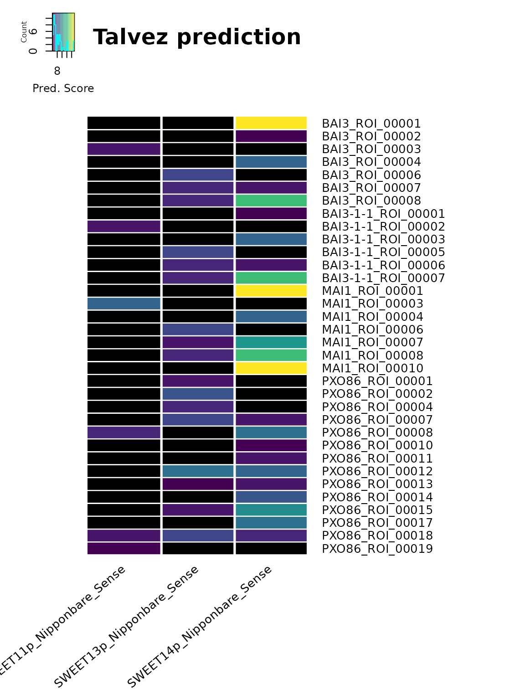
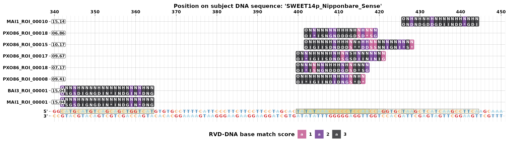
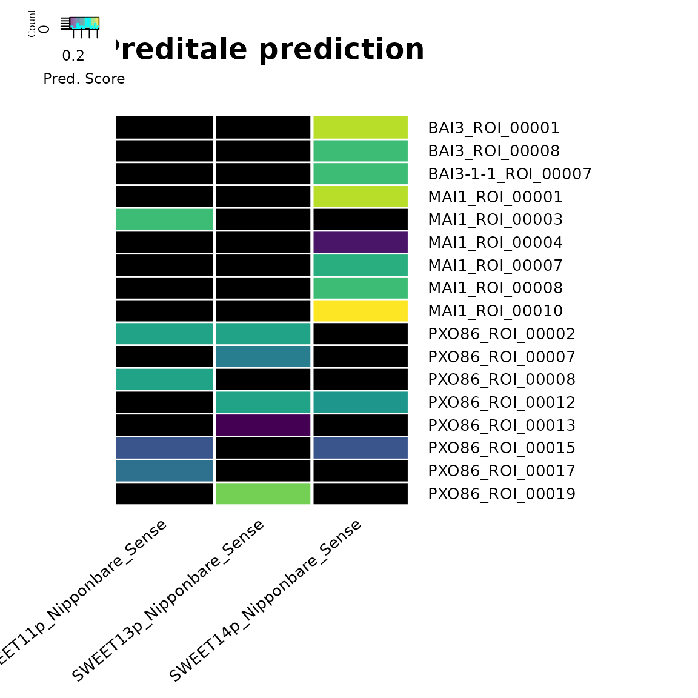
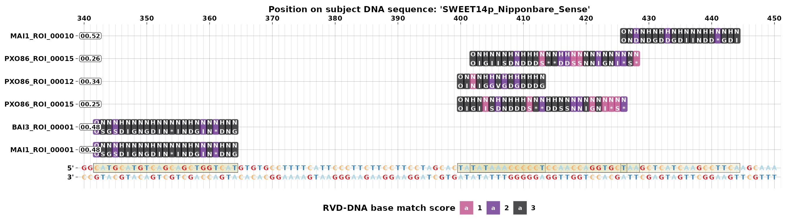

# 4. TALE targets predictions with tantale

``` r
library(tantale)
library(ggplot2)
library(tidyverse)
library(Biostrings)
library(parallel)
library(magrittr)
library(DT)
library(gplots)
library(ape)
library(ggtree)
library(corrr)
library(ggcorrplot)
```

``` r
outdir <- fs::dir_create("~/TEMP/test_tantale") # tempdir(check = TRUE)
load(file.path(outdir, "mining.RData"))
```

Considering the molecular function of TALEs, it is naturally of great
interest to predict their target DNA sequence or EBE (Effector Binding
Element). For that tantale wraps two classical predictors,
([Talvez](https://doi.org/10.1371/journal.pone.0068464) and
[PrediTALE](https://doi.org/10.1371/journal.pcbi.1007206)). This enables
to contrast their predictions in a unified interface because their
output has been harmonized in a common format.

In addition, a plotting function with customized output modes generate
very convenient and insightful diagrams for these alignments.

## TALE Target prediction

We wrap Talvez and Preditale tools in 2 functions,
[`talvez()`](https://scunnac.github.io/tantale/reference/talvez.md) and
[`preditale()`](https://scunnac.github.io/tantale/reference/preditale.md),
that take the same types of RVD sequences and promoter DNA sequences as
inputs and output a data frame containing predictions.

We need to concatenate all RVD sequences from 3 `telltale` outputs and
remove NTERM and CTERM markers.

``` r
## rvd sequences from telltale output
rvdSeqs_tt <-  readBStringSet(telltale_rvd)
rvdSeqs_tt <- gsub("\\-{0,1}\\w{5}\\-{0,1}", "",rvdSeqs_tt) %>% BStringSet() # remove NTERM and CTERM
predict_input <- file.path(outdir, "rvd_to_predict.fasta")
writeXStringSet(rvdSeqs_tt, predict_input)


## promoter sequences
rvdSeqsXstrings <-  predict_input
subjDnaSeqFile <-  system.file("extdata", "cladeIII_sweet_promoters.fasta", package = "tantale", mustWork = T)
readBStringSet(subjDnaSeqFile) %>% names
#>> [1] "SWEET11p_IR64_Sense"       "SWEET11p_BT07_Sense"      
#>> [3] "SWEET11p_93-11_Sense"      "SWEET11p_Nipponbare_Sense"
#>> [5] "SWEET13p_BT7_Sense"        "SWEET13p_IR24_Sense"      
#>> [7] "SWEET13p_Nipponbare_Sense" "SWEET14p_BT07_Sense"      
#>> [9] "SWEET14p_Nipponbare_Sense"
```

### talvez

The output of
[`talvez()`](https://scunnac.github.io/tantale/reference/talvez.md)
contains the position, score and rank of each prediction.

``` r
talvezPreds <- talvez(rvdSeqs = rvdSeqsXstrings,
                      subjDnaSeqFile = subjDnaSeqFile,
                      optParam = "-t 0 -l 19",
                      condaBinPath = "/home/cunnac/bin/miniconda3/condabin/conda")
datatable(talvezPreds, options = list(pageLength = 1))
```

Here is an example of summarizing prediction result with
[`heatmap.2()`](https://rdrr.io/pkg/gplots/man/heatmap.2.html) (scores
are display by color scale, black refers no prediction):

``` r
talvezPreds$strain <- gsub("\\_.+", "", talvezPreds$taleId)
talvezPreds$group <- sapply(talvezPreds$taleId, function(id) {
  ifelse(id %in% taleGroups$name, taleGroups$group[taleGroups$name == id], NA)
}, USE.NAMES = F)

slctPromoters <- c("SWEET14p_Nipponbare_Sense", "SWEET13p_Nipponbare_Sense", "SWEET11p_Nipponbare_Sense")
selectedPreds <- talvezPreds %>%
  dplyr::filter(subjSeqId %in% slctPromoters) 

selectedPredsMat <- selectedPreds %>%
  reshape2::acast(taleId ~ subjSeqId, max, na.rm = TRUE, value.var = "score", fill = as.single(NA))

heatmap.2(selectedPredsMat,
                  col = viridis::viridis(20), #cm.colors(255),
                  sepwidth=c(0.02,0.02), sepcolor="white", colsep = 1:ncol(selectedPredsMat), rowsep = 1:nrow(selectedPredsMat),
                  trace="none",
                  margins = c(10, 15),
                  cexRow = 1,
                  cexCol = 1, srtCol = 40,
                  density.info= "histogram", key.xlab = "Pred. Score", key.title = NA,
                  lwid = c(1,5), lhei = c(1,5),
                  dendrogram = "none", Rowv = NULL, Colv = NULL,
                  na.color = "black",
                  main = "Talvez prediction"
                  )
```



To see how RVD sequences match a promoter region, we supply the
prediction table and the promoter sequence with the genomic range to
[`plotTaleTargetPred()`](https://scunnac.github.io/tantale/reference/plotTaleTargetPred.md):

``` r
grFilter <- "SWEET14p_Nipponbare_Sense:340-450"
plotTaleTargetPred(predResults = selectedPreds, subjDnaSeqFile = subjDnaSeqFile, filterRange = grFilter)
```



### preditale

With Preditale, we get similar data frame output but with p value
additionally. Preditale takes a little bit longer than Talvez and may
give some different predictions.

``` r
preditalePreds <- preditale(rvdSeqs = rvdSeqsXstrings, subjDnaSeqFile = subjDnaSeqFile, outDir = NULL)
datatable(preditalePreds, options = list(pageLength = 1))
```

``` r
talvezPreds$strain <- gsub("\\_.+", "", talvezPreds$taleId)
talvezPreds$group <- sapply(talvezPreds$taleId, function(id) {
  ifelse(id %in% taleGroups$name, taleGroups$group[taleGroups$name == id], NA)
}, USE.NAMES = F)

slctPromoters <- c("SWEET14p_Nipponbare_Sense", "SWEET13p_Nipponbare_Sense", "SWEET11p_Nipponbare_Sense")
selectedPreds <- preditalePreds %>%
  dplyr::filter(subjSeqId %in% slctPromoters) 

selectedPredsMat <- selectedPreds %>%
  reshape2::acast(taleId ~ subjSeqId, max, na.rm = TRUE, value.var = "score", fill = as.single(NA))

gplots::heatmap.2(selectedPredsMat,
                  col = viridis::viridis(20), #cm.colors(255),
                  sepwidth=c(0.02,0.02), sepcolor="white", colsep = 1:ncol(selectedPredsMat), rowsep = 1:nrow(selectedPredsMat),
                  trace="none",
                  margins = c(10, 15),
                  cexRow = 1,
                  cexCol = 1, srtCol = 40,
                  density.info= "histogram", key.xlab = "Pred. Score", key.title = NA,
                  lwid = c(1,5), lhei = c(1,5),
                  dendrogram = "none", Rowv = NULL, Colv = NULL,
                  na.color = "black",
                  main = "Preditale prediction"
                  )
```



``` r
grFilter <- "SWEET14p_Nipponbare_Sense:340-450"
plotTaleTargetPred(predResults = selectedPreds, subjDnaSeqFile = subjDnaSeqFile, filterRange = grFilter)
```



``` r
save.image(file.path(outdir, "mining.RData"))
```

## Session info

``` r
sessioninfo::session_info()
#>> ─ Session info ───────────────────────────────────────────────────────────────
#>>  setting  value
#>>  version  R version 4.3.1 (2023-06-16)
#>>  os       Ubuntu 22.04.3 LTS
#>>  system   x86_64, linux-gnu
#>>  ui       X11
#>>  language en
#>>  collate  en_US.UTF-8
#>>  ctype    en_US.UTF-8
#>>  tz       Europe/Paris
#>>  date     2023-09-18
#>>  pandoc   3.1.1 @ /usr/lib/rstudio/resources/app/bin/quarto/bin/tools/ (via rmarkdown)
#>> 
#>> ─ Packages ───────────────────────────────────────────────────────────────────
#>>  package              * version   date (UTC) lib source
#>>  abind                  1.4-5     2016-07-21 [2] CRAN (R 4.3.1)
#>>  AnnotationDbi          1.62.2    2023-07-02 [2] Bioconductor
#>>  AnnotationFilter       1.24.0    2023-04-25 [2] Bioconductor
#>>  ape                  * 5.7-1     2023-03-13 [2] CRAN (R 4.3.1)
#>>  aplot                  0.2.0     2023-08-09 [2] CRAN (R 4.3.1)
#>>  backports              1.4.1     2021-12-13 [2] CRAN (R 4.3.1)
#>>  base64enc              0.1-3     2015-07-28 [2] CRAN (R 4.3.1)
#>>  Biobase                2.60.0    2023-04-25 [2] Bioconductor
#>>  BiocFileCache          2.8.0     2023-04-25 [2] Bioconductor
#>>  BiocGenerics         * 0.46.0    2023-04-25 [2] Bioconductor
#>>  BiocIO                 1.10.0    2023-04-25 [2] Bioconductor
#>>  BiocParallel           1.34.2    2023-05-22 [2] Bioconductor
#>>  biomaRt                2.56.1    2023-06-09 [2] Bioconductor
#>>  Biostrings           * 2.68.1    2023-05-16 [2] Bioconductor
#>>  biovizBase             1.48.0    2023-04-25 [2] Bioconductor
#>>  bit                    4.0.5     2022-11-15 [2] CRAN (R 4.3.1)
#>>  bit64                  4.0.5     2020-08-30 [2] CRAN (R 4.3.1)
#>>  bitops                 1.0-7     2021-04-24 [2] CRAN (R 4.3.1)
#>>  blob                   1.2.4     2023-03-17 [2] CRAN (R 4.3.1)
#>>  BSgenome               1.68.0    2023-04-25 [2] Bioconductor
#>>  bslib                  0.5.1     2023-08-11 [2] CRAN (R 4.3.1)
#>>  cachem                 1.0.8     2023-05-01 [2] CRAN (R 4.3.1)
#>>  callr                  3.7.3     2022-11-02 [2] CRAN (R 4.3.1)
#>>  caTools                1.18.2    2021-03-28 [2] CRAN (R 4.3.1)
#>>  checkmate              2.2.0     2023-04-27 [2] CRAN (R 4.3.1)
#>>  cli                    3.6.1     2023-03-23 [2] CRAN (R 4.3.1)
#>>  cluster                2.1.4     2022-08-22 [2] CRAN (R 4.3.1)
#>>  codetools              0.2-19    2023-02-01 [2] CRAN (R 4.3.1)
#>>  colorspace             2.1-0     2023-01-23 [2] CRAN (R 4.3.1)
#>>  corrr                * 0.4.4     2022-08-16 [2] CRAN (R 4.3.1)
#>>  crayon                 1.5.2     2022-09-29 [2] CRAN (R 4.3.1)
#>>  crosstalk              1.2.0     2021-11-04 [2] CRAN (R 4.3.1)
#>>  curl                   5.0.2     2023-08-14 [2] CRAN (R 4.3.1)
#>>  data.table             1.14.8    2023-02-17 [2] CRAN (R 4.3.1)
#>>  DBI                    1.1.3     2022-06-18 [2] CRAN (R 4.3.1)
#>>  dbplyr                 2.3.3     2023-07-07 [2] CRAN (R 4.3.1)
#>>  DelayedArray           0.26.7    2023-07-28 [2] Bioconductor
#>>  desc                   1.4.2     2022-09-08 [2] CRAN (R 4.3.1)
#>>  devtools             * 2.4.5     2022-10-11 [2] CRAN (R 4.3.1)
#>>  dichromat              2.0-0.1   2022-05-02 [2] CRAN (R 4.3.1)
#>>  digest                 0.6.33    2023-07-07 [2] CRAN (R 4.3.1)
#>>  dplyr                * 1.1.3     2023-09-03 [2] CRAN (R 4.3.1)
#>>  DT                   * 0.29      2023-08-29 [2] CRAN (R 4.3.1)
#>>  ellipsis               0.3.2     2021-04-29 [2] CRAN (R 4.3.1)
#>>  ensembldb              2.24.0    2023-04-25 [2] Bioconductor
#>>  evaluate               0.21      2023-05-05 [2] CRAN (R 4.3.1)
#>>  fansi                  1.0.4     2023-01-22 [2] CRAN (R 4.3.1)
#>>  farver                 2.1.1     2022-07-06 [2] CRAN (R 4.3.1)
#>>  fastmap                1.1.1     2023-02-24 [2] CRAN (R 4.3.1)
#>>  filelock               1.0.2     2018-10-05 [2] CRAN (R 4.3.1)
#>>  forcats              * 1.0.0     2023-01-29 [2] CRAN (R 4.3.1)
#>>  foreign                0.8-84    2022-12-06 [2] CRAN (R 4.3.1)
#>>  Formula                1.2-5     2023-02-24 [2] CRAN (R 4.3.1)
#>>  fs                     1.6.3     2023-07-20 [2] CRAN (R 4.3.1)
#>>  generics               0.1.3     2022-07-05 [2] CRAN (R 4.3.1)
#>>  GenomeInfoDb         * 1.36.2    2023-08-25 [2] Bioconductor
#>>  GenomeInfoDbData       1.2.10    2023-09-03 [2] Bioconductor
#>>  GenomicAlignments      1.36.0    2023-04-25 [2] Bioconductor
#>>  GenomicFeatures        1.52.2    2023-08-25 [2] Bioconductor
#>>  GenomicRanges          1.52.0    2023-04-25 [2] Bioconductor
#>>  ggcorrplot           * 0.1.4     2022-09-27 [2] CRAN (R 4.3.1)
#>>  ggfun                  0.1.2     2023-08-09 [2] CRAN (R 4.3.1)
#>>  ggplot2              * 3.4.3     2023-08-14 [2] CRAN (R 4.3.1)
#>>  ggplotify              0.1.2     2023-08-09 [2] CRAN (R 4.3.1)
#>>  ggtree               * 3.8.2     2023-07-24 [2] Bioconductor
#>>  glue                   1.6.2     2022-02-24 [2] CRAN (R 4.3.1)
#>>  gplots               * 3.1.3     2022-04-25 [2] CRAN (R 4.3.1)
#>>  gridExtra              2.3       2017-09-09 [2] CRAN (R 4.3.1)
#>>  gridGraphics           0.5-1     2020-12-13 [2] CRAN (R 4.3.1)
#>>  gtable                 0.3.4     2023-08-21 [2] CRAN (R 4.3.1)
#>>  gtools                 3.9.4     2022-11-27 [2] CRAN (R 4.3.1)
#>>  highr                  0.10      2022-12-22 [2] CRAN (R 4.3.1)
#>>  Hmisc                  5.1-0     2023-05-08 [2] CRAN (R 4.3.1)
#>>  hms                    1.1.3     2023-03-21 [2] CRAN (R 4.3.1)
#>>  htmlTable              2.4.1     2022-07-07 [2] CRAN (R 4.3.1)
#>>  htmltools              0.5.6     2023-08-10 [2] CRAN (R 4.3.1)
#>>  htmlwidgets            1.6.2     2023-03-17 [2] CRAN (R 4.3.1)
#>>  httpuv                 1.6.11    2023-05-11 [2] CRAN (R 4.3.1)
#>>  httr                   1.4.7     2023-08-15 [2] CRAN (R 4.3.1)
#>>  IRanges              * 2.34.1    2023-06-22 [2] Bioconductor
#>>  jquerylib              0.1.4     2021-04-26 [2] CRAN (R 4.3.1)
#>>  jsonlite               1.8.7     2023-06-29 [2] CRAN (R 4.3.1)
#>>  KEGGREST               1.40.0    2023-04-25 [2] Bioconductor
#>>  KernSmooth             2.23-22   2023-07-10 [2] CRAN (R 4.3.1)
#>>  knitr                  1.43      2023-05-25 [2] CRAN (R 4.3.1)
#>>  later                  1.3.1     2023-05-02 [2] CRAN (R 4.3.1)
#>>  lattice                0.21-8    2023-04-05 [2] CRAN (R 4.3.1)
#>>  lazyeval               0.2.2     2019-03-15 [2] CRAN (R 4.3.1)
#>>  lifecycle              1.0.3     2022-10-07 [2] CRAN (R 4.3.1)
#>>  logger                 0.2.2     2021-10-19 [2] CRAN (R 4.3.1)
#>>  lubridate            * 1.9.2     2023-02-10 [2] CRAN (R 4.3.1)
#>>  magrittr             * 2.0.3     2022-03-30 [2] CRAN (R 4.3.1)
#>>  Matrix                 1.6-1     2023-08-14 [2] CRAN (R 4.3.1)
#>>  MatrixGenerics         1.12.3    2023-07-30 [2] Bioconductor
#>>  matrixStats            1.0.0     2023-06-02 [2] CRAN (R 4.3.1)
#>>  memoise                2.0.1     2021-11-26 [2] CRAN (R 4.3.1)
#>>  mime                   0.12      2021-09-28 [2] CRAN (R 4.3.1)
#>>  miniUI                 0.1.1.1   2018-05-18 [2] CRAN (R 4.3.1)
#>>  munsell                0.5.0     2018-06-12 [2] CRAN (R 4.3.1)
#>>  nlme                   3.1-163   2023-08-09 [2] CRAN (R 4.3.1)
#>>  nnet                   7.3-19    2023-05-03 [2] CRAN (R 4.3.1)
#>>  patchwork              1.1.3     2023-08-14 [2] CRAN (R 4.3.1)
#>>  pillar                 1.9.0     2023-03-22 [2] CRAN (R 4.3.1)
#>>  pkgbuild               1.4.2     2023-06-26 [2] CRAN (R 4.3.1)
#>>  pkgconfig              2.0.3     2019-09-22 [2] CRAN (R 4.3.1)
#>>  pkgdown                2.0.7     2022-12-14 [2] CRAN (R 4.3.1)
#>>  pkgload                1.3.2.1   2023-07-08 [2] CRAN (R 4.3.1)
#>>  plyr                   1.8.8     2022-11-11 [2] CRAN (R 4.3.1)
#>>  png                    0.1-8     2022-11-29 [2] CRAN (R 4.3.1)
#>>  prettyunits            1.1.1     2020-01-24 [2] CRAN (R 4.3.1)
#>>  processx               3.8.2     2023-06-30 [2] CRAN (R 4.3.1)
#>>  profvis                0.3.8     2023-05-02 [2] CRAN (R 4.3.1)
#>>  progress               1.2.2     2019-05-16 [2] CRAN (R 4.3.1)
#>>  promises               1.2.1     2023-08-10 [2] CRAN (R 4.3.1)
#>>  ProtGenerics           1.32.0    2023-04-25 [2] Bioconductor
#>>  ps                     1.7.5     2023-04-18 [2] CRAN (R 4.3.1)
#>>  purrr                * 1.0.2     2023-08-10 [2] CRAN (R 4.3.1)
#>>  R6                     2.5.1     2021-08-19 [2] CRAN (R 4.3.1)
#>>  ragg                   1.2.5     2023-01-12 [2] CRAN (R 4.3.1)
#>>  rappdirs               0.3.3     2021-01-31 [2] CRAN (R 4.3.1)
#>>  RColorBrewer           1.1-3     2022-04-03 [2] CRAN (R 4.3.1)
#>>  Rcpp                   1.0.11    2023-07-06 [2] CRAN (R 4.3.1)
#>>  RCurl                  1.98-1.12 2023-03-27 [2] CRAN (R 4.3.1)
#>>  readr                * 2.1.4     2023-02-10 [2] CRAN (R 4.3.1)
#>>  remotes                2.4.2.1   2023-07-18 [2] CRAN (R 4.3.1)
#>>  reshape2               1.4.4     2020-04-09 [2] CRAN (R 4.3.1)
#>>  restfulr               0.0.15    2022-06-16 [2] CRAN (R 4.3.1)
#>>  reticulate             1.31      2023-08-10 [2] CRAN (R 4.3.1)
#>>  rjson                  0.2.21    2022-01-09 [2] CRAN (R 4.3.1)
#>>  rlang                  1.1.1     2023-04-28 [2] CRAN (R 4.3.1)
#>>  rmarkdown              2.24      2023-08-14 [2] CRAN (R 4.3.1)
#>>  rpart                  4.1.19    2022-10-21 [2] CRAN (R 4.3.1)
#>>  rprojroot              2.0.3     2022-04-02 [2] CRAN (R 4.3.1)
#>>  Rsamtools              2.16.0    2023-04-25 [2] Bioconductor
#>>  RSQLite                2.3.1     2023-04-03 [2] CRAN (R 4.3.1)
#>>  rstudioapi             0.15.0    2023-07-07 [2] CRAN (R 4.3.1)
#>>  rtracklayer            1.60.1    2023-08-15 [2] Bioconductor
#>>  S4Arrays               1.0.6     2023-08-30 [2] Bioconductor
#>>  S4Vectors            * 0.38.1    2023-05-02 [2] Bioconductor
#>>  sass                   0.4.7     2023-07-15 [2] CRAN (R 4.3.1)
#>>  scales                 1.2.1     2022-08-20 [2] CRAN (R 4.3.1)
#>>  sessioninfo            1.2.2     2021-12-06 [2] CRAN (R 4.3.1)
#>>  shiny                  1.7.5     2023-08-12 [2] CRAN (R 4.3.1)
#>>  stringi                1.7.12    2023-01-11 [2] CRAN (R 4.3.1)
#>>  stringr              * 1.5.0     2022-12-02 [2] CRAN (R 4.3.1)
#>>  SummarizedExperiment   1.30.2    2023-06-06 [2] Bioconductor
#>>  systemfonts            1.0.4     2022-02-11 [2] CRAN (R 4.3.1)
#>>  tantale              * 0.1.9550  2023-09-17 [1] Bioconductor
#>>  textshaping            0.3.6     2021-10-13 [2] CRAN (R 4.3.1)
#>>  tibble               * 3.2.1     2023-03-20 [2] CRAN (R 4.3.1)
#>>  tidyr                * 1.3.0     2023-01-24 [2] CRAN (R 4.3.1)
#>>  tidyselect             1.2.0     2022-10-10 [2] CRAN (R 4.3.1)
#>>  tidytree               0.4.5     2023-08-10 [2] CRAN (R 4.3.1)
#>>  tidyverse            * 2.0.0     2023-02-22 [2] CRAN (R 4.3.1)
#>>  timechange             0.2.0     2023-01-11 [2] CRAN (R 4.3.1)
#>>  treeio                 1.24.3    2023-07-24 [2] Bioconductor
#>>  tzdb                   0.4.0     2023-05-12 [2] CRAN (R 4.3.1)
#>>  urlchecker             1.0.1     2021-11-30 [2] CRAN (R 4.3.1)
#>>  usethis              * 2.2.2     2023-07-06 [2] CRAN (R 4.3.1)
#>>  utf8                   1.2.3     2023-01-31 [2] CRAN (R 4.3.1)
#>>  VariantAnnotation      1.46.0    2023-04-25 [2] Bioconductor
#>>  vctrs                  0.6.3     2023-06-14 [2] CRAN (R 4.3.1)
#>>  viridis                0.6.4     2023-07-22 [2] CRAN (R 4.3.1)
#>>  viridisLite            0.4.2     2023-05-02 [2] CRAN (R 4.3.1)
#>>  vroom                  1.6.3     2023-04-28 [2] CRAN (R 4.3.1)
#>>  withr                  2.5.0     2022-03-03 [2] CRAN (R 4.3.1)
#>>  xfun                   0.40      2023-08-09 [2] CRAN (R 4.3.1)
#>>  XML                    3.99-0.14 2023-03-19 [2] CRAN (R 4.3.1)
#>>  xml2                   1.3.5     2023-07-06 [2] CRAN (R 4.3.1)
#>>  xtable                 1.8-4     2019-04-21 [2] CRAN (R 4.3.1)
#>>  XVector              * 0.40.0    2023-04-25 [2] Bioconductor
#>>  yaml                   2.3.7     2023-01-23 [2] CRAN (R 4.3.1)
#>>  yulab.utils            0.0.9     2023-09-01 [2] CRAN (R 4.3.1)
#>>  zlibbioc               1.46.0    2023-04-25 [2] Bioconductor
#>> 
#>>  [1] /tmp/RtmpTfgQag/temp_libpath1b902266d9eb
#>>  [2] /home/cunnac/R/x86_64-pc-linux-gnu-library/4.3
#>>  [3] /usr/local/lib/R/site-library
#>>  [4] /usr/lib/R/site-library
#>>  [5] /usr/lib/R/library
#>> 
#>> ──────────────────────────────────────────────────────────────────────────────
```
