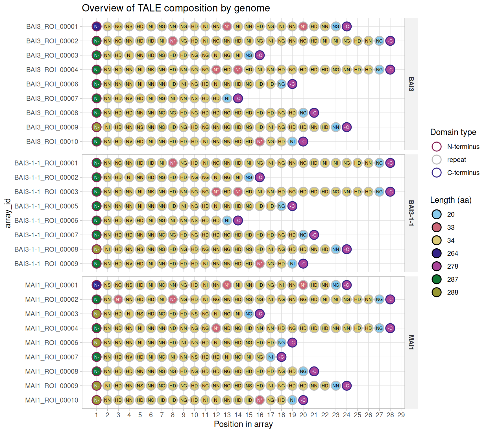
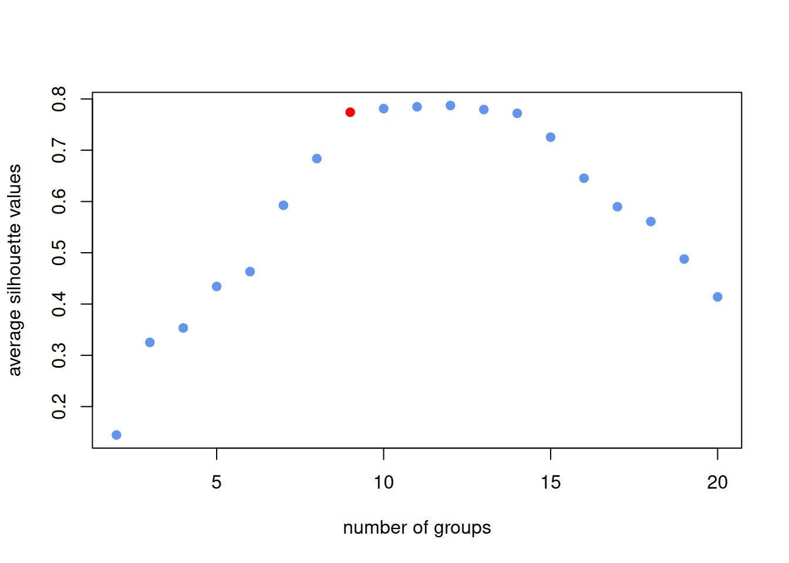
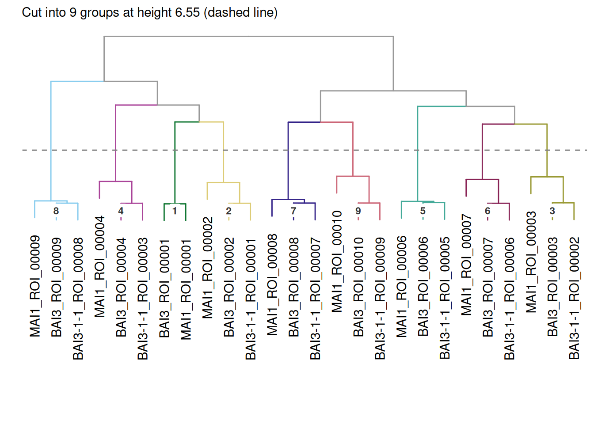
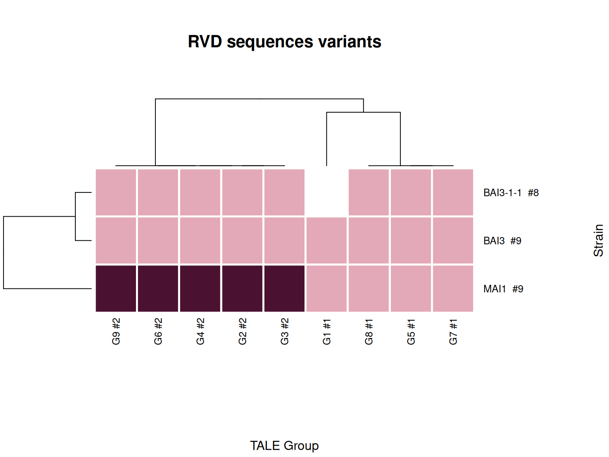
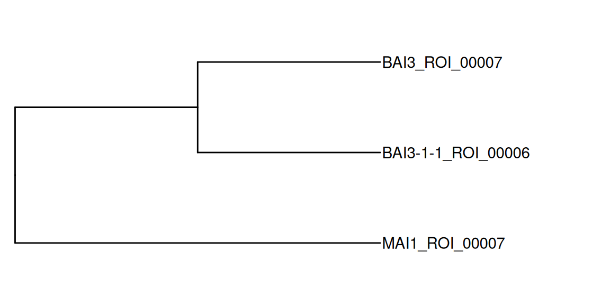
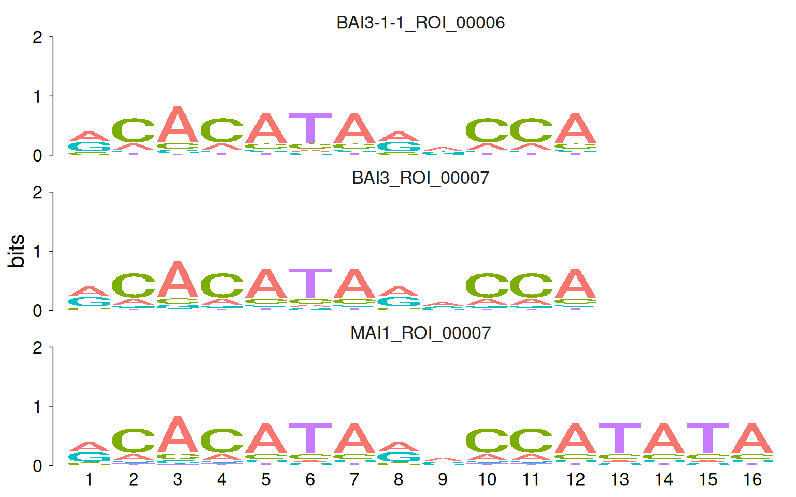

# Classifying TALE sequences from genomes

The [previous
article](https://scunnac.github.io/tantale/articles/tale_mining.md)
covered finding TALE loci in one genome at a time. A real study usually
has several genomes, and the interesting question becomes “which TALEs,
across strains, are versions of the same thing”: alleles of one locus,
related by descent. This article covers that comparison:
[`tales_compare_distal()`](https://scunnac.github.io/tantale/reference/tales_compare_distal.md)
to quantify how alike every pair of arrays and domains is, and
[`tales_group_hclust()`](https://scunnac.github.io/tantale/reference/tales_group_hclust.md)/[`tales_group_kmedoids()`](https://scunnac.github.io/tantale/reference/tales_group_kmedoids.md)
to turn that into discrete groups.

Code

``` r
library(tantale)
library(dplyr)
```

## 1 Discovering TALEs across several genomes

This is a fresh discovery run, independent of the previous article, over
three related genomes: MAI1, BAI3, and the best-corrected version of
BAI3-1-1 from [the correction section of the mining
article](https://scunnac.github.io/tantale/articles/tale_mining.html#sec-best-correction).

> **Why only three genomes**
>
> tantale ships a fourth sample genome, PXO86, a distantly related Asian
> outgroup strain. It is left out here deliberately: its TALE repertoire
> barely overlaps the African strains’ at all, so including it turns a
> clean set of one-locus-per-strain groups into a mix of real
> cross-strain groups and PXO86-only paralog clusters, which illustrate
> a different question from the one this article is asking.

Discovery runs independently per genome, so it is written as one
function applied to each genome name in turn:

Code

``` r
out <- fs::dir_create(file.path(tempdir(), "tale_classification"))
genome_files <- c(
  MAI1       = system.file("extdata", "MAI1.fa",       package = "tantale", mustWork = TRUE),
  BAI3       = system.file("extdata", "BAI3.fa",       package = "tantale", mustWork = TRUE),
  `BAI3-1-1` = system.file("extdata", "BAI3-1-1.fa",   package = "tantale", mustWork = TRUE)
)
```

Code

``` r
discover_strain <- function(strain) {
  strain_dir <- file.path(out, strain)
  invisible(tell_tales(subject_file = genome_files[strain], output_dir = strain_dir,
                       cterm_min_score = 300,
                       correct_array = TRUE, max_comparisons = 50))
  tales_from_telltales(strain_dir) |>
    mutate(array_id = paste0(strain, "_", array_id), strain = strain)
}
```

`correct_array = TRUE` with `max_comparisons = 50` is the route [the
mining
article](https://scunnac.github.io/tantale/articles/tale_mining.html#sec-best-correction)
found clean for BAI3-1-1. Run on MAI1 and BAI3 too, it costs a little
extra time; neither needed correcting.

Code

``` r
if (fs::file_exists(discovery_cache)) {
  all_tales <- readRDS(discovery_cache)
} else {
  all_tales <- lapply(names(genome_files), discover_strain) |>
    suppressWarnings() |>
    bind_rows()
}
```

`array_id` is prefixed by strain before the three objects are combined,
since
[`tell_tales()`](https://scunnac.github.io/tantale/reference/tell_tales.md)
numbers regions independently within each genome: without the prefix,
`MAI1`’s `ROI_00001` and `BAI3`’s `ROI_00001` would collide.

Code

``` r
all_tales <- tales(all_tales, sanitize = TRUE)
saveRDS(all_tales, discovery_cache)
n_distinct(all_tales$array_id)
#> [1] 26
```

Nine arrays each come from MAI1 and BAI3, and eight from BAI3-1-1.
[`plot()`](https://rdrr.io/r/graphics/plot.default.html) with
`facet_by = "strain"` draws one panel per strain:

Code

``` r
plot(all_tales, facet_by = "strain")
```

[](https://scunnac.github.io/tantale/articles/tale_classification_files/figure-html/fig-strain-composition-1.png "Figure 1: Domain composition of the TALE arrays of the three strains.")

Figure 1: Domain composition of the TALE arrays of the three strains.

## 2 Quantifying relatedness: `tales_compare_distal()`

[`tales_compare_distal()`](https://scunnac.github.io/tantale/reference/tales_compare_distal.md)
is tantale’s R implementation of the DisTAL comparison used by the
original QueTAL suite: it assigns every distinct domain sequence a
`dom_code` (see [the `tales` class
article](https://scunnac.github.io/tantale/articles/tales_class.md) for
what that means), computes pairwise distances between distinct domains,
and from those, distances between whole arrays.

Code

``` r
if (fs::file_exists(compare_cache)) {
  cmp <- readRDS(compare_cache)
} else {
  cmp <- tales_compare_distal(all_tales, aln_method = "DECIPHER", ncores = 4)
  saveRDS(cmp, compare_cache)
}
names(cmp)
#> [1] "tales"            "domain_distances" "tale_distances"
```

Code

``` r
cmp$tale_distances
#> # A tibble: 676 × 5
#>    id1                id2                dissim arlem_score max_length
#>    <chr>              <chr>               <dbl>       <dbl>      <int>
#>  1 BAI3-1-1_ROI_00001 BAI3-1-1_ROI_00001 0                0         28
#>  2 BAI3-1-1_ROI_00002 BAI3-1-1_ROI_00001 5.64           158         28
#>  3 BAI3-1-1_ROI_00003 BAI3-1-1_ROI_00001 4.89           137         28
#>  4 BAI3-1-1_ROI_00005 BAI3-1-1_ROI_00001 5.14           144         28
#>  5 BAI3-1-1_ROI_00006 BAI3-1-1_ROI_00001 6.07           170         28
#>  6 BAI3-1-1_ROI_00007 BAI3-1-1_ROI_00001 5.32           149         28
#>  7 BAI3-1-1_ROI_00008 BAI3-1-1_ROI_00001 5.04           141         28
#>  8 BAI3-1-1_ROI_00009 BAI3-1-1_ROI_00001 5.46           153         28
#>  9 BAI3_ROI_00001     BAI3-1-1_ROI_00001 4.5            126         28
#> 10 BAI3_ROI_00002     BAI3-1-1_ROI_00001 0.0714           2         28
#> # ℹ 666 more rows
```

### 2.1 Does the choice of backend matter?

Comparing domain sequences, the step just run, is the expensive part,
and three backends can do it: `"DECIPHER"` (the default, used above),
`"Biostrings"`, and `"mmseq2"`. All three score pairwise protein
alignments between domains, so the choice should depend on what is
installed and how large the dataset is, and should not change the
answer. A small independent fixture, on which all three run quickly,
checks that:

Code

``` r
small <- tales_from_telltales(system.file("extdata", "tellTaleExampleOutput",
                                          package = "tantale"))
```

Code

``` r
cmp_decipher   <- tales_compare_distal(small, aln_method = "DECIPHER")
cmp_biostrings <- tales_compare_distal(small, aln_method = "Biostrings")
#> 
  |                                                                            
  |                                                                      |   0%
  |                                                                            
  |=                                                                     |   2%
  |                                                                            
  |===                                                                   |   4%
  |                                                                            
  |====                                                                  |   6%
  |                                                                            
  |======                                                                |   9%
  |                                                                            
  |=======                                                               |  11%
  |                                                                            
  |=========                                                             |  13%
  |                                                                            
  |==========                                                            |  15%
  |                                                                            
  |============                                                          |  17%
  |                                                                            
  |=============                                                         |  19%
  |                                                                            
  |===============                                                       |  21%
  |                                                                            
  |================                                                      |  23%
  |                                                                            
  |==================                                                    |  26%
  |                                                                            
  |===================                                                   |  28%
  |                                                                            
  |=====================                                                 |  30%
  |                                                                            
  |======================                                                |  32%
  |                                                                            
  |========================                                              |  34%
  |                                                                            
  |=========================                                             |  36%
  |                                                                            
  |===========================                                           |  38%
  |                                                                            
  |============================                                          |  40%
  |                                                                            
  |==============================                                        |  43%
  |                                                                            
  |===============================                                       |  45%
  |                                                                            
  |=================================                                     |  47%
  |                                                                            
  |==================================                                    |  49%
  |                                                                            
  |====================================                                  |  51%
  |                                                                            
  |=====================================                                 |  53%
  |                                                                            
  |=======================================                               |  55%
  |                                                                            
  |========================================                              |  57%
  |                                                                            
  |==========================================                            |  60%
  |                                                                            
  |===========================================                           |  62%
  |                                                                            
  |=============================================                         |  64%
  |                                                                            
  |==============================================                        |  66%
  |                                                                            
  |================================================                      |  68%
  |                                                                            
  |=================================================                     |  70%
  |                                                                            
  |===================================================                   |  72%
  |                                                                            
  |====================================================                  |  74%
  |                                                                            
  |======================================================                |  77%
  |                                                                            
  |=======================================================               |  79%
  |                                                                            
  |=========================================================             |  81%
  |                                                                            
  |==========================================================            |  83%
  |                                                                            
  |============================================================          |  85%
  |                                                                            
  |=============================================================         |  87%
  |                                                                            
  |===============================================================       |  89%
  |                                                                            
  |================================================================      |  91%
  |                                                                            
  |==================================================================    |  94%
  |                                                                            
  |===================================================================   |  96%
  |                                                                            
  |===================================================================== |  98%
  |                                                                            
  |======================================================================| 100%
cmp_mmseq2     <- tales_compare_distal(small, aln_method = "mmseq2")
```

[`as.matrix()`](https://rdrr.io/r/base/matrix.html) on a
`tale_distances` object always returns ids sorted the same way, so the
three backends’ outputs line up without any further work:

Code

``` r
backend_dists <- tibble::tibble(
  DECIPHER   = as.vector(as.matrix(cmp_decipher$tale_distances)),
  Biostrings = as.vector(as.matrix(cmp_biostrings$tale_distances)),
  mmseq2     = as.vector(as.matrix(cmp_mmseq2$tale_distances))
)
cor(backend_dists)
#>             DECIPHER Biostrings    mmseq2
#> DECIPHER   1.0000000  0.9986910 0.9994917
#> Biostrings 0.9986910  1.0000000 0.9988094
#> mmseq2     0.9994917  0.9988094 1.0000000
```

All three agree closely on this fixture (correlations of 0.998 and
above), so the default gives up nothing in accuracy here, at least on
data this size.

## 3 Allocating arrays to groups: `tales_group_hclust()` and `tales_group_kmedoids()`

Two clustering methods turn `tale_distances` into discrete groups. Both
take the `tales` object the distances were computed from, which lets
each check that the two actually correspond, and both return it with the
result attached as a `group` column. Each carries its own
method-specific arguments (`k_range`/`seed` for k-medoids, `plot_tree`
for hclust).

[`tales_group_kmedoids()`](https://scunnac.github.io/tantale/reference/tales_group_kmedoids.md)
fits [`cluster::pam()`](https://rdrr.io/pkg/cluster/man/pam.html) for
each candidate group count in `k_range` and plots the average silhouette
value of each fit. `k = "auto"` picks the elbow of that curve, the point
after which adding groups stops paying off, a feature tantale adds on
top of what DisTAL itself offers:

Code

``` r
grouped <- tales_group_kmedoids(cmp$tales, cmp$tale_distances,
                                k_range = 2:20, k = "auto")
```

[](https://scunnac.github.io/tantale/articles/tale_classification_files/figure-html/tales_group-1.png)

    #> The number of groups is automatically decided based on the silhouette value: 9
    saveRDS(grouped, group_cache)

Code

``` r
group_sizes <- grouped |> distinct(array_id, group) |> count(group) |> arrange(desc(n))
group_sizes
#> # A tibble: 9 × 2
#>   group     n
#>   <int> <int>
#> 1     2     3
#> 2     3     3
#> 3     4     3
#> 4     5     3
#> 5     6     3
#> 6     7     3
#> 7     8     3
#> 8     9     3
#> 9     1     2
```

The automatic pick, in wine on the silhouette plot, is 9 groups. The
curve is nearly flat just past it, so a few more groups would fit about
as well; the elbow takes the smallest of those. The result is clean: 8
of 9 groups have exactly three members, one from each strain, the
one-locus-per-strain pattern this comparison is meant to recover. The
remaining group has only a MAI1 and a BAI3 member, matching BAI3-1-1’s
one fewer array.

[`tales_group_hclust()`](https://scunnac.github.io/tantale/reference/tales_group_hclust.md)
instead cuts a dendrogram at a height chosen to yield exactly `k`
groups, and with `plot_tree = TRUE` draws it. The tree is a useful check
on whether the chosen `k` looks reasonable:

Code

``` r
invisible(tales_group_hclust(cmp$tales, cmp$tale_distances,
                             k = n_distinct(grouped$group),
                             plot_tree = TRUE))
#> ! # Invaild edge matrix for <phylo>. A <tbl_df> is returned.
#> ! # Invaild edge matrix for <phylo>. A <tbl_df> is returned.
```

[](https://scunnac.github.io/tantale/articles/tale_classification_files/figure-html/fig-tale-dendrogram-1.png "Figure 2: Hierarchical clustering of the same three-genome comparison, cut at the k tales_group_kmedoids() picked automatically above.")

Figure 2: Hierarchical clustering of the same three-genome comparison,
cut at the k tales_group_kmedoids() picked automatically above.

## 4 An overview across strains: `talomes_heatmap()`

With arrays assigned to groups, one natural summary is which RVD
sequence variant each strain carries in each group. A strain’s *talome*,
by analogy to its genome, is the whole complement of TALEs it carries.
`grouped` already holds a group and a strain for each array, and
[`talomes_heatmap()`](https://scunnac.github.io/tantale/reference/talomes_heatmap.md)
computes the RVD sequences itself.

Code

``` r
talomes_heatmap(grouped, group_col = "group", strain_col = "strain")
```

[](https://scunnac.github.io/tantale/articles/tale_classification_files/figure-html/fig-talomes-heatmap-1.png "Figure 3: RVD sequence variant carried by each strain, in each classification group.")

Figure 3: RVD sequence variant carried by each strain, in each
classification group.

Each cell in [Figure 3](#fig-talomes-heatmap) is one strain’s RVD
sequence variant in one group, coloured by the variant’s rank within
that group (the palest is the most common); the `#` after each group
name counts its distinct variants. A white cell means the strain has no
member in that group, and a cell split into several colours would mean a
strain carries more than one variant in the group. Here, BAI3 and
BAI3-1-1 carry the same variant in every group they share. MAI1 carries
that same variant in four groups and a different one in the other five.

## 5 A different lens: comparing predicted binding specificity

Everything above compares TALEs by their *sequence*, domain by domain,
via DisTAL. A TALE’s RVDs also predict, base by base, the DNA sequence
it binds, and two arrays can be compared on that prediction directly
instead:
[`tales_to_universalmotif()`](https://scunnac.github.io/tantale/reference/tales_to_universalmotif.md)
converts each array’s RVD sequence into a position weight matrix (PWM)
of DNA-binding preferences, using the same per-RVD specificity weights
[`tales_predict_targets()`](https://scunnac.github.io/tantale/reference/tales_predict_targets.md)
relies on (`rvd_dna_specificity`), and
[`tales_compare_functal()`](https://scunnac.github.io/tantale/reference/tales_compare_functal.md)
scores every pair of PWMs with
[`universalmotif::compare_motifs()`](https://rdrr.io/pkg/universalmotif/man/compare_motifs.html):

Code

``` r
picked_group <- grouped |> filter(group == 6)
functal_dissim <- tales_compare_functal(picked_group)
functal_dissim
#> # A tibble: 9 × 3
#>   id1                id2                dissim
#>   <chr>              <chr>               <dbl>
#> 1 BAI3-1-1_ROI_00006 BAI3-1-1_ROI_00006   0   
#> 2 BAI3_ROI_00007     BAI3-1-1_ROI_00006   0   
#> 3 MAI1_ROI_00007     BAI3-1-1_ROI_00006   0.25
#> 4 BAI3-1-1_ROI_00006 BAI3_ROI_00007       0   
#> 5 BAI3_ROI_00007     BAI3_ROI_00007       0   
#> 6 MAI1_ROI_00007     BAI3_ROI_00007       0.25
#> 7 BAI3-1-1_ROI_00006 MAI1_ROI_00007       0.25
#> 8 BAI3_ROI_00007     MAI1_ROI_00007       0.25
#> 9 MAI1_ROI_00007     MAI1_ROI_00007       0
```

BAI3 and BAI3-1-1 (the same genomic background, with *talC* deleted in
the latter) predict the *identical* binding specificity for this array.
MAI1’s version carries the same twelve RVDs followed by four more, and
its dissimilarity of 0.25 reflects those four extra positions. This
result comes from DNA-binding prediction alone, independently of the
DisTAL comparison above, and agrees with it.

Once arrays are a list of real `universalmotif` motifs, that package’s
own plotting functions apply directly. `motif_tree()` draws the same
kind of relatedness tree as
[`tales_group_hclust()`](https://scunnac.github.io/tantale/reference/tales_group_hclust.md),
built from binding-specificity distance instead of protein-domain
distance:

Code

``` r
motifs <- tales_to_universalmotif(picked_group)
universalmotif::motif_tree(motifs, layout = "rectangular", linecol = "none",
                           labels = "name", legend = FALSE) +
  ggplot2::scale_x_continuous(expand = ggplot2::expansion(mult = c(0.02, 0.6)))
```

[](https://scunnac.github.io/tantale/articles/tale_classification_files/figure-html/fig-functal-tree-1.png "Figure 4: Predicted-binding-specificity relatedness tree for the same three arrays, from universalmotif::motif_tree(). Topology only: branch lengths are not drawn to scale.")

Figure 4: Predicted-binding-specificity relatedness tree for the same
three arrays, from universalmotif::motif_tree(). Topology only: branch
lengths are not drawn to scale.

`view_motifs()` renders the PWMs themselves as sequence logos, showing
the specificity model behind the distances. MAI1’s four extra positions
are visible at the end:

Code

``` r
universalmotif::view_motifs(motifs)
```

[](https://scunnac.github.io/tantale/articles/tale_classification_files/figure-html/fig-functal-logos-1.png "Figure 5: Predicted DNA-binding preference at each RVD position, one logo per array.")

Figure 5: Predicted DNA-binding preference at each RVD position, one
logo per array.

[`tales_to_universalmotif()`](https://scunnac.github.io/tantale/reference/tales_to_universalmotif.md)’s
output is a plain list of `universalmotif` objects, so the rest of that
package’s toolkit is reachable the same way:
[`universalmotif::scan_sequences()`](https://rdrr.io/pkg/universalmotif/man/scan_sequences.html)
can search a promoter sequence for predicted binding sites directly from
one of these PWMs, an alternative angle on what
[`tales_predict_targets()`](https://scunnac.github.io/tantale/reference/tales_predict_targets.md)
does in [the target-prediction
article](https://scunnac.github.io/tantale/articles/tale_target_prediction.md);
[`universalmotif::merge_motifs()`](https://rdrr.io/pkg/universalmotif/man/merge_motifs.html)
can build one consensus binding-site model for a whole group,
complementing what
[`tales_consensus()`](https://scunnac.github.io/tantale/reference/tales_consensus.md)
already does at the RVD/`dom_code` layer; and
[`universalmotif::average_ic()`](https://rdrr.io/pkg/universalmotif/man/utils-motif.html)
is worth checking before comparing motifs at all, since a PWM built from
an array with many unresolved RVDs carries little real information and
can distort a comparison (0.59 bits here, above the 0.25-bit minimum
`compare_motifs()` applies by default). Statistical significance testing
for these comparisons (`compare_motifs()`’s `compare.to`/`max.p`
arguments) is deliberately not shown here: `universalmotif`’s default
null distributions are calibrated on real transcription-factor motifs,
and applying them to TALE-derived PWMs would give uncalibrated p-values.
A TALE-specific calibration is separate work.

## 6 Next

Grouping tells you *which* arrays are related. Seeing exactly *how*
(which repeats match, which are inserted or deleted relative to one
another) needs an alignment, which is the subject of [the next
article](https://scunnac.github.io/tantale/articles/tale_msa.md).
