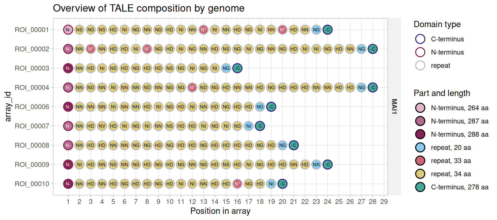
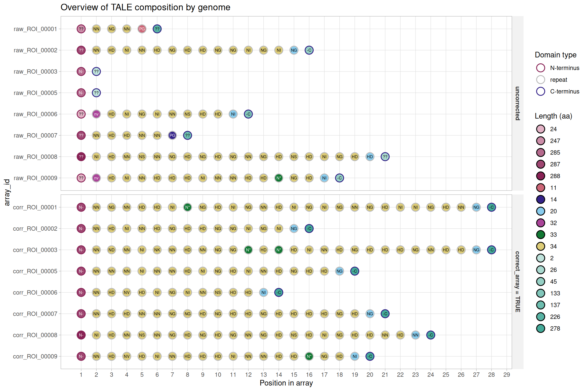
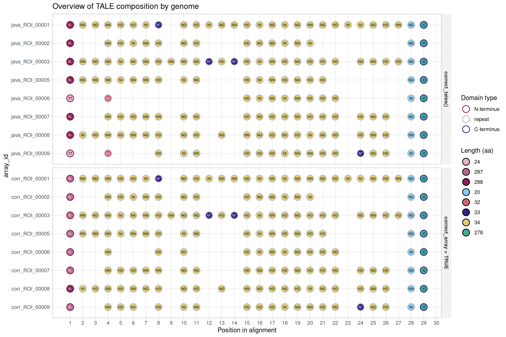

# Mining TALE sequences in genomes

This is the first of a set of articles walking through a typical study
of TALE diversity: finding TALE genes in a genome (here), classifying
the arrays found into groups of related sequences, aligning those
groups, and predicting the DNA targets of the TALEs they contain. The
other articles in the set are side branches: deep dives into a single
class (`tales`, `tales_msa`) and one case study on naturally truncated
TALEs. Each is linked from the point where it becomes relevant.

This article covers TALE discovery with AnnoTALE and
[`tell_tales()`](https://scunnac.github.io/tantale/reference/tell_tales.md).
Because of their repetitive nature *tal* genes cannot be assembled from
short read sequencing technologies data. This is why now most of the
genomes of *tal* bearing bacteria are sequenced with long read
technologies which may be error prone. Those assemblies are not always
clean, and
[`tell_tales()`](https://scunnac.github.io/tantale/reference/tell_tales.md)
can sometimes be fooled. tantale offers two ways to correct frameshifts.
They work differently, neither is guaranteed to succeed, and
[`tales_anomalies()`](https://scunnac.github.io/tantale/reference/tales_anomalies.md)
tells you which arrays still need attention after either one.

Code

``` r
library(tantale)
library(dplyr)
```

> **The genomes used throughout**
>
> Four *Xanthomonas oryzae* genomes appear across this set of articles:
> **MAI1**, **BAI3** and **PXO86** are “clean” assemblies, and
> **BAI3-1-1** is a deliberately error-prone one: an assembly of the
> same BAI3 background with a deleted *tal* locus, carrying real
> sequencing/assembly artefacts in its TALE loci. A mining pipeline
> meets this kind of input routinely in practice, and it is what the
> second half of this article is about.

## 1 AnnoTALE, the standard tool

[AnnoTALE](https://doi.org/10.1038/srep21077) is the standard tool for
finding and annotating *tal* genes in bacterial genome sequences. Its
`predict` stage locates TALE genes in a genome and flags those likely to
be pseudogenes. Its `analyze` stage splits each predicted protein into
its N-terminal region, repeats and C-terminal region, and reads the RVD
of every repeat. A third stage, `build`, assigns TALEs to the classes of
the AnnoTALE nomenclature. tantale runs the first two with
[`run_annotale_predict()`](https://scunnac.github.io/tantale/reference/run_annotale_predict.md)
and the third with
[`run_annotale_build()`](https://scunnac.github.io/tantale/reference/run_annotale_build.md),
and
[`tales_from_annotale()`](https://scunnac.github.io/tantale/reference/tales_from_annotale.md)
turns the output of `predict` into a `tales` object. tantale ships
AnnoTALE’s output for four TALEs of BAI3:

Code

``` r
annotale_example <- system.file("extdata", "annotaleExampleOutput", package = "tantale")
bai3_sample <- tales_from_annotale(annotale_example)
bai3_sample
#> <tales> 4 arrays, 96 parts
#>   layers: rvd   |   6 other columns
#>                                 rvd
#>   bai3_sample_tal_genomic_regions-tempTALE1  NTERM NN NG NN HD HD NI N* NG HD NI NG NN  ...
#>   bai3_sample_tal_genomic_regions-tempTALE2  NTERM NN HD NI NN HD NG HD HD NG NG NI NG  ...
#>   bai3_sample_tal_genomic_regions-tempTALE3  NTERM NN ND NN NI NK NN HD NN NG NG N* HD  ...
#>   bai3_sample_tal_genomic_regions-tempTALE4  NTERM NI HD NN NS NN NG HD NG HD NG NN NG  ...
```

Each terminal region is searched with the profile HMM of the TALE N- or
C-terminal domain, and marked `NTERM` or `CTERM` when it matches
(`XXXXX` otherwise). A match shows that the region is related to a TALE
terminus. A shorter terminus that matches is coded the same way,
although it has probably lost part of its function (see [Genuine
truncTALEs](https://scunnac.github.io/tantale/articles/trunctale_correction.html#sec-two-trunctales)).
On a whole genome, the same object comes from two calls (not run here,
as `predict` takes a couple of minutes per genome):

Code

``` r
mai1_annotale_dir <- file.path(tempdir(), "MAI1_annotale")
run_annotale_predict(tantale_genome("MAI1"),
                     output_dir = mai1_annotale_dir)
mai1_annotale <- tales_from_annotale(mai1_annotale_dir)
```

On the clean BAI3 assembly, AnnoTALE predicts nine TALEs, none flagged.
On BAI3-1-1, the error-prone assembly of the same background, it
predicts eight and flags all eight as putative pseudogenes.
[`tell_tales()`](https://scunnac.github.io/tantale/reference/tell_tales.md)
is built for such genomes. It locates candidate arrays with DNA profiles
of the three TALE regions before any ORF is predicted, reports the DNA
evidence for each array (which terminus profiles matched, how much of
the region the longest ORF covers), can correct frameshifts in each
array before AnnoTALE `analyze` reads it, and keeps per-array reports
and terminus alignments for inspection. The rest of this article uses
[`tell_tales()`](https://scunnac.github.io/tantale/reference/tell_tales.md).

## 2 Finding TALE loci in genomic DNA

[`tell_tales()`](https://scunnac.github.io/tantale/reference/tell_tales.md)
searches a genome with `nhmmer`, using three profile HMMs tuned to the
N-terminus, the repeat unit, and the C-terminus of a TALE CDS. Hits are
merged, grouped into candidate arrays by proximity, and each array’s
longest ORF is handed to AnnoTALE to split into parts and call its RVD
sequence. `NTERM`/`CTERM` markers are added at either end of the RVD
string wherever a terminus was identified this way, so a downstream
alignment knows where an array actually starts and ends.

A scratch directory holds everything this set of articles builds:

Code

``` r
out <- fs::dir_create(file.path(tempdir(), "tale_mining"))
```

Start with MAI1, a clean assembly, to see what discovery looks like when
nothing goes wrong:

Code

``` r
mai1_fa <- tantale_genome("MAI1")
mai1_dir <- file.path(out, "MAI1")
```

Code

``` r
invisible(tell_tales(subject_file = mai1_fa, output_dir = mai1_dir))
```

The result on disk is a directory of reports and fasta files. The result
in R is a `tales` object, with one row per part (repeat or terminus):

Code

``` r
mai1 <- suppressWarnings(tales_from_telltales(mai1_dir))
mai1
#> <tales> 9 arrays, 198 parts
#>   layers: rvd   |   6 other columns
#>              rvd
#>   ROI_00001  NTERM NS NG NS HD NI NG NN NG HD NI NN N* NI NN HD NG NI NN N ...
#>   ROI_00002  NTERM NN N* NN HD HD NI N* NG HD NI NG NN HD NS NG NI NG NN N ...
#>   ...        ...
#>   ROI_00009  NTERM NI HD NN NS NN NG HD NG HD NG NN NG HD NS HD NI NG HD H ...
#>   ROI_00010  NTERM NN HD NN HD NG HD HD NG HD NI NI NN HD HD N* NG HD NI CTERM
```

> **What a `tales` object actually is**
>
> Rows, columns, subsetting, and the `dom_code` column that the rest of
> tantale is built on are covered in depth in [the `tales` class
> article](https://scunnac.github.io/tantale/articles/tales_class.md) –
> read it once this walkthrough has given you an object to look at.

[`plot()`](https://rdrr.io/r/graphics/plot.default.html) on a `tales`
gives a compact overview of what was found: every array’s parts,
positioned within the array, outlined by domain type and filled by
amino-acid length, with the RVD printed on each repeat.

Code

``` r
plot(mai1)
```

[](https://scunnac.github.io/tantale/articles/tale_mining_files/figure-html/fig-mai1-composition-1.png "Figure 1: Domain composition of the nine TALE arrays found in MAI1.")

Figure 1: Domain composition of the nine TALE arrays found in MAI1.

[Figure 1](#fig-mai1-composition) already shows something worth
noticing: array lengths vary, from 14 to 26 repeats (counting the final
half-repeat), and each array’s parts sit side by side with no gaps,
because nothing has been aligned yet. `position_in_array` just counts
parts within each array independently.

## 3 What `tell_tales()` writes to disk

Besides the RVD sequences and the TALE ORFs themselves,
[`tell_tales()`](https://scunnac.github.io/tantale/reference/tell_tales.md)
writes three tab-separated reports, which
[`tales_from_telltales()`](https://scunnac.github.io/tantale/reference/tales_from_telltales.md)
reads back to build the object above. They are worth knowing about
directly, since they carry a few things the `tales` object does not.

| file                 | one row per            | worth knowing                                                                                                                                                             |
|:---------------------|:-----------------------|:--------------------------------------------------------------------------------------------------------------------------------------------------------------------------|
| `hits_report.tsv`    | raw `nhmmer` hit       | `codon_count`, `frameshift_count` per hit – before any merging or correction                                                                                              |
| `domains_report.tsv` | domain, after AnnoTALE | what AnnoTALE actually parsed out of the ORF                                                                                                                              |
| `array_report.tsv`   | candidate array        | `nterm_dna_hit`/`cterm_dna_hit`, `nterm_aa_hit`/`cterm_aa_hit`, `has_aberrant_repeat`, `orf_coverage`, and (with correction) `predicted_ins_count`/`predicted_dels_count` |

`array_report.tsv` is the one this article leans on most, so it is worth
reading directly:

Code

``` r
array_report <- readr::read_tsv(file.path(mai1_dir, "array_report.tsv"),
                                show_col_types = FALSE)
array_report %>%
  select(array_id, nterm_dna_hit, cterm_dna_hit, longest_orf_length, orf_coverage)
#> # A tibble: 10 × 5
#>    array_id  nterm_dna_hit cterm_dna_hit longest_orf_length orf_coverage
#>    <chr>     <lgl>         <lgl>                      <dbl>        <dbl>
#>  1 ROI_00005 FALSE         FALSE                         NA           NA
#>  2 ROI_00003 TRUE          TRUE                        3087           91
#>  3 ROI_00007 TRUE          TRUE                        3288           91
#>  4 ROI_00006 TRUE          TRUE                        3393           91
#>  5 ROI_00010 TRUE          TRUE                        3492           92
#>  6 ROI_00008 TRUE          TRUE                        3594           92
#>  7 ROI_00001 TRUE          TRUE                        3825           92
#>  8 ROI_00009 TRUE          TRUE                        3903           92
#>  9 ROI_00002 TRUE          TRUE                        4302           93
#> 10 ROI_00004 TRUE          TRUE                        4305           93
```

`orf_coverage` is the longest ORF found, as a percentage of the whole
candidate array region length; a clean array’s ORF covers 91-93% of it
here. That number is about to matter a great deal.

The report has one more row than the `tales` object has arrays.
`ROI_00005` is a candidate region with no terminus hit (`nterm_dna_hit`
and `cterm_dna_hit` both `FALSE`) and no ORF length; it yields no parts,
so it is absent from the object and from
[Figure 1](#fig-mai1-composition). Using
[`tell_tales()`](https://scunnac.github.io/tantale/reference/tell_tales.md)
with a more stringent `min_dna_hits` or `min_array_length` parameter
values would probably have got rid of it right away.

## 4 When discovery goes wrong: detecting anomalies

MAI1 is a good assembly, and every array in the `tales` object above
came back complete. That is not guaranteed. Running the same search on
BAI3-1-1, the deliberately error-prone assembly, shows what an assembly
artefact does to the pipeline.

Code

``` r
bai311_fa <- tantale_genome("BAI3-1-1")
bai311_raw_dir <- file.path(out, "BAI3-1-1_raw")
```

Code

``` r
invisible(tell_tales(subject_file = bai311_fa, output_dir = bai311_raw_dir,
                     cterm_min_score = 300))
```

A first sign that there is something unexpected with these TALEs
predictions are the warnings obtained when importing `tell_tales`
results as a `tales` object:

Code

``` r
bai311_raw <- tales_from_telltales(bai311_raw_dir)
#> Warning: 8 arrays have biological anomalies.
#> ✖ Arrays: "ROI_00001", "ROI_00002", "ROI_00003", "ROI_00005", "ROI_00006",
#>   "ROI_00007", "ROI_00008", and "ROI_00009"
#> ℹ Reasons: terminus_unmatched and no_repeat
#> ℹ Inspect with `tales_anomalies()`, or drop with `sanitize = TRUE`.
```

[`tales_anomalies()`](https://scunnac.github.io/tantale/reference/tales_anomalies.md)
lists the arrays concerned and why. It reports every array that is not a
standard TALE (an N-terminus, one or more repeats and a C-terminus, both
termini matching the profile of their TALE domain), and every array
whose content is inconsistent (missing sequence data, impossible
terminus arrangements, coordinate disagreements):

Code

``` r
tales_anomalies(bai311_raw)
#> # A tibble: 13 × 3
#>    array_id  check              detail                                          
#>    <chr>     <chr>              <chr>                                           
#>  1 ROI_00001 terminus_unmatched N-terminus not matched by its TALE domain profi…
#>  2 ROI_00001 terminus_unmatched C-terminus not matched by its TALE domain profi…
#>  3 ROI_00002 terminus_unmatched N-terminus not matched by its TALE domain profi…
#>  4 ROI_00003 no_repeat          no repeat                                       
#>  5 ROI_00003 terminus_unmatched C-terminus not matched by its TALE domain profi…
#>  6 ROI_00005 no_repeat          no repeat                                       
#>  7 ROI_00005 terminus_unmatched C-terminus not matched by its TALE domain profi…
#>  8 ROI_00006 terminus_unmatched N-terminus not matched by its TALE domain profi…
#>  9 ROI_00007 terminus_unmatched N-terminus not matched by its TALE domain profi…
#> 10 ROI_00007 terminus_unmatched C-terminus not matched by its TALE domain profi…
#> 11 ROI_00008 terminus_unmatched N-terminus not matched by its TALE domain profi…
#> 12 ROI_00008 terminus_unmatched C-terminus not matched by its TALE domain profi…
#> 13 ROI_00009 terminus_unmatched N-terminus not matched by its TALE domain profi…
```

`ROI_00003` and `ROI_00005` have no repeat at all: AnnoTALE could not
parse a repeat-array structure out of the longest predicted ORF. Five
other arrays have a terminus coded `XXXXX`, which does not match the
profile of its TALE domain. Their `orf_coverage` shows why:

Code

``` r
readr::read_tsv(file.path(bai311_raw_dir, "array_report.tsv"),
                show_col_types = FALSE) %>%
  select(array_id, nterm_dna_hit, cterm_dna_hit,
         longest_orf_length, orf_coverage, rvd_string) %>%
  arrange(array_id) %>%
  knitr::kable()
```

| array_id  | nterm_dna_hit | cterm_dna_hit | longest_orf_length | orf_coverage | rvd_string                                                           |
|:----------|:--------------|:--------------|-------------------:|-------------:|:---------------------------------------------------------------------|
| ROI_00001 | TRUE          | TRUE          |               1764 |           38 | XXXXX-NN-NG-NN-PG-XXXXX                                              |
| ROI_00002 | TRUE          | TRUE          |               2385 |           70 | XXXXX-NN-HD-NI-NN-HD-NG-HD-HD-NG-NG-NI-NG-NI-NG-CTERM                |
| ROI_00003 | TRUE          | TRUE          |                864 |           19 | NA                                                                   |
| ROI_00004 | FALSE         | FALSE         |                 NA |           NA | NA                                                                   |
| ROI_00005 | TRUE          | TRUE          |                864 |           23 | NA                                                                   |
| ROI_00006 | TRUE          | TRUE          |               1446 |           45 | XXXXX-NV-HD-NI-NG-NI-NN-NS-HD-HD-NI-CTERM                            |
| ROI_00007 | TRUE          | TRUE          |               1827 |           47 | XXXXX-NN-HD-HD-NN-NN-PG-XXXXX                                        |
| ROI_00008 | TRUE          | TRUE          |               2841 |           67 | XXXXX-NI-HD-NN-NS-NN-NG-HD-NG-HD-NG-NN-NG-HD-NS-HD-NI-NG-HD-HD-XXXXX |
| ROI_00009 | TRUE          | TRUE          |               1791 |           47 | XXXXX-NV-HD-NI-NN-HD-HD-HD-NI-NN-NN-HD-HD-N\*-NG-HD-NI-CTERM         |

`ROI_00003` and `ROI_00005` predicted ORFs cover 19% and 23% of their
candidate region.

No array in this assembly reaches MAI1’s 91-93%: the others fall between
38% and 70%. This is unusual, and
[`tales_anomalies()`](https://scunnac.github.io/tantale/reference/tales_anomalies.md)
flags every one of them except `ROI_00002`. A close look at the
‘array_report.tsv’ table indicates that loci such as `ROI_00001` and
`ROI_00007` have a predicted ORF encoding very few repeats (4-6), and
only repeats (see `rvd_string`), even if both termini profiles were
found at the DNA level (`nterm_dna_hit` and `cterm_dna_hit` are both
`TRUE`).

Because, in practice this barely happens in high quality genomes, in the
absence of any further evidence, this could be explained by in/del(s)
along the CDS that completely break them.

A premature stop could also be genuine: some strains carry naturally
truncated TALEs (see [Genuine truncTALEs and frameshift
correction](https://scunnac.github.io/tantale/articles/trunctale_correction.md)).
In BAI3-1-1 the corrections below settle it: once repaired, both arrays
recover the coverage of a clean MAI1 array, as expected of assembly
frameshifts.

## 5 Correcting frameshifts, two ways

tantale offers two distinct routes to a corrected sequence: one corrects
candidate *arrays* after they have been found, from inside
[`tell_tales()`](https://scunnac.github.io/tantale/reference/tell_tales.md);
the other corrects the *genome* before discovery starts. Both can fail,
in different ways, so [Section 4](#sec-anomalies)’s check is worth
repeating after either one. Run on the same genome below, **they
disagree about which array still needs help**.

### 5.1 Correcting inside `tell_tales()`

`correct_array = TRUE` runs
[`DECIPHER::CorrectFrameshifts()`](https://rdrr.io/pkg/DECIPHER/man/CorrectFrameshifts.html)
on each candidate array, aligning it against a shipped reference set of
real TALE proteins and inferring the indels needed to remove premature
stops. `max_comparisons` caps how many of these references each array is
aligned against; [Section 5.4](#sec-max-comparisons) explains its
default, 50.

Code

``` r
bai311_corr_dir <- file.path(out, "BAI3-1-1_corrected")
```

Code

``` r
t_corr <- system.time(
  tell_tales(subject_file = bai311_fa, output_dir = bai311_corr_dir,
             cterm_min_score = 300, correct_array = TRUE)
)
#> Warning: After correction, ROI_00001 sequence contains 'N's which will be substituted by
#> 'C's in order to run AnnoTALE analyze for RVDs prediction.
#> Warning: After correction, ROI_00002 sequence contains 'N's which will be substituted by
#> 'C's in order to run AnnoTALE analyze for RVDs prediction.
#> Warning: After correction, ROI_00003 sequence contains 'N's which will be substituted by
#> 'C's in order to run AnnoTALE analyze for RVDs prediction.
#> Warning: After correction, ROI_00005 sequence contains 'N's which will be substituted by
#> 'C's in order to run AnnoTALE analyze for RVDs prediction.
#> Warning: After correction, ROI_00006 sequence contains 'N's which will be substituted by
#> 'C's in order to run AnnoTALE analyze for RVDs prediction.
#> Warning: After correction, ROI_00007 sequence contains 'N's which will be substituted by
#> 'C's in order to run AnnoTALE analyze for RVDs prediction.
#> Warning: After correction, ROI_00008 sequence contains 'N's which will be substituted by
#> 'C's in order to run AnnoTALE analyze for RVDs prediction.
#> Warning: After correction, ROI_00009 sequence contains 'N's which will be substituted by
#> 'C's in order to run AnnoTALE analyze for RVDs prediction.
```

The warnings come from the correction itself. Where
[`DECIPHER::CorrectFrameshifts()`](https://rdrr.io/pkg/DECIPHER/man/CorrectFrameshifts.html)
inserts a base to restore the reading frame, it writes an `N`, and
[`tell_tales()`](https://scunnac.github.io/tantale/reference/tell_tales.md)
turns it into a `C` so that AnnoTALE can translate the sequence.

Importing the result as a `tales` object raises no warning, and
[`tales_anomalies()`](https://scunnac.github.io/tantale/reference/tales_anomalies.md)
finds nothing:

Code

``` r
bai311_corr <- tales_from_telltales(bai311_corr_dir)
tales_anomalies(bai311_corr)
#> # A tibble: 0 × 3
#> # ℹ 3 variables: array_id <chr>, check <chr>, detail <chr>
```

To see what changed,
[`tales_bind()`](https://scunnac.github.io/tantale/reference/tales_bind.md)
combines the uncorrected and the corrected arrays into one object, which
[`plot()`](https://rdrr.io/r/graphics/plot.default.html) draws with a
single legend. The array identifiers must be unique across the objects
it binds, so each object’s get a prefix, and a `method` column records
the correction each array went through (a factor, which sets the order
of the panels):

Code

``` r
method_levels <- c("uncorrected", "correct_tales()", "correct_array = TRUE")
tag_method <- function(x, method, prefix) {
  mutate(x, method = factor(method, levels = method_levels),
         array_id = paste0(prefix, "_", array_id))
}
bai311_compared <- tales_bind(
  tag_method(bai311_raw, "uncorrected", "raw"),
  tag_method(bai311_corr, "correct_array = TRUE", "corr")
)
```

[`tales_bind()`](https://scunnac.github.io/tantale/reference/tales_bind.md)
warns again about the anomalies of the uncorrected arrays; that warning
is hidden here. `facet_by = "method"` draws one panel per method:

Code

``` r
plot(bai311_compared, facet_by = "method")
```

[](https://scunnac.github.io/tantale/articles/tale_mining_files/figure-html/plot-raw-vs-corrected-1.png)

The uncorrected talome is extremely messy: most arrays have no canonical
N- and C-termini, and `ROI_00003` and `ROI_00005` essentially encode
shorter N-termini only. In contrast, the corrected arrays all display
both termini with a canonical length, which suggests that these TALEs
are likely to have a standard transcription activation function.

### 5.2 Correcting the genome, before discovery

[`correct_tales()`](https://scunnac.github.io/tantale/reference/correct_tales.md)
takes a different, faster route. It wraps the Java `TALEcorrection`
tool, which scans the *whole input genome* against profile HMMs and
repairs the frameshifts it finds, before
[`tell_tales()`](https://scunnac.github.io/tantale/reference/tell_tales.md)
ever runs. As a genome-wide pre-processing step that needs no candidate
arrays, it is worth trying first on a large or especially error-prone
assembly (an ONT-sequenced genome, say).

Code

``` r
bai311_java_fa <- file.path(out, "BAI3-1-1_java_corrected.fa")
```

Code

``` r
t_java <- system.time(
  corrections <- correct_tales(uncorrected_path = bai311_fa,
                               corrected_path = bai311_java_fa,
                               return_corrections = TRUE)
)
```

[`correct_tales()`](https://scunnac.github.io/tantale/reference/correct_tales.md)
reports every edit it made, genome-wide, as a table of positions and
inserted or deleted bases. This genome needed 70:

Code

``` r
head(corrections, 4)
#> # A tibble: 4 × 4
#>   seqName  posInOriginSeq type      substitution
#>   <chr>             <dbl> <chr>     <chr>       
#> 1 contig_1        4260089 insertion - -> g      
#> 2 contig_1        4260088 insertion - -> c      
#> 3 contig_1        4260087 insertion - -> c      
#> 4 contig_1        4259647 insertion - -> g
```

[`tell_tales()`](https://scunnac.github.io/tantale/reference/tell_tales.md)
then runs on the corrected genome exactly as it would on any other, with
no `correct_array`, because the correction already happened upstream:

Code

``` r
bai311_java_dir <- file.path(out, "BAI3-1-1_java_tell_tales")
```

Code

``` r
t_java <- t_java + system.time(
  tell_tales(subject_file = bai311_java_fa, output_dir = bai311_java_dir,
             cterm_min_score = 300, correct_array = FALSE)
)
bai311_java <- tales_from_telltales(bai311_java_dir)
```

Code

``` r
tales_anomalies(bai311_java)
#> # A tibble: 2 × 3
#>   array_id  check              detail                                           
#>   <chr>     <chr>              <chr>                                            
#> 1 ROI_00006 terminus_unmatched N-terminus not matched by its TALE domain profil…
#> 2 ROI_00009 terminus_unmatched N-terminus not matched by its TALE domain profil…
```

[`correct_tales()`](https://scunnac.github.io/tantale/reference/correct_tales.md)
fixes most arrays but fails to repair the N-termini of `ROI_00006` and
`ROI_00009`, which still do not match the TALE N-terminal profile.

To see where the two corrections differ, bind their arrays as above and
align them.
[`tales_align()`](https://scunnac.github.io/tantale/reference/tales_align.md)
aligns the arrays on their RVDs, and `position = "alignment"` then
places each part in its alignment column instead of at its position in
the array, so that corresponding repeats share a column.
[`as_tales()`](https://scunnac.github.io/tantale/reference/as_tales.md)
turns the alignment back into a plain `tales`, for which
[`plot()`](https://rdrr.io/r/graphics/plot.default.html) draws this
composition view (on the alignment object itself it draws an alignment
heatmap):

Code

``` r
java_vs_corr <- tales_bind(
  tag_method(bai311_java, "correct_tales()", "java"),
  tag_method(bai311_corr, "correct_array = TRUE", "corr")
)
java_vs_corr_msa <- tales_align(java_vs_corr)
```

Code

``` r
plot(as_tales(java_vs_corr_msa), position = "alignment", facet_by = "method")
```

[](https://scunnac.github.io/tantale/articles/tale_mining_files/figure-html/plot-java-vs-corrected-1.png)

The two corrections agree everywhere except at the start of `ROI_00006`
and `ROI_00009`. After
[`correct_tales()`](https://scunnac.github.io/tantale/reference/correct_tales.md),
both begin with a 24-aa N-terminus followed by a 32-aa repeat read as
`nv`, and the `NN` and `HD` repeats that open these arrays after
correction inside
[`tell_tales()`](https://scunnac.github.io/tantale/reference/tell_tales.md)
are missing.

### 5.3 What is the best method for correcting the DNA sequences of TALE arrays?

On this genome, correction inside
[`tell_tales()`](https://scunnac.github.io/tantale/reference/tell_tales.md)
gives the better result: 8 of 8 arrays come out as standard TALEs,
against 6 of 8 after
[`correct_tales()`](https://scunnac.github.io/tantale/reference/correct_tales.md).
It is also about as fast: on the machine that built this page it took 62
seconds. The Java route needs two steps,
[`correct_tales()`](https://scunnac.github.io/tantale/reference/correct_tales.md)
and then the
[`tell_tales()`](https://scunnac.github.io/tantale/reference/tell_tales.md)
run that finds the arrays in the corrected genome, and together they
took 43 seconds. One genome is a small sample, however.
[`correct_tales()`](https://scunnac.github.io/tantale/reference/correct_tales.md)
repairs the whole genome in one pass, and the corrected genome can serve
other analyses as well. On a new, error-prone assembly, running both
routes and comparing their
[`tales_anomalies()`](https://scunnac.github.io/tantale/reference/tales_anomalies.md)
costs a few minutes and shows the arrays on which they agree.

### 5.4 `max_comparisons` sets the depth of the search

`max_comparisons` is the main control on how long correction inside
[`tell_tales()`](https://scunnac.github.io/tantale/reference/tell_tales.md)
takes.
[`DECIPHER::CorrectFrameshifts()`](https://rdrr.io/pkg/DECIPHER/man/CorrectFrameshifts.html)
ranks the references by a quick distance and aligns each array against
the closest `max_comparisons` of them. When the cap is too low, an array
whose good references rank further down is corrected against a poor one.
BAI3-1-1 has one such array, `ROI_00001`. Measured once on this genome,
against the 494 shipped references:

| `max_comparisons` | seconds | standard TALEs | `ROI_00001`                                |
|-------------------|---------|----------------|--------------------------------------------|
| no correction     | 19      | 0 of 8         | 4 repeats, neither terminus matched        |
| 2 to 5            | 19-22   | 7 of 8         | N-terminus unmatched, 19 of its 26 repeats |
| 10, 20            | 26, 34  | 7 of 7         | not parsed by AnnoTALE                     |
| 50 (default)      | 61      | 8 of 8         | N-terminus, 26 repeats, C-terminus         |
| 100               | 101     | 8 of 8         | as at 50                                   |
| all 494           | 455     | 8 of 8         | as at 50                                   |

At 2 to 5,
[`tales_anomalies()`](https://scunnac.github.io/tantale/reference/tales_anomalies.md)
flags `ROI_00001`. At 10 and 20, AnnoTALE cannot split the corrected ORF
into parts, so the array never reaches the `tales` object, and
[`tales_from_telltales()`](https://scunnac.github.io/tantale/reference/tales_from_telltales.md)
warns about it:

Code

``` r
bai311_mc20_dir <- file.path(out, "BAI3-1-1_corrected_20")
```

Code

``` r
invisible(tell_tales(subject_file = bai311_fa, output_dir = bai311_mc20_dir,
                     cterm_min_score = 300, correct_array = TRUE,
                     max_comparisons = 20))
```

Code

``` r
bai311_mc20 <- tales_from_telltales(bai311_mc20_dir)
#> Warning: AnnoTALE could not split 1 candidate array into parts; it is absent from the
#> result.
#> ℹ Affected array: "ROI_00001"
#> ℹ It has a TALE terminus DNA hit in 'array_report.tsv'.
#> ℹ A larger `max_comparisons` in `tell_tales()` may correct it well enough to
#>   parse.
```

On MAI1, BAI3 and PXO86, the other genomes shipped with the package, 50
gives the same corrected sequences as the full search. With a reference
set of your own, compare a run at the default with one at
`max_comparisons = NULL` before relying on the cap.

## 6 Moving on with what you have

`bai311_corr` needs none of this: it is already clean. A route that
stops short of that, such as
[`correct_tales()`](https://scunnac.github.io/tantale/reference/correct_tales.md)
above (which left the N-termini of `ROI_00006` and `ROI_00009`
unmatched), still needs a decision about what to do with what remains
flagged. `tales(x, sanitize = TRUE)` drops it so an analysis can proceed
on what is clean, with a warning naming each dropped array and the
reason:

Code

``` r
bai311_clean <- tales(bai311_java, sanitize = TRUE)
#> Warning: Dropped 2 arrays with biological anomalies.
#> ✖ Arrays: "ROI_00006" and "ROI_00009"
#> ℹ Reason: terminus_unmatched
n_distinct(bai311_java$array_id) - n_distinct(bai311_clean$array_id)
#> [1] 2
```

> **What the rest of this set of articles uses**
>
> From here on, “BAI3-1-1” means `bai311_corr`, the correction made
> inside
> [`tell_tales()`](https://scunnac.github.io/tantale/reference/tell_tales.md)
> ([Section 5.1](#sec-best-correction)), alongside MAI1 and BAI3. PXO86,
> the fourth genome shipped with the package, is left out of the
> classification and alignment articles that follow: it is a distant
> Asian outgroup whose TALE repertoire barely overlaps the African
> strains’, and including it turns a clean set of
> one-ortholog-per-strain groups into a mix of real cross-strain groups
> and PXO86-only paralog clusters that do not illustrate the same thing.

## 7 Next

The [next
article](https://scunnac.github.io/tantale/articles/tale_classification.md)
picks up from a set of `tales` objects like the ones built here, across
several genomes this time, and classifies their arrays into groups of
related sequences with
[`tales_compare_distal()`](https://scunnac.github.io/tantale/reference/tales_compare_distal.md)
and
[`tales_group_hclust()`](https://scunnac.github.io/tantale/reference/tales_group_hclust.md)/[`tales_group_kmedoids()`](https://scunnac.github.io/tantale/reference/tales_group_kmedoids.md).
