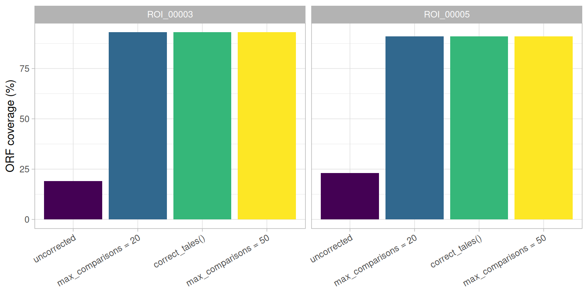

# Mining TALE sequences in genomes

This is the first of a set of articles walking through a typical study
of TALE diversity: finding TALE genes in a genome (here), classifying
the arrays found into groups of related sequences, aligning those
groups, and predicting the DNA targets of the TALEs they contain. The
other articles in the set are side branches: deep dives into a single
class (`tales`, `tales_msa`) and one case study on naturally truncated
TALEs. Each is linked from the point where it becomes relevant.

This article covers TALE discovery with AnnoTALE and
[`tell_tales()`](https://scunnac.github.io/tantale/reference/tell_tales.md).
Because of their repetitive nature *tal* genes cannot be assembled from
short read sequencing technologies data. This is why now most of the
genomes of *tal* bearing bacteria are sequenced with long read
technologies which may be error prone. Those assemblies are not always
clean, and
[`tell_tales()`](https://scunnac.github.io/tantale/reference/tell_tales.md)
can sometimes be fooled. tantale offers two ways to correct frameshifts.
They work differently, neither is guaranteed to succeed, and
[`tales_anomalies()`](https://scunnac.github.io/tantale/reference/tales_anomalies.md)
tells you which arrays still need attention after either one.

Code

``` r
library(tantale)
library(dplyr)
```

> **The genomes used throughout**
>
> Four *Xanthomonas oryzae* genomes appear across this set of articles:
> **MAI1**, **BAI3** and **PXO86** are “clean” assemblies, and
> **BAI3-1-1** is a deliberately error-prone one: an assembly of the
> same BAI3 background with *talC* deleted, carrying real
> sequencing/assembly artefacts in its TALE loci. A mining pipeline
> meets this kind of input routinely in practice, and it is what the
> second half of this article is about.

## 1 AnnoTALE, the standard tool

[AnnoTALE](https://doi.org/10.1038/srep21077) is the standard tool for
finding and annotating *tal* genes in bacterial genome sequences. Its
`predict` stage locates TALE genes in a genome and flags those likely to
be pseudogenes. Its `analyze` stage splits each predicted protein into
its N-terminal region, repeats and C-terminal region, and reads the RVD
of every repeat. A third stage, `build`, assigns TALEs to the classes of
the AnnoTALE nomenclature. tantale runs the first two with
[`run_annotale_predict()`](https://scunnac.github.io/tantale/reference/run_annotale_predict.md)
and the third with
[`run_annotale_build()`](https://scunnac.github.io/tantale/reference/run_annotale_build.md),
and
[`tales_from_annotale()`](https://scunnac.github.io/tantale/reference/tales_from_annotale.md)
turns the output of `predict` into a `tales` object. tantale ships
AnnoTALE’s output for four TALEs of BAI3:

Code

``` r
annotale_example <- system.file("extdata", "annotaleExampleOutput", package = "tantale")
bai3_sample <- tales_from_annotale(annotale_example)
bai3_sample
#> <tales> 4 arrays, 96 parts
#>   layers: rvd   |   6 other columns
#>                                 rvd
#>   bai3_sample_tal_genomic_regions-tempTALE1  NTERM NN NG NN HD HD NI N* NG HD NI NG NN  ...
#>   bai3_sample_tal_genomic_regions-tempTALE2  NTERM NN HD NI NN HD NG HD HD NG NG NI NG  ...
#>   bai3_sample_tal_genomic_regions-tempTALE3  NTERM NN ND NN NI NK NN HD NN NG NG N* HD  ...
#>   bai3_sample_tal_genomic_regions-tempTALE4  NTERM NI HD NN NS NN NG HD NG HD NG NN NG  ...
```

Each terminal region is searched with the profile HMM of the TALE N- or
C-terminal domain, and marked `NTERM` or `CTERM` when it matches
(`XXXXX` otherwise). On a whole genome, the same object comes from two
calls (not run here, as `predict` takes a couple of minutes per genome):

Code

``` r
mai1_annotale_dir <- file.path(tempdir(), "MAI1_annotale")
run_annotale_predict(system.file("extdata", "MAI1.fa", package = "tantale"),
                     output_dir = mai1_annotale_dir)
mai1_annotale <- tales_from_annotale(mai1_annotale_dir)
```

On the clean BAI3 assembly, AnnoTALE predicts nine TALEs, none flagged.
On BAI3-1-1, the error-prone assembly of the same background, it
predicts eight and flags all eight as putative pseudogenes.
[`tell_tales()`](https://scunnac.github.io/tantale/reference/tell_tales.md)
is built for such genomes. It locates candidate arrays with DNA profiles
of the three TALE regions before any ORF is predicted, reports the DNA
evidence for each array (which terminus profiles matched, how much of
the region the longest ORF covers), can correct frameshifts in each
array before AnnoTALE `analyze` reads it, and keeps per-array reports
and terminus alignments for inspection. The rest of this article uses
[`tell_tales()`](https://scunnac.github.io/tantale/reference/tell_tales.md).

## 2 Finding TALE loci in genomic DNA

[`tell_tales()`](https://scunnac.github.io/tantale/reference/tell_tales.md)
searches a genome with `nhmmer`, using three profile HMMs tuned to the
N-terminus, the repeat unit, and the C-terminus of a TALE CDS. Hits are
merged, grouped into candidate arrays by proximity, and each array’s
longest ORF is handed to AnnoTALE to split into parts and call its RVD
sequence. `NTERM`/`CTERM` markers are added at either end of the RVD
string wherever a terminus was identified this way, so a downstream
alignment knows where an array actually starts and ends.

A scratch directory holds everything this set of articles builds:

Code

``` r
out <- fs::dir_create(file.path(tempdir(), "tale_mining"))
```

Start with MAI1, a clean assembly, to see what discovery looks like when
nothing goes wrong:

Code

``` r
mai1_fa <- system.file("extdata", "MAI1.fa", package = "tantale", mustWork = TRUE)
mai1_dir <- file.path(out, "MAI1")
```

Code

``` r
invisible(tell_tales(subject_file = mai1_fa, output_dir = mai1_dir))
```

The result on disk is a directory of reports and fasta files. The result
in R is a `tales` object, with one row per part (repeat or terminus):

Code

``` r
mai1 <- suppressWarnings(tales_from_telltales(mai1_dir))
mai1
#> <tales> 9 arrays, 198 parts
#>   layers: rvd   |   6 other columns
#>              rvd
#>   ROI_00001  NTERM NS NG NS HD NI NG NN NG HD NI NN N* NI NN HD NG NI NN N ...
#>   ROI_00002  NTERM NN N* NN HD HD NI N* NG HD NI NG NN HD NS NG NI NG NN N ...
#>   ...        ...
#>   ROI_00009  NTERM NI HD NN NS NN NG HD NG HD NG NN NG HD NS HD NI NG HD H ...
#>   ROI_00010  NTERM NN HD NN HD NG HD HD NG HD NI NI NN HD HD N* NG HD NI CTERM
```

> **What a `tales` object actually is**
>
> Rows, columns, subsetting, and the `dom_code` column that the rest of
> tantale is built on are covered in depth in [the `tales` class
> article](https://scunnac.github.io/tantale/articles/tales_class.md) –
> read it once this walkthrough has given you an object to look at.

[`plot()`](https://rdrr.io/r/graphics/plot.default.html) on a `tales`
gives a compact overview of what was found: every array’s parts,
positioned within the array, outlined by domain type and filled by
amino-acid length, with the RVD printed on each repeat.

Code

``` r
plot(mai1)
```

[](https://scunnac.github.io/tantale/articles/tale_mining_files/figure-html/fig-mai1-composition-1.png "Figure 1: Domain composition of the nine TALE arrays found in MAI1.")

Figure 1: Domain composition of the nine TALE arrays found in MAI1.

[Figure 1](#fig-mai1-composition) already shows something worth
noticing: array lengths vary, from 14 to 26 repeats (counting the final
half-repeat), and each array’s parts sit side by side with no gaps,
because nothing has been aligned yet. `position_in_array` just counts
parts within each array independently.

## 3 What `tell_tales()` writes to disk

Besides the RVD sequences and the TALE ORFs themselves,
[`tell_tales()`](https://scunnac.github.io/tantale/reference/tell_tales.md)
writes three tab-separated reports, which
[`tales_from_telltales()`](https://scunnac.github.io/tantale/reference/tales_from_telltales.md)
reads back to build the object above. They are worth knowing about
directly, since they carry a few things the `tales` object does not.

| file                 | one row per            | worth knowing                                                                                                                                                             |
|:---------------------|:-----------------------|:--------------------------------------------------------------------------------------------------------------------------------------------------------------------------|
| `hits_report.tsv`    | raw `nhmmer` hit       | `codon_count`, `frameshift_count` per hit – before any merging or correction                                                                                              |
| `domains_report.tsv` | domain, after AnnoTALE | what AnnoTALE actually parsed out of the ORF                                                                                                                              |
| `array_report.tsv`   | candidate array        | `nterm_dna_hit`/`cterm_dna_hit`, `nterm_aa_hit`/`cterm_aa_hit`, `has_aberrant_repeat`, `orf_coverage`, and (with correction) `predicted_ins_count`/`predicted_dels_count` |

`array_report.tsv` is the one this article leans on most, so it is worth
reading directly:

Code

``` r
array_report <- readr::read_tsv(file.path(mai1_dir, "array_report.tsv"),
                                show_col_types = FALSE)
array_report %>%
  select(array_id, nterm_dna_hit, cterm_dna_hit, longest_orf_length, orf_coverage)
#> # A tibble: 10 × 5
#>    array_id  nterm_dna_hit cterm_dna_hit longest_orf_length orf_coverage
#>    <chr>     <lgl>         <lgl>                      <dbl>        <dbl>
#>  1 ROI_00005 FALSE         FALSE                         NA           NA
#>  2 ROI_00003 TRUE          TRUE                        3087           91
#>  3 ROI_00007 TRUE          TRUE                        3288           91
#>  4 ROI_00006 TRUE          TRUE                        3393           91
#>  5 ROI_00010 TRUE          TRUE                        3492           92
#>  6 ROI_00008 TRUE          TRUE                        3594           92
#>  7 ROI_00001 TRUE          TRUE                        3825           92
#>  8 ROI_00009 TRUE          TRUE                        3903           92
#>  9 ROI_00002 TRUE          TRUE                        4302           93
#> 10 ROI_00004 TRUE          TRUE                        4305           93
```

`orf_coverage` is the longest ORF found, as a percentage of the whole
candidate array region; a clean array’s ORF covers 91-93% of it here.
That number is about to matter a great deal.

The report has one more row than the `tales` object has arrays.
`ROI_00005` is a candidate region with no terminus hit (`nterm_dna_hit`
and `cterm_dna_hit` both `FALSE`) and no ORF length; it yields no parts,
so it is absent from the object and from
[Figure 1](#fig-mai1-composition).

## 4 When discovery goes wrong: detecting anomalies

MAI1 is a good assembly, and every array in the `tales` object above
came back complete. That is not guaranteed. Running the same search on
BAI3-1-1, the deliberately error-prone assembly, shows what an assembly
artefact does to the pipeline.

Code

``` r
bai311_fa <- system.file("extdata", "BAI3-1-1.fa", package = "tantale", mustWork = TRUE)
bai311_raw_dir <- file.path(out, "BAI3-1-1_raw")
```

Code

``` r
invisible(tell_tales(subject_file = bai311_fa, output_dir = bai311_raw_dir,
                     cterm_min_score = 300))
```

A first sign that there is something unexpected with these TALEs
predictions are the warnings obtained when importing `tell_tales`
results as a `tales` object:

Code

``` r
bai311_raw <- tales_from_telltales(bai311_raw_dir)
```

[`tales_anomalies()`](https://scunnac.github.io/tantale/reference/tales_anomalies.md)
reports arrays whose content is inconsistent: missing sequence data,
impossible terminus arrangements, coordinate disagreements:

Code

``` r
tales_anomalies(bai311_raw)
#> # A tibble: 0 × 3
#> # ℹ 3 variables: array_id <chr>, check <chr>, detail <chr>
```

Two arrays have no `rvd` at all: AnnoTALE could not parse a repeat-array
structure out of the longest predicted ORF. Their `orf_coverage` shows
why:

Code

``` r
readr::read_tsv(file.path(bai311_raw_dir, "array_report.tsv"),
                show_col_types = FALSE) %>%
  select(array_id, nterm_dna_hit, cterm_dna_hit, longest_orf_length, orf_coverage)
#> # A tibble: 9 × 5
#>   array_id  nterm_dna_hit cterm_dna_hit longest_orf_length orf_coverage
#>   <chr>     <lgl>         <lgl>                      <dbl>        <dbl>
#> 1 ROI_00004 FALSE         FALSE                         NA           NA
#> 2 ROI_00006 TRUE          TRUE                        1446           45
#> 3 ROI_00002 TRUE          TRUE                        2385           70
#> 4 ROI_00005 TRUE          TRUE                         864           23
#> 5 ROI_00009 TRUE          TRUE                        1791           47
#> 6 ROI_00007 TRUE          TRUE                        1827           47
#> 7 ROI_00008 TRUE          TRUE                        2841           67
#> 8 ROI_00001 TRUE          TRUE                        1764           38
#> 9 ROI_00003 TRUE          TRUE                         864           19
```

`ROI_00003` and `ROI_00005` predicted ORFs cover 19% and 23% of their
candidate region.

No array in this assembly reaches MAI1’s 91-93%: the others fall between
38% and 70%. This is unusual and a sign also deserving further scrutiny
even if `tales_anomalies` did not report any problem. A close look at
the ‘array_report.tsv’ table indicates that `ROI_00001` and `ROI_00007`
have a predicted ORF encoding very few repeats (4-6) even if both
termini profiles where found at the DNA level (`nterm_dna_hit` and
`cterm_dna_hit` are both `TRUE`).

Because, in practice this barely happens in high quality genomes, in the
absence of any further evidence, this could be explained by several
in/dels along the CDS that completely break it.

Code

``` r

readr::read_tsv(file.path(bai311_raw_dir, "array_report.tsv"),
                show_col_types = FALSE) %>%
  select(array_id, nterm_dna_hit, cterm_dna_hit, orf_coverage, rvd_string)
#> # A tibble: 9 × 5
#>   array_id  nterm_dna_hit cterm_dna_hit orf_coverage rvd_string                 
#>   <chr>     <lgl>         <lgl>                <dbl> <chr>                      
#> 1 ROI_00004 FALSE         FALSE                   NA <NA>                       
#> 2 ROI_00006 TRUE          TRUE                    45 XXXXX-NV-HD-NI-NG-NI-NN-NS…
#> 3 ROI_00002 TRUE          TRUE                    70 NTERM-NN-HD-NI-NN-HD-NG-HD…
#> 4 ROI_00005 TRUE          TRUE                    23 <NA>                       
#> 5 ROI_00009 TRUE          TRUE                    47 XXXXX-NV-HD-NI-NN-HD-HD-HD…
#> 6 ROI_00007 TRUE          TRUE                    47 NTERM-NN-HD-HD-NN-NN-PG-XX…
#> 7 ROI_00008 TRUE          TRUE                    67 NTERM-NI-HD-NN-NS-NN-NG-HD…
#> 8 ROI_00001 TRUE          TRUE                    38 NTERM-NN-NG-NN-PG-XXXXX    
#> 9 ROI_00003 TRUE          TRUE                    19 <NA>
```

A premature stop could also be genuine: some strains carry naturally
truncated TALEs (see [Genuine truncTALEs and frameshift
correction](https://scunnac.github.io/tantale/articles/trunctale_correction.md)).
In BAI3-1-1 the corrections below settle it: once repaired, both arrays
recover the coverage of a clean MAI1 array, as expected of assembly
frameshifts.

## 5 Correcting frameshifts, two ways

tantale offers two distinct routes to a corrected sequence: one corrects
candidate *arrays* after they have been found, from inside
[`tell_tales()`](https://scunnac.github.io/tantale/reference/tell_tales.md);
the other corrects the *genome* before discovery starts. Both can fail,
in different ways, so [Section 4](#sec-anomalies)’s check is worth
repeating after either one. Run on the same genome below, they disagree
about which array still needs help.

### 5.1 Correcting inside `tell_tales()`

`correct_array = TRUE` runs
[`DECIPHER::CorrectFrameshifts()`](https://rdrr.io/pkg/DECIPHER/man/CorrectFrameshifts.html)
on each candidate array, aligning it against a shipped reference set of
real TALE proteins and inferring the indels needed to remove premature
stops.

> **`max_comparisons` trades reliability for speed**
>
> `max_comparisons` caps how many references each array may be aligned
> against, and is the main control on how long correction takes. The
> full docs on
> [`tell_tales()`](https://scunnac.github.io/tantale/reference/tell_tales.md)
> measure the trade-off directly: four arrays aligned against a
> 1057-sequence reference set took 252 seconds uncapped and 10 seconds
> capped to 20. At a cap of 2, the aligner cannot reach a good reference
> and invents indels wholesale. A cap of 20 is usually ample, and is
> used below to keep this article fast to build; the next section shows
> a case where it is not enough.

Code

``` r
bai311_corr_dir <- file.path(out, "BAI3-1-1_corrected")
```

Code

``` r
invisible(tell_tales(subject_file = bai311_fa, output_dir = bai311_corr_dir,
                     cterm_min_score = 300,
                     correct_array = TRUE, max_comparisons = 20))
#> Finding the closest reference amino acid sequences:
#> ================================================================================
#> 
#> Time difference of 0.43 secs
#> ================================================================================
#> 
#> Time difference of 15.28 secs
```

Something is odd:

Code

``` r
bai311_corr <- tales_from_telltales(bai311_corr_dir)
```

Anomalies reported:

Code

``` r
tales_anomalies(bai311_corr)
#> # A tibble: 0 × 3
#> # ℹ 3 variables: array_id <chr>, check <chr>, detail <chr>
```

Correction did fix the two frameshifted arrays – `ROI_00003` and
`ROI_00005` are no longer flagged. But a *different* array, `ROI_00001`,
now is: it was clean in the uncorrected run above, and 20 references
were, for this particular array, not enough to find a good match. The
aligner corrected it against a poor reference instead. That is worse
than leaving it alone, because the output still looks like a corrected
ORF right up until AnnoTALE tries to parse domains out of it and cannot.

Running the full search on this same genome, against all ~500 shipped
references, takes about eight minutes instead of twenty seconds and
clears every anomaly, `ROI_00001` included: the aligner can then reach a
reference close enough to it. A small `max_comparisons` is a real risk,
and checking
[`tales_anomalies()`](https://scunnac.github.io/tantale/reference/tales_anomalies.md)
after correcting is how it gets caught before it reaches downstream
analyses.

### 5.2 Correcting the genome, before discovery

[`correct_tales()`](https://scunnac.github.io/tantale/reference/correct_tales.md)
takes a different, faster route. It wraps the Java `TALEcorrection`
tool, which scans the *whole input genome* against profile HMMs and
repairs the frameshifts it finds, before
[`tell_tales()`](https://scunnac.github.io/tantale/reference/tell_tales.md)
ever runs. As a genome-wide pre-processing step that needs no candidate
arrays, it is worth trying first on a large or especially error-prone
assembly (an ONT-sequenced genome, say).

Code

``` r
bai311_java_fa <- file.path(out, "BAI3-1-1_java_corrected.fa")
```

Code

``` r
corrections <- correct_tales(uncorrected_path = bai311_fa,
                             corrected_path = bai311_java_fa,
                             return_corrections = TRUE)
```

[`correct_tales()`](https://scunnac.github.io/tantale/reference/correct_tales.md)
reports every edit it made, genome-wide, as a table of positions and
inserted or deleted bases. This genome needed 70:

Code

``` r
head(corrections, 4)
#> # A tibble: 4 × 4
#>   seqName  posInOriginSeq type      substitution
#>   <chr>             <dbl> <chr>     <chr>       
#> 1 contig_1        4260089 insertion - -> g      
#> 2 contig_1        4260088 insertion - -> c      
#> 3 contig_1        4260087 insertion - -> c      
#> 4 contig_1        4259647 insertion - -> g
```

[`tell_tales()`](https://scunnac.github.io/tantale/reference/tell_tales.md)
then runs on the corrected genome exactly as it would on any other, with
no `correct_array`, because the correction already happened upstream:

Code

``` r
bai311_java_dir <- file.path(out, "BAI3-1-1_java_tell_tales")
```

Code

``` r
invisible(tell_tales(subject_file = bai311_java_fa, output_dir = bai311_java_dir,
                     cterm_min_score = 300, correct_array = FALSE))
bai311_java <- suppressWarnings(tales_from_telltales(bai311_java_dir))
```

Code

``` r
tales_anomalies(bai311_java)
#> # A tibble: 0 × 3
#> # ℹ 3 variables: array_id <chr>, check <chr>, detail <chr>
```

Zero anomalies:
[`correct_tales()`](https://scunnac.github.io/tantale/reference/correct_tales.md)
fixes both `ROI_00003` and `ROI_00005` on this genome, without touching
any candidate array individually, and does not break `ROI_00001`.

### 5.3 A clean correction without an eight-minute wait

[`correct_tales()`](https://scunnac.github.io/tantale/reference/correct_tales.md)
above already reached zero anomalies in under a minute.
`max_comparisons = 50` is a second, independent route to the same
outcome, useful when the Java correction tool is not available:

Code

``` r
bai311_best_dir <- file.path(out, "BAI3-1-1_best")
```

Code

``` r
invisible(tell_tales(subject_file = bai311_fa, output_dir = bai311_best_dir,
                     cterm_min_score = 300,
                     correct_array = TRUE, max_comparisons = 50))
#> Finding the closest reference amino acid sequences:
#> ================================================================================
#> 
#> Time difference of 0.43 secs
#> ================================================================================
#> 
#> Time difference of 44.05 secs
bai311_best <- tales_from_telltales(bai311_best_dir)
```

Code

``` r
tales_anomalies(bai311_best)
#> # A tibble: 0 × 3
#> # ℹ 3 variables: array_id <chr>, check <chr>, detail <chr>
```

Zero anomalies: raising the cap from 20 to 50 references was enough for
every array in this genome, in about a minute. Either this run or
[`correct_tales()`](https://scunnac.github.io/tantale/reference/correct_tales.md)’s
own result above is a reasonable choice for the rest of this set of
articles; `bai311_best` (built here) is the one used from here on.

## 6 How much did either correction actually help?

Anomaly counts say whether AnnoTALE could parse an array at all, which
is a pass/fail signal. `orf_coverage` is more informative, since it is a
number and can be compared *before* an array even becomes an anomaly.
Read it back for the two originally-broken arrays, across all three
runs:

Code

``` r
read_coverage <- function(dir, method) {
  readr::read_tsv(file.path(dir, "array_report.tsv"), show_col_types = FALSE) |>
    select(array_id, orf_coverage) |>
    filter(array_id %in% c("ROI_00001", "ROI_00005")) |>
    mutate(method = method)
}
```

Code

``` r
coverage <- bind_rows(
  read_coverage(bai311_raw_dir,  "uncorrected"),
  read_coverage(bai311_corr_dir, "max_comparisons = 20"),
  read_coverage(bai311_java_dir, "correct_tales()"),
  read_coverage(bai311_best_dir, "max_comparisons = 50")
) |>
  mutate(method = factor(method, levels = c(
    "uncorrected", "max_comparisons = 20", "correct_tales()", "max_comparisons = 50"
  )))
```

Code

``` r
coverage |>
  tidyr::pivot_wider(names_from = method, values_from = orf_coverage) |>
  knitr::kable()
```

| array_id  | uncorrected | max_comparisons = 20 | correct_tales() | max_comparisons = 50 |
|:----------|------------:|---------------------:|----------------:|---------------------:|
| ROI_00005 |          23 |                   91 |              91 |                   91 |
| ROI_00001 |          38 |                   72 |              93 |                   93 |

Code

``` r
ggplot2::ggplot(coverage, ggplot2::aes(x = method, y = orf_coverage, fill = method)) +
  ggplot2::geom_col() +
  ggplot2::facet_wrap(~ array_id) +
  ggplot2::scale_fill_viridis_d(guide = "none") +
  ggplot2::labs(x = NULL, y = "ORF coverage (%)") +
  ggplot2::theme_light() +
  ggplot2::theme(axis.text.x = ggplot2::element_text(angle = 30, hjust = 1))
```

[](https://scunnac.github.io/tantale/articles/tale_mining_files/figure-html/fig-coverage-improvement-1.png "Figure 2: ORF coverage of the two frameshifted BAI3-1-1 arrays, before and after each correction attempt. All three routes bring both arrays to the 91-93% of a clean MAI1 array.")

Figure 2: ORF coverage of the two frameshifted BAI3-1-1 arrays, before
and after each correction attempt. All three routes bring both arrays to
the 91-93% of a clean MAI1 array.

In [Figure 2](#fig-coverage-improvement), all three routes bring
`ROI_00001` and `ROI_00005` to identical coverage, 93% and 91%. On these
two numbers alone the three routes look interchangeable. What separates
them is the new anomaly `max_comparisons = 20` introduced in a different
array, `ROI_00001`, and coverage of these two arrays cannot show it;
only
[`tales_anomalies()`](https://scunnac.github.io/tantale/reference/tales_anomalies.md)
catches it.

## 7 Moving on with what you have

`bai311_best` needs none of this: it is already clean, and so is
[`correct_tales()`](https://scunnac.github.io/tantale/reference/correct_tales.md)’s
own result above. A route that stops short of that, such as
`bai311_corr` (the `max_comparisons = 20` run, which fixed the two
original frameshifts but broke `ROI_00001`), still needs a decision
about what to do with what remains flagged. `tales(x, sanitize = TRUE)`
drops it so an analysis can proceed on what is clean, with a warning
naming each dropped array and the reason:

Code

``` r
bai311_clean <- tales(bai311_corr, sanitize = TRUE)
n_distinct(bai311_corr$array_id) - n_distinct(bai311_clean$array_id)
#> [1] 0
```

> **What the rest of this set of articles uses**
>
> From here on, “BAI3-1-1” means `bai311_best`, the
> `max_comparisons = 50` correction from
> [Section 5.3](#sec-best-correction), alongside MAI1 and BAI3. PXO86,
> the fourth genome shipped with the package, is left out of the
> classification and alignment articles that follow: it is a distant
> Asian outgroup whose TALE repertoire barely overlaps the African
> strains’, and including it turns a clean set of
> one-ortholog-per-strain groups into a mix of real cross-strain groups
> and PXO86-only paralog clusters that do not illustrate the same thing.

## 8 Next

The [next
article](https://scunnac.github.io/tantale/articles/tale_classification.md)
picks up from a set of `tales` objects like the ones built here, across
several genomes this time, and classifies their arrays into groups of
related sequences with
[`tales_compare_distal()`](https://scunnac.github.io/tantale/reference/tales_compare_distal.md)
and
[`tales_group_hclust()`](https://scunnac.github.io/tantale/reference/tales_group_hclust.md)/[`tales_group_kmedoids()`](https://scunnac.github.io/tantale/reference/tales_group_kmedoids.md).
