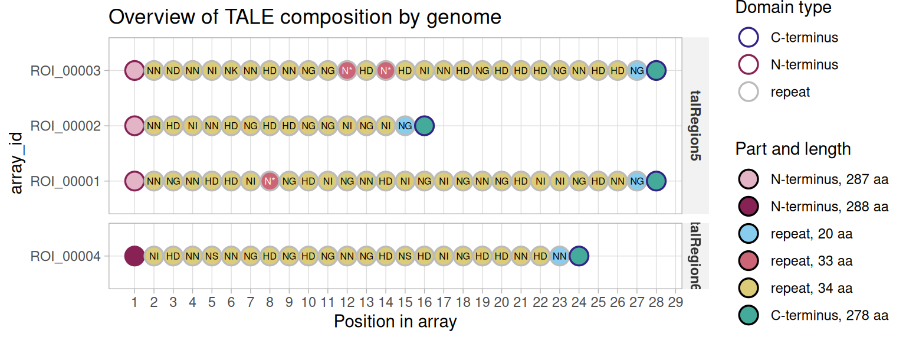

# Getting started with tantale

A TALE (Transcription Activator-Like Effector) is a modular protein: a
central array of near-identical ~34-residue repeats, each one specifying
a single DNA base through two variable residues (its RVD), flanked by an
N- and a C-terminal region. tantale’s job is to find these arrays in
genomic sequence, and to represent them as data you can subset, compare
and plot like any other tibble, with one row per repeat or terminus.

This article is a two-minute tour. It loads a small result already
sitting on disk, so there are no external tools to install first. The
[package website](https://scunnac.github.io/tantale/) has the full set
of articles, which start from raw genomic FASTA and carry a handful of
real *Xanthomonas oryzae* genomes through discovery, classification,
alignment and target prediction.

Code

``` r
library(tantale)
```

## A `tales` object

[`tell_tales()`](https://scunnac.github.io/tantale/reference/tell_tales.md)
searches a genome for TALE-coding regions and writes its findings to a
directory of reports and FASTA files;
[`tales_from_telltales()`](https://scunnac.github.io/tantale/reference/tales_from_telltales.md)
reads that directory back into R. The package ships one such directory
already computed (four arrays found across two short input sequences),
so this tour can start from the object and skip a multi-minute search:

Code

``` r
example_dir <- system.file("extdata", "tellTaleExampleOutput", package = "tantale")
x <- tales_from_telltales(example_dir)
x
#> <tales> 4 arrays, 96 parts
#>   layers: rvd   |   6 other columns
#>              rvd
#>   ROI_00001  NTERM NN NG NN HD HD NI N* NG HD NI NG NN HD NI NG NI NG NN N ...
#>   ROI_00002  NTERM NN HD NI NN HD NG HD HD NG NG NI NG NI NG CTERM
#>   ROI_00003  NTERM NN ND NN NI NK NN HD NN NG NG N* HD N* HD NI NN HD NG H ...
#>   ROI_00004  NTERM NI HD NN NS NN NG HD NG HD NG NN NG HD NS HD NI NG HD H ...
```

Every row is one *part* of one TALE *array* (the domains composing the
full protein, ie the *array*): a repeat or a terminus.
[`summary()`](https://rdrr.io/r/base/summary.html) gives the array-level
view:

Code

``` r
summary(x)
#> <tales> summary
#>   arrays / parts            4 / 96
#>   distinct RVDs             8
#>   repeats per array         min 14   median 24   max 26
#>   arrays with both termini  4 of 4
#>   source sequences          2
#>   anomalies                 none
```

## Checking for trouble

Real assemblies are not always clean: a frameshift can leave AnnoTALE
unable to parse a repeat structure out of a candidate array, or a
terminus can be truncated.
[`tales_anomalies()`](https://scunnac.github.io/tantale/reference/tales_anomalies.md)
reports which arrays, if any, need a second look:

Code

``` r
tales_anomalies(x)
#> # A tibble: 0 × 3
#> # ℹ 3 variables: array_id <chr>, check <chr>, detail <chr>
```

Zero rows means none did, here. The [mining
article](https://scunnac.github.io/tantale/articles/tale_mining.html)
covers what to do when this table is not empty – tantale has two
different ways to correct a frameshifted array.

## Looking at the arrays

[`plot()`](https://rdrr.io/r/graphics/plot.default.html) on a `tales`
object lays out every array’s parts in order. The outline of each circle
gives the domain type, its fill the part’s length in amino acids, and
each repeat carries its RVD. The last repeat of each array is shorter
(20 residues here): it is the half-repeat that ends every TALE repeat
region:

Code

``` r
plot(x)
```



Figure 1: Domain composition of the four TALE arrays in the bundled
example.

## Where to next

This is deliberately the smallest possible slice of tantale. From here,
the package website walks through the full pipeline on real genomes:

- [Mining TALE sequences in
  genomes](https://scunnac.github.io/tantale/articles/tale_mining.html)
  – discovery from raw FASTA, and correcting the frameshifts real
  assemblies produce
- [The `tales`
  class](https://scunnac.github.io/tantale/articles/tales_class.html) –
  what the object built above actually is, in depth
- [Genuine truncTALEs and frameshift
  correction](https://scunnac.github.io/tantale/articles/trunctale_correction.html)
  – how the two frameshift-correction methods treat naturally truncated
  TALEs
- [Classifying TALE sequences from
  genomes](https://scunnac.github.io/tantale/articles/tale_classification.html)
  – grouping arrays across several genomes by relatedness
- [Multiple alignment of TALE
  arrays](https://scunnac.github.io/tantale/articles/tale_msa.html) and
  [the `tales_msa`
  class](https://scunnac.github.io/tantale/articles/tales_msa_class.html)
- [Predicting TALE
  targets](https://scunnac.github.io/tantale/articles/tale_target_prediction.html)
  – from an aligned group to a predicted DNA binding site

> **These four articles form one analysis**
>
> Classification, both alignment articles, and target prediction all
> work over the same three genomes and share one
> discovery/comparison/grouping result. The classification article
> computes it and caches it in `vignettes/articles/_cache/`, outside the
> installed package; the other three read that cache. To render one of
> those three on its own from a clean checkout, render the
> classification article first.
