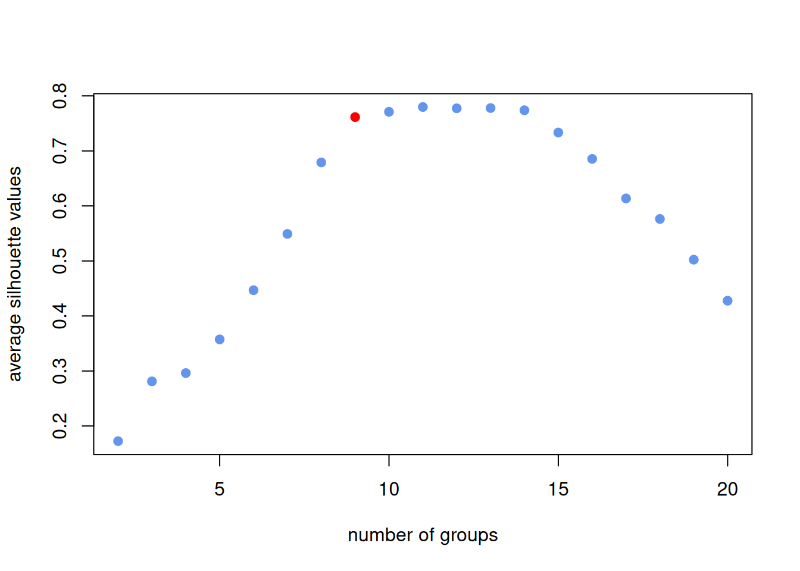
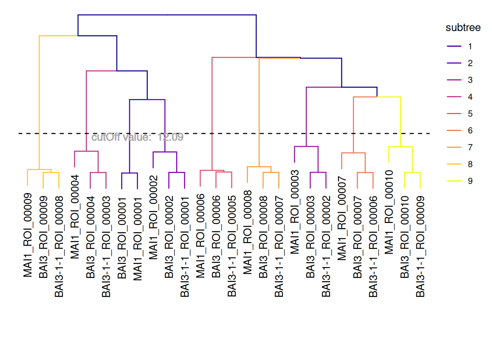
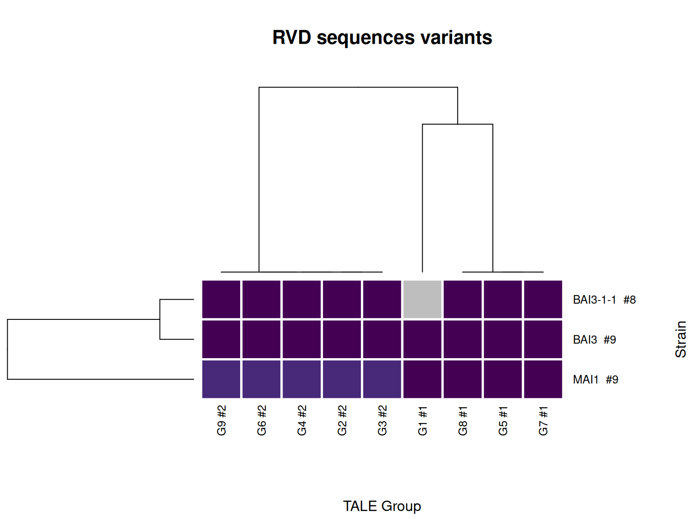

# Classifying TALE sequences from genomes

The [previous
article](https://scunnac.github.io/tantale/dev/articles/tale_mining.md)
covered finding TALE loci in one genome at a time. A real study usually
has several genomes, and the interesting question is not “what TALEs
does this strain carry” but “which TALEs, across strains, are versions
of the same thing” – alleles of one locus, related by descent, rather
than unrelated proteins that happen to both be TALEs. This article
covers that comparison:
[`tales_compare()`](https://scunnac.github.io/tantale/dev/reference/tales_compare.md)
to quantify how alike every pair of arrays and repeats is, and
[`tales_group()`](https://scunnac.github.io/tantale/dev/reference/tales_group.md)
to turn that into discrete groups.

Code

``` r
library(tantale)
library(dplyr)
```

## 1 Discovering TALEs across several genomes

This is a fresh discovery run, independent of the previous article, over
three related genomes: MAI1, BAI3, and the best-corrected version of
BAI3-1-1 from [the correction section of the mining
article](https://scunnac.github.io/tantale/dev/articles/tale_mining.html#sec-best-correction).

> **Why only three genomes, not the fourth**
>
> tantale ships a fourth sample genome, PXO86, a distantly related Asian
> outgroup strain. It is left out here deliberately: its TALE repertoire
> barely overlaps the African strains’ at all, so including it turns a
> clean set of one-locus-per-strain groups into a mix of real
> cross-strain groups and PXO86-only paralog clusters that illustrate a
> different question than the one this article is asking.
> [`tales_group()`](https://scunnac.github.io/tantale/dev/reference/tales_group.md)
> on three related genomes, below, is a considerably better
> demonstration of what it does than the same call over four genomes
> spanning two continents.

Discovery runs independently per genome, so it is written as one
function applied to each genome name in turn:

Code

``` r
out <- fs::dir_create(file.path(tempdir(), "tale_classification"))
genome_files <- c(
  MAI1       = system.file("extdata", "MAI1.fa",       package = "tantale", mustWork = TRUE),
  BAI3       = system.file("extdata", "BAI3.fa",       package = "tantale", mustWork = TRUE),
  `BAI3-1-1` = system.file("extdata", "BAI3-1-1.fa",   package = "tantale", mustWork = TRUE)
)
```

Code

``` r
discover_strain <- function(strain) {
  strain_dir <- file.path(out, strain)
  invisible(tell_tales(subject_file = genome_files[strain], output_dir = strain_dir,
                       cterm_min_score = 300,
                       correct_array = TRUE, max_comparisons = 50))
  tales_from_telltale(strain_dir) |>
    mutate(array_id = paste0(strain, "_", array_id), strain = strain)
}
```

`correct_array = TRUE` with `max_comparisons = 50` is the route [the
mining
article](https://scunnac.github.io/tantale/dev/articles/tale_mining.html#sec-best-correction)
found clean for BAI3-1-1; run on MAI1 and BAI3 too, it costs a little
extra time for no change, since neither needed correcting.

Code

``` r
all_tales <- lapply(names(genome_files), discover_strain) |>
  suppressWarnings() |>
  bind_rows()
#> Finding the closest reference amino acid sequences:
#> ================================================================================
#> 
#> Time difference of 2.68 secs
#> ================================================================================
#> 
#> Time difference of 55.1 secs
#> Finding the closest reference amino acid sequences:
#> ================================================================================
#> 
#> Time difference of 2.82 secs
#> ================================================================================
#> 
#> Time difference of 52.21 secs
#> Finding the closest reference amino acid sequences:
#> ================================================================================
#> 
#> Time difference of 0.43 secs
#> ================================================================================
#> 
#> Time difference of 44.62 secs
```

`array_id` is prefixed by strain before the three objects are combined,
since
[`tell_tales()`](https://scunnac.github.io/tantale/dev/reference/tell_tales.md)
numbers regions independently within each genome – without the prefix,
`MAI1`’s `ROI_00001` and `BAI3`’s `ROI_00001` would collide.

Code

``` r
all_tales <- tales(all_tales, sanitize = TRUE)
n_distinct(all_tales$array_id)
#> [1] 26
```

## 2 Quantifying relatedness: `tales_compare()`

[`tales_compare()`](https://scunnac.github.io/tantale/dev/reference/tales_compare.md)
is tantale’s R implementation of the DisTAL comparison used by the
original QueTAL suite: it assigns every distinct domain sequence a
`dom_code` (see [the `tales` class
article](https://scunnac.github.io/tantale/dev/articles/tales_class.md)
for what that means), computes pairwise distances between distinct
domains, and from those, distances between whole arrays.

Code

``` r
cmp <- tales_compare(all_tales, aln_method = "DECIPHER", ncores = 4)
names(cmp)
#> [1] "tales"            "domain_distances" "tale_distances"
```

Code

``` r
cmp$tale_distances
#> # A tibble: 676 × 5
#>    id1                id2                dissim arlem_score max_length
#>    <chr>              <chr>               <dbl>       <dbl>      <int>
#>  1 BAI3-1-1_ROI_00001 BAI3-1-1_ROI_00001 0                0         28
#>  2 BAI3-1-1_ROI_00002 BAI3-1-1_ROI_00001 6.07           170         28
#>  3 BAI3-1-1_ROI_00003 BAI3-1-1_ROI_00001 6.21           174         28
#>  4 BAI3-1-1_ROI_00005 BAI3-1-1_ROI_00001 5.79           162         28
#>  5 BAI3-1-1_ROI_00006 BAI3-1-1_ROI_00001 6.43           180         28
#>  6 BAI3-1-1_ROI_00007 BAI3-1-1_ROI_00001 6.32           177         28
#>  7 BAI3-1-1_ROI_00008 BAI3-1-1_ROI_00001 6.14           172         28
#>  8 BAI3-1-1_ROI_00009 BAI3-1-1_ROI_00001 6.29           176         28
#>  9 BAI3_ROI_00001     BAI3-1-1_ROI_00001 5.07           142         28
#> 10 BAI3_ROI_00002     BAI3-1-1_ROI_00001 0.0714           2         28
#> # ℹ 666 more rows
```

### 2.1 Does the choice of backend matter?

Comparing domain sequences – the step just run – is the expensive part,
and three backends can do it: `"DECIPHER"` (the default, and by far the
fastest, which is why it was used above), `"Biostrings"`, and
`"mmseq2"`. They implement the same pairwise protein alignment, so which
one to pick is a question of what is installed and how large the dataset
is, not of which answer is right. Checking that claim, rather than
trusting it, on a small independent fixture so all three run quickly:

Code

``` r
small <- tales_from_telltale(system.file("extdata", "tellTaleExampleOutput",
                                         package = "tantale"))
```

Code

``` r
cmp_decipher   <- tales_compare(small, aln_method = "DECIPHER")
cmp_biostrings <- tales_compare(small, aln_method = "Biostrings")
#> 
  |                                                                            
  |                                                                      |   0%
  |                                                                            
  |=                                                                     |   2%
  |                                                                            
  |===                                                                   |   4%
  |                                                                            
  |====                                                                  |   6%
  |                                                                            
  |======                                                                |   9%
  |                                                                            
  |=======                                                               |  11%
  |                                                                            
  |=========                                                             |  13%
  |                                                                            
  |==========                                                            |  15%
  |                                                                            
  |============                                                          |  17%
  |                                                                            
  |=============                                                         |  19%
  |                                                                            
  |===============                                                       |  21%
  |                                                                            
  |================                                                      |  23%
  |                                                                            
  |==================                                                    |  26%
  |                                                                            
  |===================                                                   |  28%
  |                                                                            
  |=====================                                                 |  30%
  |                                                                            
  |======================                                                |  32%
  |                                                                            
  |========================                                              |  34%
  |                                                                            
  |=========================                                             |  36%
  |                                                                            
  |===========================                                           |  38%
  |                                                                            
  |============================                                          |  40%
  |                                                                            
  |==============================                                        |  43%
  |                                                                            
  |===============================                                       |  45%
  |                                                                            
  |=================================                                     |  47%
  |                                                                            
  |==================================                                    |  49%
  |                                                                            
  |====================================                                  |  51%
  |                                                                            
  |=====================================                                 |  53%
  |                                                                            
  |=======================================                               |  55%
  |                                                                            
  |========================================                              |  57%
  |                                                                            
  |==========================================                            |  60%
  |                                                                            
  |===========================================                           |  62%
  |                                                                            
  |=============================================                         |  64%
  |                                                                            
  |==============================================                        |  66%
  |                                                                            
  |================================================                      |  68%
  |                                                                            
  |=================================================                     |  70%
  |                                                                            
  |===================================================                   |  72%
  |                                                                            
  |====================================================                  |  74%
  |                                                                            
  |======================================================                |  77%
  |                                                                            
  |=======================================================               |  79%
  |                                                                            
  |=========================================================             |  81%
  |                                                                            
  |==========================================================            |  83%
  |                                                                            
  |============================================================          |  85%
  |                                                                            
  |=============================================================         |  87%
  |                                                                            
  |===============================================================       |  89%
  |                                                                            
  |================================================================      |  91%
  |                                                                            
  |==================================================================    |  94%
  |                                                                            
  |===================================================================   |  96%
  |                                                                            
  |===================================================================== |  98%
  |                                                                            
  |======================================================================| 100%
cmp_mmseq2     <- tales_compare(small, aln_method = "mmseq2")
```

[`as.matrix()`](https://rdrr.io/r/base/matrix.html) on a
`tale_distances` object always returns ids sorted the same way, so the
three backends’ outputs line up without any further work:

Code

``` r
backend_dists <- tibble::tibble(
  DECIPHER   = as.vector(as.matrix(cmp_decipher$tale_distances)),
  Biostrings = as.vector(as.matrix(cmp_biostrings$tale_distances)),
  mmseq2     = as.vector(as.matrix(cmp_mmseq2$tale_distances))
)
cor(backend_dists)
#>             DECIPHER Biostrings    mmseq2
#> DECIPHER   1.0000000  0.9872101 0.9860172
#> Biostrings 0.9872101  1.0000000 0.9994692
#> mmseq2     0.9860172  0.9994692 1.0000000
```

All three agree closely on this fixture, which is the point: the fast
default is not a shortcut that trades accuracy for speed here, at least
not on data this size.

## 3 Allocating arrays to groups: `tales_group()`

[`tales_group()`](https://scunnac.github.io/tantale/dev/reference/tales_group.md)
clusters arrays from `tale_distances` and returns the `tales` object
with the result attached as a `group` column – taking the object the
distances were computed from is what lets it check that the two actually
correspond (see
[`?tales_group`](https://scunnac.github.io/tantale/dev/reference/tales_group.md)).

Two clustering methods are available. `method = "k-medoids"` (the
default) fits
[`cluster::pam()`](https://rdrr.io/pkg/cluster/man/pam.html) across a
range of candidate group counts and picks one by its silhouette value;
`k = "auto"` accepts that automatic pick:

Code

``` r
grouped <- tales_group(cmp$tales, cmp$tale_distances,
                       method = "k-medoids", k = "auto", k_range = 2:20)
```

[](https://scunnac.github.io/tantale/dev/articles/tale_classification_files/figure-html/tales_group-1.png)

    #> The number of groups is automatically decided based on the silhoutte value: 9

Code

``` r
group_sizes <- grouped |> distinct(array_id, group) |> count(group) |> arrange(desc(n))
group_sizes
#> # A tibble: 9 × 2
#>   group     n
#>   <int> <int>
#> 1     2     3
#> 2     3     3
#> 3     4     3
#> 4     5     3
#> 5     6     3
#> 6     7     3
#> 7     8     3
#> 8     9     3
#> 9     1     2
```

With PXO86 out of the picture, this is a clean result: 8 of 9 groups
have exactly three members, one from each strain – the
one-locus-per-strain pattern this comparison is meant to recover.

`method = "hclust"` cuts a dendrogram at a height chosen to yield
exactly `k` groups instead, and with `plot_tree = TRUE` draws it –
useful for judging whether the chosen `k` looks reasonable rather than
trusting the silhouette value blindly:

Code

``` r
invisible(tales_group(cmp$tales, cmp$tale_distances,
                      method = "hclust", k = n_distinct(grouped$group),
                      plot_tree = TRUE))
```

[](https://scunnac.github.io/tantale/dev/articles/tale_classification_files/figure-html/fig-tale-dendrogram-1.png "Figure 1: Hierarchical clustering of the same three-genome comparison, cut at the k tales_group() picked automatically above.")

Figure 1: Hierarchical clustering of the same three-genome comparison,
cut at the k tales_group() picked automatically above.

## 4 An overview across strains: `talomes_heatmap()`

With arrays assigned to groups, one natural summary is which RVD
sequence variant each strain carries in each group – a *talome*, by
analogy to a genome, being the whole complement of TALEs a strain
carries.

Code

``` r
tale_annotation <- tibble::tibble(
  array_id = names(tales_rvd_strings(grouped)),
  rvdseq = as.character(tales_rvd_strings(grouped))
) |>
  left_join(distinct(grouped, array_id, group, strain), by = "array_id")
```

Code

``` r
talomes_heatmap(tale_annotation, group_col = "group", strain_col = "strain",
                rvd_col = "rvdseq")
```

[](https://scunnac.github.io/tantale/dev/articles/tale_classification_files/figure-html/fig-talomes-heatmap-1.png "Figure 2: RVD sequence variant carried by each strain, in each classification group.")

Figure 2: RVD sequence variant carried by each strain, in each
classification group.

Each cell in [Figure 2](#fig-talomes-heatmap) is one strain’s RVD
sequence variant in one group; a strain missing from a group carries no
member of it, and a cell with more than one colour means that strain
carries more than one distinct variant in that group.

## 5 Next

Grouping tells you *which* arrays are related. Seeing exactly *how* –
which repeats match, which are inserted or deleted relative to one
another – needs an alignment, which is the subject of [the next
article](https://scunnac.github.io/tantale/dev/articles/tale_msa.md).
