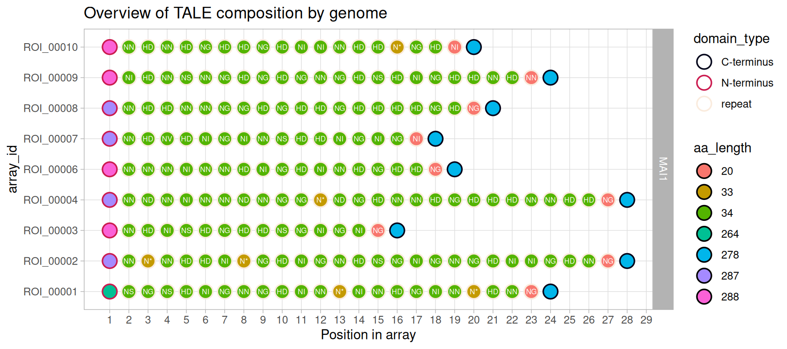
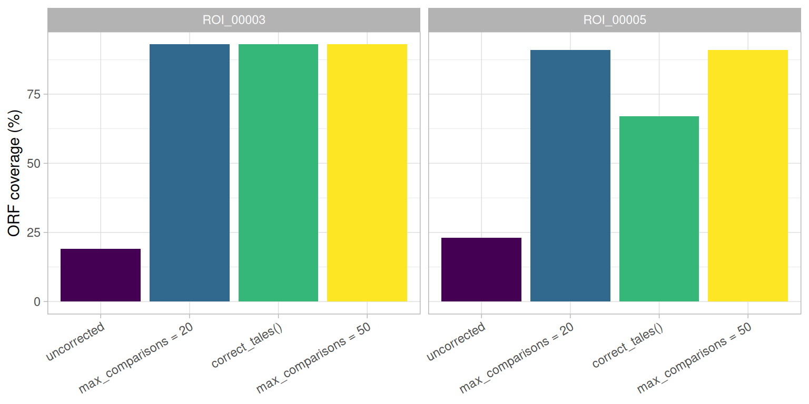

# Mining TALE sequences in genomes

This is the first of a set of articles walking through a typical study
of TALE diversity: finding TALE genes in a genome (here), classifying
the arrays found into groups of related sequences, aligning those
groups, and predicting the DNA targets of the TALEs they contain. Two of
the articles in the set are deep dives into a single class (`tales`,
`tales_msa`) rather than the next step in the walkthrough; they are
linked from the point where they become relevant, not numbered into the
sequence.

This article covers TALE discovery with
[`tell_tales()`](https://scunnac.github.io/tantale/dev/reference/tell_tales.md),
and something discovery cannot avoid: real assemblies are not always
clean,
[`tell_tales()`](https://scunnac.github.io/tantale/dev/reference/tell_tales.md)
can sometimes be fooled, and tantale offers two ways to fix that which
are not interchangeable and neither of which is guaranteed to work.
[`tales_anomalies()`](https://scunnac.github.io/tantale/dev/reference/tales_anomalies.md)
is the tool that tells you which.

Code

``` r
library(tantale)
library(dplyr)
```

> **The genomes used throughout**
>
> Four *Xanthomonas oryzae* genomes appear across this whole set of
> articles: **MAI1**, **BAI3** and **PXO86** are “clean” assemblies, and
> **BAI3-1-1** is a deliberately error-prone one – an assembly of the
> same BAI3 background with *talC* deleted, carrying real
> sequencing/assembly artefacts in its TALE loci. That last kind is not
> a corner case: it is exactly the kind of input a mining pipeline has
> to cope with in practice, and it is what the second half of this
> article is about.

## 1 Finding TALE loci in genomic DNA

[`tell_tales()`](https://scunnac.github.io/tantale/dev/reference/tell_tales.md)
searches a genome with `nhmmer`, using three profile HMMs tuned to the
N-terminus, the repeat unit, and the C-terminus of a TALE CDS. Hits are
merged, grouped into candidate arrays by proximity, and each array’s
longest ORF is handed to AnnoTALE to split into parts and call its RVD
sequence. `NTERM`/`CTERM` markers are appended to the RVD string
wherever a terminus was identified this way, so a downstream alignment
knows where an array actually starts and ends.

A scratch directory holds everything this set of articles builds:

Code

``` r
out <- fs::dir_create(file.path(tempdir(), "tale_mining"))
```

Start with MAI1, a clean assembly, to see what discovery looks like when
nothing goes wrong:

Code

``` r
mai1_fa <- system.file("extdata", "MAI1.fa", package = "tantale", mustWork = TRUE)
mai1_dir <- file.path(out, "MAI1")
```

Code

``` r
invisible(tell_tales(subject_file = mai1_fa, output_dir = mai1_dir))
```

The result on disk is a directory of reports and fasta files. The result
in R is a `tales` object – one row per part, not per TALE:

Code

``` r
mai1 <- suppressWarnings(tales_from_telltale(mai1_dir))
mai1
#> <tales> 9 arrays, 198 parts
#>   layers: rvd   |   6 other columns
#>              rvd
#>   ROI_00001  NTERM NS NG NS HD NI NG NN NG HD NI NN N* NI NN HD NG NI NN N ...
#>   ROI_00002  NTERM NN N* NN HD HD NI N* NG HD NI NG NN HD NS NG NI NG NN N ...
#>   ...        ...
#>   ROI_00009  NTERM NI HD NN NS NN NG HD NG HD NG NN NG HD NS HD NI NG HD H ...
#>   ROI_00010  NTERM NN HD NN HD NG HD HD NG HD NI NI NN HD HD N* NG HD NI CTERM
```

> **What a `tales` object actually is**
>
> Rows, columns, subsetting, and the `dom_code` column that the rest of
> tantale is built on are covered in depth in [the `tales` class
> article](https://scunnac.github.io/tantale/dev/articles/tales_class.md)
> – read it once this walkthrough has given you an object to look at.

[`plot()`](https://rdrr.io/r/graphics/plot.default.html) on a `tales`
gives a compact overview of what was found: every array’s parts,
positioned within the array, coloured by domain type and filled by
amino-acid length, with the RVD printed on each repeat.

Code

``` r
plot(mai1)
```

[](https://scunnac.github.io/tantale/dev/articles/tale_mining_files/figure-html/fig-mai1-composition-1.png "Figure 1: Domain composition of the nine TALE arrays found in MAI1.")

Figure 1: Domain composition of the nine TALE arrays found in MAI1.

[Figure 1](#fig-mai1-composition) already shows something worth
noticing: array lengths vary, and every array here runs the full width
of its row – there are no gaps, because nothing has been aligned yet.
`position_in_array` just counts parts within each array independently.

## 2 What `tell_tales()` writes to disk

Besides the RVD sequences and the TALE ORFs themselves,
[`tell_tales()`](https://scunnac.github.io/tantale/dev/reference/tell_tales.md)
writes three tab-separated reports, which
[`tales_from_telltale()`](https://scunnac.github.io/tantale/dev/reference/tales_from_telltale.md)
reads back to build the object above. They are worth knowing about
directly, since they carry a few things the `tales` object does not.

| file                 | one row per            | worth knowing                                                                                                                |
|:---------------------|:-----------------------|:-----------------------------------------------------------------------------------------------------------------------------|
| `hits_report.tsv`    | raw `nhmmer` hit       | `codon_count`, `frameshift_count` per hit – before any merging or correction                                                 |
| `domains_report.tsv` | domain, after AnnoTALE | what AnnoTALE actually parsed out of the ORF                                                                                 |
| `array_report.tsv`   | candidate array        | `has_all_domains`, `has_aberrant_repeat`, `orf_coverage`, and (with correction) `predicted_ins_count`/`predicted_dels_count` |

`array_report.tsv` is the one this article leans on most, so it is worth
reading directly rather than only through the `tales` object:

Code

``` r
array_report <- readr::read_tsv(file.path(mai1_dir, "array_report.tsv"),
                                show_col_types = FALSE)
array_report %>%
  select(array_id, has_all_domains, longest_orf_length, orf_coverage)
#> # A tibble: 10 × 4
#>    array_id  has_all_domains longest_orf_length orf_coverage
#>    <chr>     <lgl>                        <dbl>        <dbl>
#>  1 ROI_00005 FALSE                           NA           NA
#>  2 ROI_00003 TRUE                          3087           91
#>  3 ROI_00007 TRUE                          3288           91
#>  4 ROI_00006 TRUE                          3393           91
#>  5 ROI_00010 TRUE                          3492           92
#>  6 ROI_00008 TRUE                          3594           92
#>  7 ROI_00001 TRUE                          3825           92
#>  8 ROI_00009 TRUE                          3903           92
#>  9 ROI_00002 TRUE                          4302           93
#> 10 ROI_00004 TRUE                          4305           93
```

`orf_coverage` is the longest ORF found, as a percentage of the whole
candidate array region – a clean array covers nearly all of it. That
number is about to matter a great deal.

## 3 When discovery goes wrong: detecting anomalies

MAI1 is a good assembly, and every array above came back complete. That
is not guaranteed. Running the same search on BAI3-1-1 – deliberately
error-prone – shows what an assembly artefact does to the pipeline.

Code

``` r
bai311_fa <- system.file("extdata", "BAI3-1-1.fa", package = "tantale", mustWork = TRUE)
bai311_raw_dir <- file.path(out, "BAI3-1-1_raw")
```

Code

``` r
invisible(tell_tales(subject_file = bai311_fa, output_dir = bai311_raw_dir,
                     cterm_min_score = 300))
```

Code

``` r
bai311_raw <- suppressWarnings(tales_from_telltale(bai311_raw_dir))
```

[`tales_anomalies()`](https://scunnac.github.io/tantale/dev/reference/tales_anomalies.md)
reports the arrays that are odd rather than merely absent – missing
sequence data, impossible terminus arrangements, coordinate
disagreements:

Code

``` r
tales_anomalies(bai311_raw)
#> # A tibble: 2 × 3
#>   array_id  check       detail             
#>   <chr>     <chr>       <chr>              
#> 1 ROI_00003 missing_rvd part(s) with no rvd
#> 2 ROI_00005 missing_rvd part(s) with no rvd
```

Two arrays have no `rvd` at all: AnnoTALE could not parse a repeat-array
structure out of their ORF. This is a frameshift, not a truncation –
compare their `orf_coverage` to a complete array:

Code

``` r
readr::read_tsv(file.path(bai311_raw_dir, "array_report.tsv"),
                show_col_types = FALSE) %>%
  select(array_id, has_all_domains, longest_orf_length, orf_coverage)
#> # A tibble: 9 × 4
#>   array_id  has_all_domains longest_orf_length orf_coverage
#>   <chr>     <lgl>                        <dbl>        <dbl>
#> 1 ROI_00004 FALSE                           NA           NA
#> 2 ROI_00006 TRUE                          1446           45
#> 3 ROI_00002 TRUE                          2385           70
#> 4 ROI_00005 TRUE                           864           23
#> 5 ROI_00009 TRUE                          1791           47
#> 6 ROI_00007 TRUE                          1827           47
#> 7 ROI_00008 TRUE                          2841           67
#> 8 ROI_00001 TRUE                          1764           38
#> 9 ROI_00003 TRUE                           864           19
```

`ROI_00003` and `ROI_00005` cover barely a fifth and a quarter of their
candidate region – a single inserted or deleted base early in the array
shifts every codon downstream of it, and the ORF finder simply stops at
the first premature stop codon it meets. Nothing here is a bug: this is
exactly the situation frameshift correction exists for.

## 4 Correcting frameshifts, two ways

tantale offers two distinct routes to a corrected sequence, and they are
not interchangeable: one corrects candidate *arrays* after they have
already been found, from inside
[`tell_tales()`](https://scunnac.github.io/tantale/dev/reference/tell_tales.md);
the other corrects the *genome* before discovery even starts. Both can
fail, in different ways, which is exactly why
[Section 3](#sec-anomalies)’s check is worth repeating after either one
– and, run on the same genome, they will turn out to disagree with each
other about which array still needs help.

### 4.1 Correcting inside `tell_tales()`

`correct_array = TRUE` runs
[`DECIPHER::CorrectFrameshifts()`](https://rdrr.io/pkg/DECIPHER/man/CorrectFrameshifts.html)
on each candidate array, aligning it against a shipped reference set of
real TALE proteins and inferring the indels needed to remove premature
stops.

> **`max_comparisons` trades reliability for speed**
>
> `max_comparisons` caps how many references each array may be aligned
> against, and is the main control on how long correction takes. The
> full docs on
> [`tell_tales()`](https://scunnac.github.io/tantale/dev/reference/tell_tales.md)
> measure the trade-off directly: at the default (all references) a set
> of four arrays took 252 seconds; capped to 20, 10 seconds – but at a
> cap of 2, the aligner cannot reach a good reference and invents indels
> wholesale. Capped to 20 is normally ample, and is used below to keep
> this article fast to build – but the section it fixes also shows
> exactly what “ample, not certain” means in practice.

Code

``` r
bai311_corr_dir <- file.path(out, "BAI3-1-1_corrected")
```

Code

``` r
invisible(tell_tales(subject_file = bai311_fa, output_dir = bai311_corr_dir,
                     cterm_min_score = 300,
                     correct_array = TRUE, max_comparisons = 20))
#> Finding the closest reference amino acid sequences:
#> ================================================================================
#> 
#> Time difference of 0.47 secs
#> ================================================================================
#> 
#> Time difference of 17.76 secs
bai311_corr <- suppressWarnings(tales_from_telltale(bai311_corr_dir))
```

Code

``` r
tales_anomalies(bai311_corr)
#> # A tibble: 2 × 3
#>   array_id  check          detail                
#>   <chr>     <chr>          <chr>                 
#> 1 ROI_00001 missing_rvd    part(s) with no rvd   
#> 2 ROI_00001 missing_aa_seq part(s) with no aa_seq
```

Correction did fix the two frameshifted arrays – `ROI_00003` and
`ROI_00005` are no longer flagged. But a *different* array, `ROI_00001`,
now is: it was clean in the uncorrected run above, and correcting
against only 20 references was, for this particular array, not enough to
find a good match. The correction did not fail by leaving the array
alone; it failed by aligning it against a poor reference, which is
worse, because the output still looks like a corrected ORF right up
until AnnoTALE tries to parse domains out of it and cannot.

Spending the full search on this same genome – all ~500 shipped
references rather than 20, about eight minutes instead of ten seconds –
clears every anomaly, `ROI_00001` included, because the aligner can then
actually reach a reference close enough to it. There is no shortcut
around that trade-off: a small `max_comparisons` is a real risk, not a
rounding error, and checking
[`tales_anomalies()`](https://scunnac.github.io/tantale/dev/reference/tales_anomalies.md)
after correcting is how that risk gets caught rather than silently
shipped downstream.

### 4.2 Correcting the genome, before discovery

[`correct_tales()`](https://scunnac.github.io/tantale/dev/reference/correct_tales.md)
takes a different, faster route: rather than aligning already-found
candidate arrays against reference proteins, it wraps the Java
`TALEcorrection` tool to scan the *whole input genome* directly against
profile HMMs and repair frameshifts it finds, before
[`tell_tales()`](https://scunnac.github.io/tantale/dev/reference/tell_tales.md)
ever runs. That makes it a genome-wide pre-processing step rather than a
per-array one – worth trying first on a large or especially error-prone
assembly (an ONT-sequenced genome, say), precisely because it does not
need candidate arrays to already exist.

Code

``` r
bai311_java_fa <- file.path(out, "BAI3-1-1_java_corrected.fa")
```

Code

``` r
corrections <- correct_tales(uncorrected_path = bai311_fa,
                             corrected_path = bai311_java_fa,
                             return_corrections = TRUE)
```

[`correct_tales()`](https://scunnac.github.io/tantale/dev/reference/correct_tales.md)
reports every substitution it made, genome-wide, as a table – this
genome needed 63:

Code

``` r
head(corrections, 4)
#> # A tibble: 4 × 4
#>   seqName  posInOriginSeq type      substitution
#>   <chr>             <dbl> <chr>     <chr>       
#> 1 contig_1        4260089 insertion - -> g      
#> 2 contig_1        4260088 insertion - -> c      
#> 3 contig_1        4260087 insertion - -> c      
#> 4 contig_1        4259647 insertion - -> g
```

[`tell_tales()`](https://scunnac.github.io/tantale/dev/reference/tell_tales.md)
then runs on the corrected genome exactly as it would on any other – no
`correct_array` needed, because the correction already happened
upstream:

Code

``` r
bai311_java_dir <- file.path(out, "BAI3-1-1_java_tell_tales")
```

Code

``` r
invisible(tell_tales(subject_file = bai311_java_fa, output_dir = bai311_java_dir,
                     cterm_min_score = 300, correct_array = FALSE))
bai311_java <- suppressWarnings(tales_from_telltale(bai311_java_dir))
```

Code

``` r
tales_anomalies(bai311_java)
#> # A tibble: 2 × 3
#>   array_id  check          detail                
#>   <chr>     <chr>          <chr>                 
#> 1 ROI_00005 missing_rvd    part(s) with no rvd   
#> 2 ROI_00005 missing_aa_seq part(s) with no aa_seq
```

A third outcome again: `ROI_00003` is fixed, but `ROI_00005` still is
not – the opposite pattern from the `max_comparisons = 20` run above,
which fixed both original frameshifts but broke a third array instead.
Neither correction path is a silver bullet, and which one a given array
needs is not predictable in advance.

### 4.3 A clean correction without an eight-minute wait

Three results so far, none of them fully clean: `max_comparisons = 20`
trades a fix for a new break;
[`correct_tales()`](https://scunnac.github.io/tantale/dev/reference/correct_tales.md)
alone leaves one array short. Two ways forward, both measured rather
than assumed:

Code

``` r
bai311_best_dir <- file.path(out, "BAI3-1-1_best")
```

Code

``` r
invisible(tell_tales(subject_file = bai311_fa, output_dir = bai311_best_dir,
                     cterm_min_score = 300,
                     correct_array = TRUE, max_comparisons = 50))
#> Finding the closest reference amino acid sequences:
#> ================================================================================
#> 
#> Time difference of 0.45 secs
#> ================================================================================
#> 
#> Time difference of 44.89 secs
bai311_best <- suppressWarnings(tales_from_telltale(bai311_best_dir))
```

Code

``` r
tales_anomalies(bai311_best)
#> # A tibble: 0 × 3
#> # ℹ 3 variables: array_id <chr>, check <chr>, detail <chr>
```

Zero anomalies – raising the cap from 20 to 50 references was enough for
every array in this genome, in a little over a minute rather than eight.
`bai311_best` is the version the rest of this set of articles builds on.

> **A second way there: chain both correction paths**
>
> Running
> [`correct_tales()`](https://scunnac.github.io/tantale/dev/reference/correct_tales.md)
> first and feeding *its* output into `tell_tales(correct_array = TRUE)`
> also reaches zero anomalies, and lets the per-array step use a smaller
> `max_comparisons` again, because the genome-wide pass has already
> removed most of the damage
> [`tell_tales()`](https://scunnac.github.io/tantale/dev/reference/tell_tales.md)
> would otherwise have to correct for on its own. Measured on this same
> genome (not re-run live here, to keep this article’s build time down):
>
> | route                                                                                                                             | time           | anomalies             |
> |-----------------------------------------------------------------------------------------------------------------------------------|----------------|-----------------------|
> | `max_comparisons = 50` alone                                                                                                      | ~79 s          | 0                     |
> | [`correct_tales()`](https://scunnac.github.io/tantale/dev/reference/correct_tales.md) (~29 s) then `max_comparisons = 20` (~50 s) | ~79 s combined | still 1 (`ROI_00001`) |
> | [`correct_tales()`](https://scunnac.github.io/tantale/dev/reference/correct_tales.md) (~29 s) then `max_comparisons = 50` (~66 s) | ~95 s combined | 0                     |
>
> For this genome the two routes land at about the same cost. The
> chained route is worth reaching for on a genome messy enough that
> neither correction alone gets close: each pass only has to clean up
> what the other left behind, rather than solving the whole problem
> itself.

## 5 How much did either correction actually help?

Anomaly counts say whether AnnoTALE could parse an array at all, which
is a pass/fail signal. `orf_coverage` is more informative, since it is a
number and can be compared *before* an array even becomes an anomaly.
Read it back for the two originally-broken arrays, across all three
runs:

Code

``` r
read_coverage <- function(dir, method) {
  readr::read_tsv(file.path(dir, "array_report.tsv"), show_col_types = FALSE) |>
    select(array_id, orf_coverage) |>
    filter(array_id %in% c("ROI_00003", "ROI_00005")) |>
    mutate(method = method)
}
```

Code

``` r
coverage <- bind_rows(
  read_coverage(bai311_raw_dir,  "uncorrected"),
  read_coverage(bai311_corr_dir, "max_comparisons = 20"),
  read_coverage(bai311_java_dir, "correct_tales()"),
  read_coverage(bai311_best_dir, "max_comparisons = 50")
) |>
  mutate(method = factor(method, levels = c(
    "uncorrected", "max_comparisons = 20", "correct_tales()", "max_comparisons = 50"
  )))
```

Code

``` r
coverage |>
  tidyr::pivot_wider(names_from = method, values_from = orf_coverage) |>
  knitr::kable()
```

| array_id  | uncorrected | max_comparisons = 20 | correct_tales() | max_comparisons = 50 |
|:----------|------------:|---------------------:|----------------:|---------------------:|
| ROI_00005 |          23 |                   91 |              67 |                   91 |
| ROI_00003 |          19 |                   93 |              93 |                   93 |

Code

``` r
ggplot2::ggplot(coverage, ggplot2::aes(x = method, y = orf_coverage, fill = method)) +
  ggplot2::geom_col() +
  ggplot2::facet_wrap(~ array_id) +
  ggplot2::scale_fill_viridis_d(guide = "none") +
  ggplot2::labs(x = NULL, y = "ORF coverage (%)") +
  ggplot2::theme_light() +
  ggplot2::theme(axis.text.x = ggplot2::element_text(angle = 30, hjust = 1))
```

[](https://scunnac.github.io/tantale/dev/articles/tale_mining_files/figure-html/fig-coverage-improvement-1.png "Figure 2: ORF coverage of the two frameshifted BAI3-1-1 arrays, before and after each correction attempt. max_comparisons = 50 is the only one of the three that recovers both arrays fully.")

Figure 2: ORF coverage of the two frameshifted BAI3-1-1 arrays, before
and after each correction attempt. max_comparisons = 50 is the only one
of the three that recovers both arrays fully.

[Figure 2](#fig-coverage-improvement) is the honest version of “did
correction help”: `max_comparisons = 20` and
[`correct_tales()`](https://scunnac.github.io/tantale/dev/reference/correct_tales.md)
both recover most of `ROI_00003`’s coding sequence outright, but only
partly help `ROI_00005` – and only `max_comparisons = 50` reaches full
coverage on both, which is exactly why
[Section 4.3](#sec-best-correction) settled on it. What is true of every
attempted route is that
[`tales_anomalies()`](https://scunnac.github.io/tantale/dev/reference/tales_anomalies.md),
not a coverage number by itself, is what actually says whether AnnoTALE
could use the result.

## 6 Moving on with what you have

`bai311_best` needs none of this – it is already clean – but a route
that stops short of that, such as the
[`correct_tales()`](https://scunnac.github.io/tantale/dev/reference/correct_tales.md)-only
run above, still needs a decision about what to do with what remains
flagged. `tales(x, sanitize = TRUE)` drops it so an analysis can proceed
on what is clean, while keeping a clear record of what and why:

Code

``` r
bai311_clean <- tales(bai311_java, sanitize = TRUE)
n_distinct(bai311_java$array_id) - n_distinct(bai311_clean$array_id)
#> [1] 1
```

> **What the rest of this set of articles uses**
>
> From here on, “BAI3-1-1” means `bai311_best` – the
> `max_comparisons = 50` correction from
> [Section 4.3](#sec-best-correction) – alongside MAI1 and BAI3. PXO86,
> the fourth genome shipped with the package, is left out of the
> classification and alignment articles that follow: it is a distant
> Asian outgroup whose TALE repertoire barely overlaps the African
> strains’, and including it turns a clean set of
> one-ortholog-per-strain groups into a mix of real cross-strain groups
> and PXO86-only paralog clusters that do not illustrate the same thing.

## 7 Next

The [next
article](https://scunnac.github.io/tantale/dev/articles/tale_classification.md)
picks up from a set of `tales` objects like the ones built here – across
several genomes this time – and classifies their arrays into groups of
related sequences with
[`tales_compare()`](https://scunnac.github.io/tantale/dev/reference/tales_compare.md)
and
[`tales_group()`](https://scunnac.github.io/tantale/dev/reference/tales_group.md).
