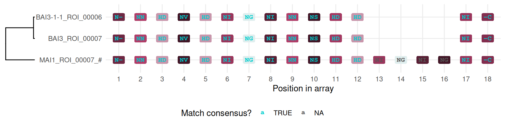
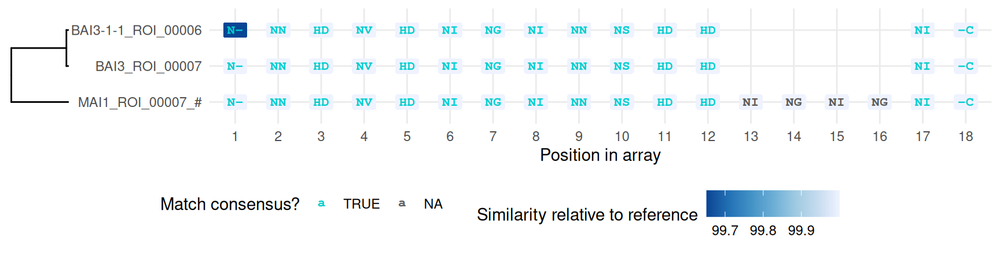
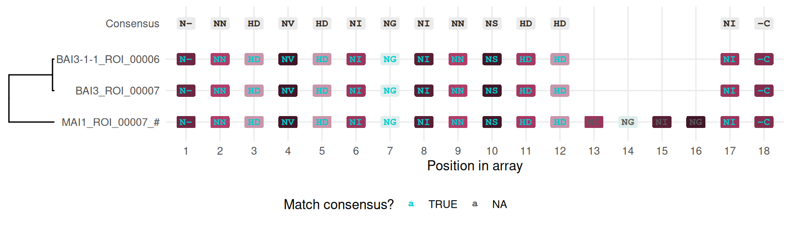

# Multiple alignment of TALE arrays

The [previous
article](https://scunnac.github.io/tantale/dev/articles/tale_classification.md)
grouped TALE arrays by overall similarity. Grouping says arrays are
related; it does not say *how* – which repeats correspond, where one
array has an insertion or a deletion relative to another. That needs an
alignment.

Code

``` r
library(tantale)
library(dplyr)
```

> **Where this fits**
>
> This article is a walkthrough: pick one real classification group and
> align it. The mechanics – what a `tales_msa` actually is, coercion
> between `tales` and `tales_msa`, and the plotting options in full –
> are a deep dive in [the `tales_msa` class
> article](https://scunnac.github.io/tantale/dev/articles/tales_msa_class.md),
> which continues directly from the alignment built here rather than
> starting over.

The AnnoTALE tool this package builds on can assign TALEs to classes,
but cannot insert gaps while doing so – and TALE arrays evolve
substantially by whole-repeat duplication and deletion, so a method that
cannot represent a gap is blind to exactly the events that matter most
(see the [QueTAL paper](https://doi.org/10.3389/fpls.2015.00545)).
[`tales_align()`](https://scunnac.github.io/tantale/dev/reference/tales_align.md)
drives MAFFT in text mode instead, treating each distinct repeat as one
alignable symbol, which lets it open and close gaps freely.

## 1 Re-deriving one group from the previous article

Reproduced here rather than carried over, since each article in this
series stands alone. The three genomes and the correction settings are
exactly [the previous
article’s](https://scunnac.github.io/tantale/dev/articles/tale_classification.md).

Code

``` r
out <- fs::dir_create(file.path(tempdir(), "tale_msa"))
genome_files <- c(
  MAI1       = system.file("extdata", "MAI1.fa",     package = "tantale", mustWork = TRUE),
  BAI3       = system.file("extdata", "BAI3.fa",     package = "tantale", mustWork = TRUE),
  `BAI3-1-1` = system.file("extdata", "BAI3-1-1.fa", package = "tantale", mustWork = TRUE)
)
```

Code

``` r
all_tales <- lapply(names(genome_files), function(strain) {
  strain_dir <- file.path(out, strain)
  invisible(tell_tales(subject_file = genome_files[strain], output_dir = strain_dir,
                       cterm_min_score = 300,
                       correct_array = TRUE, max_comparisons = 50))
  tales_from_telltale(strain_dir) |>
    mutate(array_id = paste0(strain, "_", array_id))
}) |>
  suppressWarnings() |>
  bind_rows() |>
  tales(sanitize = TRUE)
#> Finding the closest reference amino acid sequences:
#> ================================================================================
#> 
#> Time difference of 2.95 secs
#> ================================================================================
#> 
#> Time difference of 55.36 secs
#> Finding the closest reference amino acid sequences:
#> ================================================================================
#> 
#> Time difference of 2.72 secs
#> ================================================================================
#> 
#> Time difference of 52.88 secs
#> Finding the closest reference amino acid sequences:
#> ================================================================================
#> 
#> Time difference of 0.48 secs
#> ================================================================================
#> 
#> Time difference of 45.05 secs
```

Code

``` r
cmp <- tales_compare(all_tales, aln_method = "DECIPHER", ncores = 4)
grouped <- tales_group(cmp$tales, cmp$tale_distances,
                       method = "k-medoids", k = "auto", k_range = 2:20) |>
  suppressMessages()
```

[](https://scunnac.github.io/tantale/dev/articles/tale_msa_files/figure-html/compare_and_group-1.png)

One group holds a member from each of MAI1, BAI3 and BAI3-1-1 – the same
locus, present in all three related African strains – and, usefully for
this article, its three copies are not identical:

Code

``` r
picked_group <- grouped |> filter(group == 6)
picked_group |> distinct(array_id)
#> # A tibble: 3 × 1
#>   array_id          
#>   <chr>             
#> 1 MAI1_ROI_00007    
#> 2 BAI3_ROI_00007    
#> 3 BAI3-1-1_ROI_00006
```

## 2 Aligning the group

Code

``` r
msa <- tales_align(picked_group, residue_col = "dom_code")
msa
#> <tales_msa> 3 arrays, 18 alignment positions
#>   layers: rvd, dom_code   |   namespace: 5d8762602564ac93   |   7 other columns
#>                       dom_code
#>   MAI1_ROI_00007       84  35  43   5  41  31  24  49  35  54  18  40  31  ...
#>   BAI3_ROI_00007       84  35  43   5  41  31  24  49  35  54  18  40   -  ...
#>   BAI3-1-1_ROI_00006   85  35  43   5  41  31  24  49  35  54  18  40   -  ...
```

Code

``` r
plot(msa, tal_sim = cmp$tale_distances, domain_sim = cmp$domain_distances)
```

[](https://scunnac.github.io/tantale/dev/articles/tale_msa_files/figure-html/fig-msa-default-1.png "Figure 1: Alignment of one TALE locus across three related strains, coloured by repeat cluster.")

Figure 1: Alignment of one TALE locus across three related strains,
coloured by repeat cluster.

[Figure 1](#fig-msa-default) already shows something
[`tales_group()`](https://scunnac.github.io/tantale/dev/reference/tales_group.md)’s
single distance number could not: **BAI3 and BAI3-1-1 are both missing
four repeats that MAI1 has**, at alignment positions 13-16 – a real
internal gap, not one at either end of the array. Because BAI3-1-1 is
the same genomic background as BAI3 with *talC* deleted, the two sharing
this exact deletion is consistent with it being inherited from their
common background rather than independent events in each.

## 3 Does a scoring matrix change the alignment?

[`tales_align()`](https://scunnac.github.io/tantale/dev/reference/tales_align.md)
accepts a `repeat_sims` argument: a substitution cost matrix MAFFT uses
when scoring which repeats to match against each other, rather than
treating every mismatch as equally bad. Passing one is optional, and it
is worth checking what it actually changes rather than assuming.

### 3.1 Aligning on `dom_code`

Without one, every distinct repeat is as different from every other as
any other pair – MAFFT has no notion that two repeats might be more or
less alike:

Code

``` r
msa_plain <- tales_align(picked_group, residue_col = "dom_code")
#> Now running MAFFT (Copyright 2002-2007 Kazutaka Katoh) on TALE array sequences.
```

With one, `domain_distances` – the repeat-level protein similarity
already computed by
[`tales_compare()`](https://scunnac.github.io/tantale/dev/reference/tales_compare.md)
– tells MAFFT how alike two repeats actually are:

Code

``` r
msa_scored <- tales_align(picked_group, residue_col = "dom_code",
                          repeat_sims = cmp$domain_distances)
```

Code

``` r
identical(as.matrix(msa_plain), as.matrix(msa_scored))
#> [1] FALSE
```

They differ. Looking at just the affected row shows how:

Code

``` r
rbind(
  no_matrix = as.matrix(msa_plain)["BAI3-1-1_ROI_00006", ],
  scored    = as.matrix(msa_scored)["BAI3-1-1_ROI_00006", ]
)
#>           1       2    3    4    5    6    7    8    9    10   11   12   13  
#> no_matrix "NTERM" "NN" "HD" "NV" "HD" "NI" "NG" "NI" "NN" "NS" "HD" "HD" NA  
#> scored    "NTERM" "NN" "HD" "NV" "HD" "NI" "NG" "NI" "NN" "NS" "HD" "HD" "NI"
#>           14 15 16 17   18     
#> no_matrix NA NA NA "NI" "CTERM"
#> scored    NA NA NA NA   "CTERM"
```

Scored, the gap this array carries is one column narrower – MAFFT could
place its real repeats slightly more compactly once it knew which
substitutions were cheap. This matches what the package documentation
already claims about `repeat_sims`: more compact alignments, fewer gap
columns, on data where it has something to work with.

### 3.2 Aligning on `rvd`

The built-in RVD similarity matrix works the same way, opted into with
`repeat_sims = "rvd"` rather than a `domain_distances` table – but
scores DNA-binding specificity instead of protein sequence, so it is
worth checking separately rather than assuming it behaves like the
`dom_code` case:

Code

``` r
msa_rvd_plain  <- tales_align(picked_group, residue_col = "rvd")
msa_rvd_scored <- tales_align(picked_group, residue_col = "rvd", repeat_sims = "rvd")
identical(as.matrix(msa_rvd_plain), as.matrix(msa_rvd_scored))
#> [1] TRUE
```

On this group, aligning on RVDs gives the *same* alignment whether or
not the matrix is supplied. That is a real result, not a shortcut taken
here: the RVD alphabet is much smaller than the repeat-code one (a
handful of distinct RVDs against a handful of distinct repeats, for
three arrays this closely related), so there was little room for a
scoring matrix to change anything. The lesson is not “the RVD matrix
never matters” – it is that whether either matrix matters depends on the
data, which is exactly why this section checked rather than asserted it.

## 4 Other views of the same alignment

Colouring by similarity to a reference instead of by cluster membership
makes graded divergence visible where cluster identity would only say
“different”:

Code

``` r
plot(msa, fill_type = "repeat_sim",
    tal_sim = cmp$tale_distances, domain_sim = cmp$domain_distances)
```

[](https://scunnac.github.io/tantale/dev/articles/tale_msa_files/figure-html/fig-msa-sim-1.png "Figure 2: The same alignment, coloured by protein-sequence similarity to the reference array.")

Figure 2: The same alignment, coloured by protein-sequence similarity to
the reference array.

And with a consensus panel attached, the column-by-column question “does
this array agree with the group” is answered directly above the
alignment itself:

Code

``` r
plot(msa, consensus = TRUE,
    tal_sim = cmp$tale_distances, domain_sim = cmp$domain_distances)
```

[](https://scunnac.github.io/tantale/dev/articles/tale_msa_files/figure-html/fig-msa-consensus-1.png "Figure 3: The same alignment again, with a consensus row attached above it.")

Figure 3: The same alignment again, with a consensus row attached above
it.

## 5 Next

Once related arrays are aligned, the biologically motivated next
question is what DNA sequence their RVDs are predicted to bind – covered
in [the final
article](https://scunnac.github.io/tantale/dev/articles/tale_target_prediction.md)
of this series. To go deeper on the alignment mechanics used here first,
see [the `tales_msa` class
article](https://scunnac.github.io/tantale/dev/articles/tales_msa_class.md).
