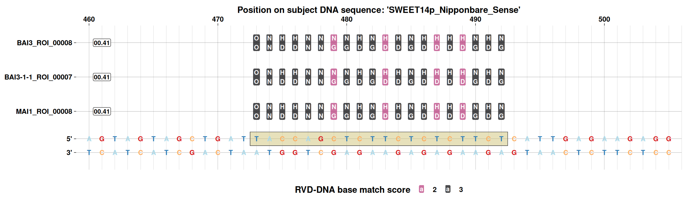

# Predicting TALE targets

The previous articles found TALE arrays, grouped them, and aligned
related ones. This last article asks the question a TALE’s RVD sequence
exists to answer: what DNA sequence does it bind? Each RVD contacts one
base of the target through a well-characterised, largely one-to-one code
(`NI` prefers A, `HD` prefers C, `NG` prefers T, `NN` prefers G or A,
and so on), so a whole RVD sequence predicts an *EBE* – an Effector
Binding Element – as a short DNA motif with one position per RVD.

Code

``` r
library(tantale)
library(dplyr)
```

tantale wraps two independent predictors that use this code differently
enough to be worth contrasting:
[TALVEZ](https://doi.org/10.1371/journal.pone.0068464), a
position-weight-matrix scan, and
[PrediTALE](https://doi.org/10.1371/journal.pcbi.1007206), which also
models where a real EBE tends to sit relative to a transcription start
site. Both are wrapped as
[`talvez()`](https://scunnac.github.io/tantale/dev/reference/talvez.md)
and
[`preditale()`](https://scunnac.github.io/tantale/dev/reference/preditale.md),
taking the same inputs and returning the same column layout, so their
predictions can be compared directly rather than translated by hand.

## 1 Getting RVD sequences to predict with

RVD sequences come straight from a `tales` object via
[`tales_rvd_strings()`](https://scunnac.github.io/tantale/dev/reference/tales_rvd_strings.md)
– the same projection used for alignment input, just with the termini
dropped by default, since prediction concerns the repeat domain only.
This reuses the same three genomes as [the
classification](https://scunnac.github.io/tantale/dev/articles/tale_classification.md)
and
[alignment](https://scunnac.github.io/tantale/dev/articles/tale_msa.md)
articles.

Code

``` r
out <- fs::dir_create(file.path(tempdir(), "tale_target_prediction"))
genome_files <- c(
  MAI1       = system.file("extdata", "MAI1.fa",     package = "tantale", mustWork = TRUE),
  BAI3       = system.file("extdata", "BAI3.fa",     package = "tantale", mustWork = TRUE),
  `BAI3-1-1` = system.file("extdata", "BAI3-1-1.fa", package = "tantale", mustWork = TRUE)
)
```

Code

``` r
all_tales <- lapply(names(genome_files), function(strain) {
  strain_dir <- file.path(out, strain)
  invisible(tell_tales(subject_file = genome_files[strain], output_dir = strain_dir,
                       cterm_min_score = 300,
                       correct_array = TRUE, max_comparisons = 50))
  tales_from_telltale(strain_dir) |>
    mutate(array_id = paste0(strain, "_", array_id))
}) |>
  suppressWarnings() |>
  bind_rows() |>
  tales(sanitize = TRUE)
#> Finding the closest reference amino acid sequences:
#> ================================================================================
#> 
#> Time difference of 2.74 secs
#> ================================================================================
#> 
#> Time difference of 54.73 secs
#> Finding the closest reference amino acid sequences:
#> ================================================================================
#> 
#> Time difference of 2.83 secs
#> ================================================================================
#> 
#> Time difference of 52.3 secs
#> Finding the closest reference amino acid sequences:
#> ================================================================================
#> 
#> Time difference of 0.43 secs
#> ================================================================================
#> 
#> Time difference of 43.57 secs
```

Code

``` r
rvds <- tales_rvd_strings(all_tales)
length(rvds)
#> [1] 26
```

The target sequences are promoter regions of three clade III *SWEET*
genes – a well-studied class of rice susceptibility genes that TALEs
from *Xanthomonas oryzae* are known to target – from several rice
varieties:

Code

``` r
subj_file <- system.file("extdata", "cladeIII_sweet_promoters.fasta",
                         package = "tantale", mustWork = TRUE)
Biostrings::readBStringSet(subj_file) |> names()
#> [1] "SWEET11p_IR64_Sense"       "SWEET11p_BT07_Sense"      
#> [3] "SWEET11p_93-11_Sense"      "SWEET11p_Nipponbare_Sense"
#> [5] "SWEET13p_BT7_Sense"        "SWEET13p_IR24_Sense"      
#> [7] "SWEET13p_Nipponbare_Sense" "SWEET14p_BT07_Sense"      
#> [9] "SWEET14p_Nipponbare_Sense"
```

## 2 TALVEZ

Code

``` r
talvez_preds <- talvez(rvd_seqs = rvds, subj_file = subj_file, opt_param = "-t 0 -l 19")
nrow(talvez_preds)
#> [1] 90
```

Code

``` r
talvez_preds |> arrange(desc(score)) |> head(5)
#> # A tibble: 5 × 9
#>   taleId         rvds            subjSeqId score strand start   end ebeSeq  rank
#>   <chr>          <chr>           <chr>     <dbl> <chr>  <dbl> <dbl> <chr>  <dbl>
#> 1 MAI1_ROI_00010 NN-HD-NN-HD-NG… SWEET14p…  15.1 +        430   448 TAAGC…     1
#> 2 MAI1_ROI_00010 NN-HD-NN-HD-NG… SWEET14p…  15.1 +        426   444 TAAGC…     2
#> 3 BAI3_ROI_00001 NS-NG-NS-HD-NI… SWEET14p…  15.0 +        346   368 CATGC…     1
#> 4 BAI3_ROI_00001 NS-NG-NS-HD-NI… SWEET14p…  15.0 +        342   364 CATGC…     2
#> 5 MAI1_ROI_00001 NS-NG-NS-HD-NI… SWEET14p…  15.0 +        346   368 CATGC…     1
```

## 3 PrediTALE

Code

``` r
preditale_preds <- preditale(rvd_seqs = rvds, subj_file = subj_file)
```

Code

``` r
nrow(preditale_preds)
#> [1] 23
preditale_preds |> arrange(desc(score)) |> head(5)
#> # A tibble: 5 × 9
#>   subjSeqId                 start   end strand score ebeSeq    pval rvds  taleId
#>   <chr>                     <dbl> <dbl> <chr>  <dbl> <chr>    <dbl> <chr> <chr> 
#> 1 SWEET14p_BT07_Sense         430   448 +      0.520 TAAGC… 1.04e-7 NN-H… MAI1_…
#> 2 SWEET14p_Nipponbare_Sense   426   444 +      0.520 TAAGC… 1.04e-7 NN-H… MAI1_…
#> 3 SWEET14p_BT07_Sense         346   368 +      0.476 CATGC… 5.44e-9 NS-N… BAI3_…
#> 4 SWEET14p_Nipponbare_Sense   342   364 +      0.476 CATGC… 5.44e-9 NS-N… BAI3_…
#> 5 SWEET14p_BT07_Sense         346   368 +      0.476 CATGC… 5.44e-9 NS-N… MAI1_…
```

> **`pval`, not just a score**
>
> PrediTALE additionally reports a `pval` per prediction, since it
> models the null distribution of scores directly rather than only
> ranking candidates against each other – worth using when the question
> is “is this a credible site at all” rather than only “which of these
> is the best”.

## 4 Visualising predictions against the target sequence

[`plot_target_preds()`](https://scunnac.github.io/tantale/dev/reference/plot_target_preds.md)
draws predicted RVD-to-base correspondences directly against the target
DNA, coloured by how well each RVD’s known base preference matches the
base actually predicted underneath it – so a “good” prediction is
visually distinguishable from one held up by only one or two
well-matching RVDs.

> **Keep the plotted window narrow**
>
> Every RVD gets its own box, one per base of the target. A window wide
> enough to span several unrelated predictions squeezes every box down
> to a sliver too narrow for its own label. Pick a window around *one*
> region of interest – here, where two orthologous TALEs from different
> strains converge on the same site – rather than the whole promoter at
> once.

The same locus turns up more than once across strains – unsurprising,
since [the classification
article](https://scunnac.github.io/tantale/dev/articles/tale_classification.md)
already found this comparison to be dominated by one-locus-per-strain
groups. Three arrays, one from each strain, all predict the *same* site:

Code

``` r
converging <- preditale_preds |>
  filter(taleId %in% c("BAI3_ROI_00008", "BAI3-1-1_ROI_00007", "MAI1_ROI_00008"),
        subjSeqId == "SWEET14p_Nipponbare_Sense")
converging |> select(subjSeqId, start, end, score, taleId)
#> # A tibble: 3 × 5
#>   subjSeqId                 start   end score taleId            
#>   <chr>                     <dbl> <dbl> <dbl> <chr>             
#> 1 SWEET14p_Nipponbare_Sense   473   492 0.406 BAI3_ROI_00008    
#> 2 SWEET14p_Nipponbare_Sense   473   492 0.406 BAI3-1-1_ROI_00007
#> 3 SWEET14p_Nipponbare_Sense   473   492 0.406 MAI1_ROI_00008
```

Code

``` r
plot_target_preds(preds = converging, subj_file = subj_file,
                  filter_range = "SWEET14p_Nipponbare_Sense:460-505")
```

[](https://scunnac.github.io/tantale/dev/articles/tale_target_prediction_files/figure-html/fig-target-preds-1.png "Figure 1: Three orthologous TALEs, one from each strain, predicted to bind the exact same site in the SWEET14 promoter.")

Figure 1: Three orthologous TALEs, one from each strain, predicted to
bind the exact same site in the SWEET14 promoter.

Each RVD is printed in a box over the base it is predicted to contact;
predictions on the sense strand are drawn above the sequence and those
on the antisense strand below it, since a TALE can bind either strand of
its target. All three predictions in [Figure 1](#fig-target-preds) land
on the exact same site, from the same locus in three different strains,
with identical scores – exactly the kind of convergence [the alignment
article](https://scunnac.github.io/tantale/dev/articles/tale_msa.md)
would call conserved rather than coincidental.

## 5 Closing the loop

This set of articles followed one path through a TALE study:
[`tell_tales()`](https://scunnac.github.io/tantale/dev/reference/tell_tales.md)
to find arrays (correcting them, and checking for what correction could
not fix, along the way),
[`tales_compare()`](https://scunnac.github.io/tantale/dev/reference/tales_compare.md)
and
[`tales_group()`](https://scunnac.github.io/tantale/dev/reference/tales_group.md)
to relate them,
[`tales_align()`](https://scunnac.github.io/tantale/dev/reference/tales_align.md)
to see that relatedness directly, and
[`talvez()`](https://scunnac.github.io/tantale/dev/reference/talvez.md)/[`preditale()`](https://scunnac.github.io/tantale/dev/reference/preditale.md)
to ask what they do. None of these steps requires the ones before it in
code – each function documented here takes ordinary `tales` objects or
plain sequences – but together they cover most of what a study of TALE
diversity in a set of genomes actually needs.
