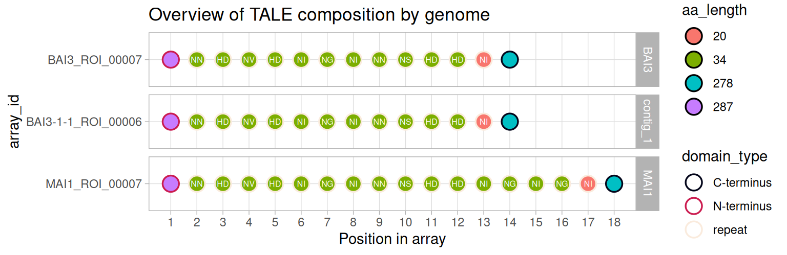
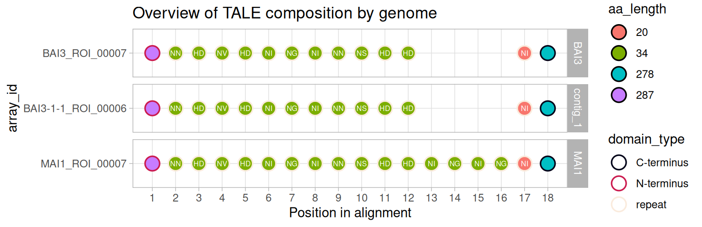
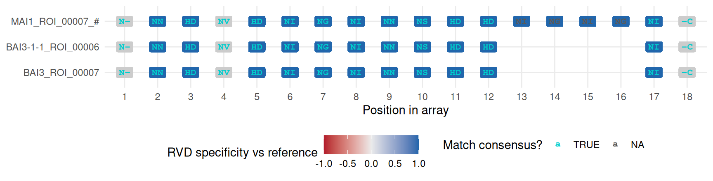

# The tales_msa class

[The `tales` class
article](https://scunnac.github.io/tantale/dev/articles/tales_class.md)
covered `tales`: one row per part, with `dom_code` as the identity layer
that makes an array alignable. This one is a deep dive into what happens
once several arrays *are* aligned – the `tales_msa` class – and about
the traffic between the two classes: how a `tales` is promoted into one,
how it demotes back, and what each class draws when plotted.

> **Where this fits**
>
> This picks up directly from [the alignment built in the
> walkthrough](https://scunnac.github.io/tantale/dev/articles/tale_msa.html#aligning-the-group)
> – same three arrays, same real internal gap – and goes further into
> the mechanics than that article needed to.

Code

``` r
library(tantale)
library(dplyr)
```

## 1 Building the alignment this article examines

Reproduced rather than carried over, so this article stands alone. The
three genomes and the group are exactly [the
walkthrough’s](https://scunnac.github.io/tantale/dev/articles/tale_msa.md).

Code

``` r
out <- fs::dir_create(file.path(tempdir(), "tales_msa_article"))
genome_files <- c(
  MAI1       = system.file("extdata", "MAI1.fa",     package = "tantale", mustWork = TRUE),
  BAI3       = system.file("extdata", "BAI3.fa",     package = "tantale", mustWork = TRUE),
  `BAI3-1-1` = system.file("extdata", "BAI3-1-1.fa", package = "tantale", mustWork = TRUE)
)
```

Code

``` r
all_tales <- lapply(names(genome_files), function(strain) {
  strain_dir <- file.path(out, strain)
  invisible(tell_tales(subject_file = genome_files[strain], output_dir = strain_dir,
                       cterm_min_score = 300,
                       correct_array = TRUE, max_comparisons = 50))
  tales_from_telltale(strain_dir) |>
    mutate(array_id = paste0(strain, "_", array_id))
}) |>
  suppressWarnings() |>
  bind_rows() |>
  tales(sanitize = TRUE)
#> Finding the closest reference amino acid sequences:
#> ================================================================================
#> 
#> Time difference of 2.78 secs
#> ================================================================================
#> 
#> Time difference of 54.53 secs
#> Finding the closest reference amino acid sequences:
#> ================================================================================
#> 
#> Time difference of 2.97 secs
#> ================================================================================
#> 
#> Time difference of 54.79 secs
#> Finding the closest reference amino acid sequences:
#> ================================================================================
#> 
#> Time difference of 0.44 secs
#> ================================================================================
#> 
#> Time difference of 44.14 secs
```

Code

``` r
cmp <- tales_compare(all_tales, aln_method = "DECIPHER", ncores = 4)
```

Code

``` r
group6 <- suppressMessages(
  tales_group(cmp$tales, cmp$tale_distances, method = "k-medoids", k = "auto", k_range = 2:20)
) |>
  filter(group == 6)
```

[](https://scunnac.github.io/tantale/dev/articles/tales_msa_class_files/figure-html/pick_group-1.png)

[`tales_align()`](https://scunnac.github.io/tantale/dev/reference/tales_align.md)
takes a `tales` and returns a `tales_msa`: the same rows, plus one new
column, `alignment_position`. Nothing else changes – every column the
input carried, `rvd` and `dom_code` both included, survives the trip,
because the alignment is computed on *one* residue layer (`residue_col`)
but the object it returns is still the whole table.

Code

``` r
msa <- tales_align(group6, residue_col = "dom_code")
msa
#> <tales_msa> 3 arrays, 18 alignment positions
#>   layers: rvd, dom_code   |   namespace: 5d8762602564ac93   |   7 other columns
#>                       dom_code
#>   MAI1_ROI_00007       84  35  43   5  41  31  24  49  35  54  18  40  31  ...
#>   BAI3_ROI_00007       84  35  43   5  41  31  24  49  35  54  18  40   -  ...
#>   BAI3-1-1_ROI_00006   85  35  43   5  41  31  24  49  35  54  18  40   -  ...
```

## 2 What is new: `alignment_position`

A `tales_msa` is a `tales` with one extra column and one extra stored
number:

- **`alignment_position`** – where this part sits in the alignment,
  which is not the same coordinate as `position_in_array`. The two agree
  up to the first gap and diverge after it.
- **[`tales_width()`](https://scunnac.github.io/tantale/dev/reference/tales_width.md)**
  – the alignment’s total column count, stored rather than derived,
  because `max(alignment_position)` over a *subset* of arrays can
  under-report a width whose last columns happen to be all gaps in that
  subset.

Code

``` r
tales_width(msa)
#> [1] 18
```

The array with the internal deletion shows the divergence directly:
`position_in_array` counts its 14 real parts contiguously, while
`alignment_position` jumps by five across the gap.

Code

``` r
msa |>
  filter(array_id == "BAI3_ROI_00007") |>
  select(array_id, position_in_array, alignment_position, domain_type)
#> # A tibble: 14 × 4
#>    array_id       position_in_array alignment_position domain_type
#>    <chr>                      <int>              <int> <chr>      
#>  1 BAI3_ROI_00007                 1                  1 N-terminus 
#>  2 BAI3_ROI_00007                 2                  2 repeat     
#>  3 BAI3_ROI_00007                 3                  3 repeat     
#>  4 BAI3_ROI_00007                 4                  4 repeat     
#>  5 BAI3_ROI_00007                 5                  5 repeat     
#>  6 BAI3_ROI_00007                 6                  6 repeat     
#>  7 BAI3_ROI_00007                 7                  7 repeat     
#>  8 BAI3_ROI_00007                 8                  8 repeat     
#>  9 BAI3_ROI_00007                 9                  9 repeat     
#> 10 BAI3_ROI_00007                10                 10 repeat     
#> 11 BAI3_ROI_00007                11                 11 repeat     
#> 12 BAI3_ROI_00007                12                 12 repeat     
#> 13 BAI3_ROI_00007                13                 17 repeat     
#> 14 BAI3_ROI_00007                14                 18 C-terminus
```

> **Gaps are implicit, not stored**
>
> There is no row, anywhere, whose `alignment_position` is a gap – a gap
> is simply a column with no row for that array. This is why the class
> validates cheaply and why every `tales` invariant (the key, the
> residue columns, the `dom_code` bijection) keeps holding unchanged on
> a `tales_msa`: nothing new was added to *rows*, only a new column that
> says where each existing row lands.

What the alignment adds on top is its own, narrower, set of rules –
checked by
[`validate_tales_msa()`](https://scunnac.github.io/tantale/dev/reference/validate_tales_msa.md)
in addition to everything
[`validate_tales()`](https://scunnac.github.io/tantale/dev/reference/validate_tales.md)
already checks: `alignment_position` is a positive integer, present on
every row; unique within an array; ordered like `position_in_array` (an
alignment may insert gaps, it may never reorder parts); and never beyond
the declared width.

## 3 Views: matrices are computed, not stored

The long table is the only thing actually stored. A rectangular
alignment – the picture most people have in mind, one row per array, one
column per position – is a *view*, built on request by
[`as.matrix()`](https://rdrr.io/r/base/matrix.html), and it has to be
asked which layer to render:

Code

``` r
as.matrix(msa, value = "dom_code")
#>                    1    2    3    4   5    6    7    8    9    10   11   12  
#> MAI1_ROI_00007     "84" "35" "43" "5" "41" "31" "24" "49" "35" "54" "18" "40"
#> BAI3_ROI_00007     "84" "35" "43" "5" "41" "31" "24" "49" "35" "54" "18" "40"
#> BAI3-1-1_ROI_00006 "85" "35" "43" "5" "41" "31" "24" "49" "35" "54" "18" "40"
#>                    13   14   15   16   17   18   
#> MAI1_ROI_00007     "31" "24" "49" "45" "29" "100"
#> BAI3_ROI_00007     NA   NA   NA   NA   "29" "100"
#> BAI3-1-1_ROI_00006 NA   NA   NA   NA   "29" "100"
```

Code

``` r
as.matrix(msa, value = "rvd")
#>                    1       2    3    4    5    6    7    8    9    10   11  
#> MAI1_ROI_00007     "NTERM" "NN" "HD" "NV" "HD" "NI" "NG" "NI" "NN" "NS" "HD"
#> BAI3_ROI_00007     "NTERM" "NN" "HD" "NV" "HD" "NI" "NG" "NI" "NN" "NS" "HD"
#> BAI3-1-1_ROI_00006 "NTERM" "NN" "HD" "NV" "HD" "NI" "NG" "NI" "NN" "NS" "HD"
#>                    12   13   14   15   16   17   18     
#> MAI1_ROI_00007     "HD" "NI" "NG" "NI" "NG" "NI" "CTERM"
#> BAI3_ROI_00007     "HD" NA   NA   NA   NA   "NI" "CTERM"
#> BAI3-1-1_ROI_00006 "HD" NA   NA   NA   NA   "NI" "CTERM"
```

Both matrices have the same shape and the same gaps – they are two
readings of one geometry, not two independent alignments. That
equivalence is exactly what lets
[`plot.tales_msa()`](https://scunnac.github.io/tantale/dev/reference/plot.tales_msa.md)
(below) show a repeat’s identity as a colour and its RVD as a label on
the same cell.

## 4 Coercion between `tales` and `tales_msa`

**Promotion** is
[`tales_align()`](https://scunnac.github.io/tantale/dev/reference/tales_align.md):
give it a complete `tales`, get back a `tales_msa`. There is no other
route, because the alignment column has to come from an actual alignment
run – nothing else could populate it honestly.

**Demotion** is
[`as_tales()`](https://scunnac.github.io/tantale/dev/reference/as_tales.md),
and it is a real operation, not a formality:

Code

``` r
demoted <- as_tales(msa)
class(demoted)
#> [1] "tales"      "tbl_df"     "tbl"        "data.frame"
```

Code

``` r
is_tales_msa(demoted)
#> [1] FALSE
"alignment_position" %in% names(demoted)
#> [1] TRUE
```

`alignment_position` survives as an ordinary column – demoting does not
erase where things were aligned, it only stops the object *claiming* to
be a coherent single alignment. That claim is exactly what
[`tales_width()`](https://scunnac.github.io/tantale/dev/reference/tales_width.md)
encodes, and it is gone:

Code

``` r
tales_width(demoted)
#> [1] 18
```

> **Why this distinction is not pedantic**
>
> A talome-wide summary spanning several *independently* aligned groups
> cannot honestly be one `tales_msa` – each group has its own width and
> its own coordinate system, so `alignment_position = 5` would mean
> unrelated things in two different groups. Demoting to a plain `tales`
> and carrying `alignment_position` as an ordinary column (per group) is
> the honest shape for that case; the class is not stretched to cover
> something it cannot actually guarantee.

**Subsetting degrades the same way, automatically, one step at a time.**
Row subsetting never touches the alignment contract, since every check
above is closed under keeping a subset of rows. Column subsetting can:
dropping `alignment_position` itself leaves something that is still a
valid `tales` (everything else about a part is unaffected) but can no
longer be a `tales_msa`, and the class notices without being told:

Code

``` r
no_alignment <- msa |> select(-alignment_position)
class(no_alignment)
#> [1] "tales"      "tbl_df"     "tbl"        "data.frame"
```

This is the same graded-degradation mechanism from [the `tales` class
article’s](https://scunnac.github.io/tantale/dev/articles/tales_class.html#sec-subsetting)
`[.tales` method, just visible one level up: a `tales_msa` that loses
what makes it an alignment steps down to a `tales` rather than lying
about still being one, and a `tales` that loses its key steps down to a
bare tibble for the same reason. Losing an *optional* column –
`seqnames`, `aa_seq` – costs nothing at either level.

## 5 Plotting: two methods, one generic

[`plot()`](https://rdrr.io/r/graphics/plot.default.html) dispatches on
class, so the two objects draw different things from the same call.

### 5.1 `plot.tales()` before and after alignment

A `tales` without an alignment can only be laid out on
`position_in_array`: every array starts its own count at 1, so an
aberrant repeat scatters to wherever it happens to sit in each array.
`position = "alignment"` needs the column that only an aligned (or
demoted-from-aligned) object carries, and lines features up instead:

Code

``` r
plot(group6, position = "array")
```

[](https://scunnac.github.io/tantale/dev/articles/tales_msa_class_files/figure-html/fig-plot-before-1.png "Figure 1: The same three arrays laid out by position_in_array – no gaps, because nothing has been aligned.")

Figure 1: The same three arrays laid out by position_in_array – no gaps,
because nothing has been aligned.

Code

``` r
plot(demoted, position = "alignment")
```

[](https://scunnac.github.io/tantale/dev/articles/tales_msa_class_files/figure-html/fig-plot-after-1.png "Figure 2: The same three arrays laid out by alignment_position – the shared deletion now lines up as a column.")

Figure 2: The same three arrays laid out by alignment_position – the
shared deletion now lines up as a column.

### 5.2 `plot.tales_msa()`: three things decided independently

The alignment plot draws a heatmap – one row per array, one column per
position – and three questions about it are answered separately:

- **what each cell *says*** – `label`, defaulting to `rvd` whenever that
  is not also the fill layer;
- **what colour that text is** – always whether the cell matches the
  consensus of its column
  ([`tales_consensus()`](https://scunnac.github.io/tantale/dev/reference/tales_consensus.md)),
  cyan for yes, pink for no, regardless of what `fill_type` is showing;
- **what colour the block behind it is** – `fill_type`, the only one of
  the three that can be unavailable.

| fill_type        | shows                                                                       | needs           |
|:-----------------|:----------------------------------------------------------------------------|:----------------|
| `"repeat_clust"` | which cluster the repeat falls in, cut at `h_cut`                           | `domain_sim`    |
| `"repeat_sim"`   | protein-sequence similarity to the reference, 0-100                         | `domain_sim`    |
| `"rvd_sim"`      | how alike the RVD’s *DNA-binding preference* is to the reference’s, -1 to 1 | a `label` layer |

`domain_sim` is the `domain_distances` element of
[`tales_compare()`](https://scunnac.github.io/tantale/dev/reference/tales_compare.md)’s
result. Passing `tal_sim` (the `tale_distances` element) in addition
adds a dendrogram panel ordering the rows by relatedness:

Code

``` r
plot(msa, tal_sim = cmp$tale_distances, domain_sim = cmp$domain_distances)
```

[](https://scunnac.github.io/tantale/dev/articles/tales_msa_class_files/figure-html/fig-msa-plot-default-1.png "Figure 3: Default plot.tales_msa() view: repeat-cluster fill, RVD labels, and a tree from tal_sim.")

Figure 3: Default plot.tales_msa() view: repeat-cluster fill, RVD
labels, and a tree from tal_sim.

`"rvd_sim"` asks a different question at a different layer: not “which
cluster” or “how similar a protein”, but how alike each RVD’s
DNA-binding specificity is to the reference’s. It needs no `domain_sim`
at all, only the RVDs themselves:

Code

``` r
plot(msa, fill_type = "rvd_sim")
```

[](https://scunnac.github.io/tantale/dev/articles/tales_msa_class_files/figure-html/fig-msa-plot-rvdsim-1.png "Figure 4: The same alignment, coloured by RVD specificity relative to the reference rather than by repeat identity.")

Figure 4: The same alignment, coloured by RVD specificity relative to
the reference rather than by repeat identity.

The repeat- and RVD-level views genuinely differ: `HD` and `ND` are
different repeats with identical specificity, while repeats differing
only at positions 12-13 are near-identical proteins with opposite target
bases – so `"repeat_sim"` and `"rvd_sim"` are not two colour schemes for
the same fact, they are answers to two different questions.

## 6 Next

Return to [the
walkthrough](https://scunnac.github.io/tantale/dev/articles/tale_msa.md)
to continue with target prediction, or to [the `tales` class
article](https://scunnac.github.io/tantale/dev/articles/tales_class.md)
for the identity layer this alignment is built on.
